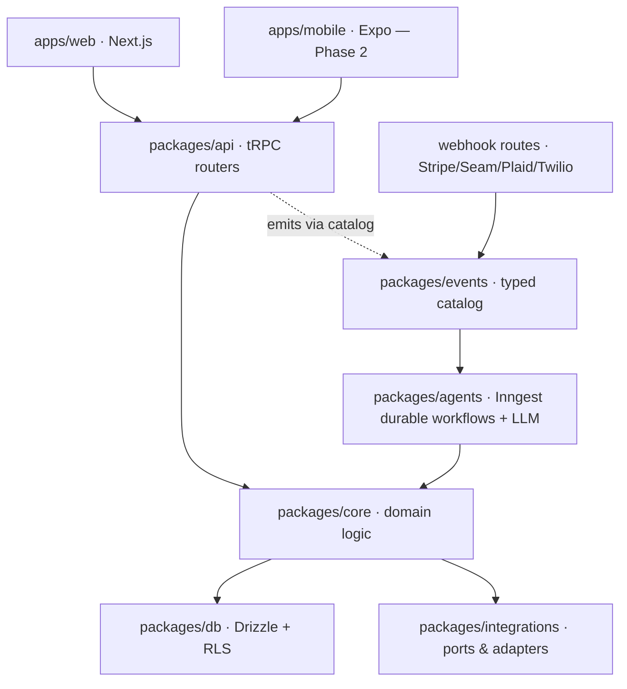
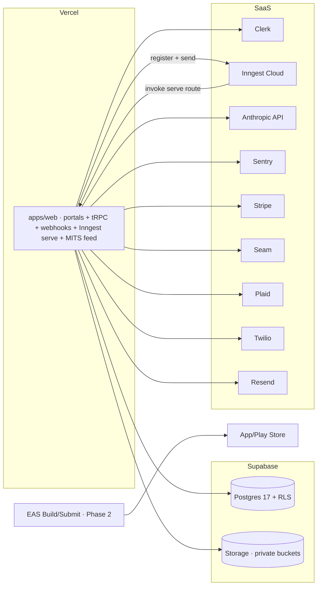
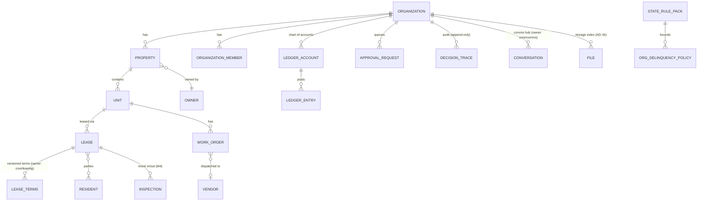

# Architecture Spine — RentalPro.ai

## Design Paradigm

**Modular monolith in a Turborepo monorepo, with a hexagonal (ports & adapters) domain core and event-driven durable workflows for everything autonomous.**

- **Domain core** (`packages/core`) — pure TypeScript business logic: ledger, rules engine, governance, comms, screening. No I/O, no framework imports.
- **Delivery layer** — two entry surfaces only: tRPC routers (`packages/api`) for request/response, Inngest functions (`packages/agents`) for autonomous/async work. Both call the core; neither contains business rules.
- **Adapters** (`packages/integrations`) — every external system (Stripe, Seam, Plaid, Twilio, Resend, screening, e-sign) behind a port interface.
- **Apps are shells** — `apps/web` (Next.js) and `apps/mobile` (Expo, Phase 2) contain UI and wiring only. Mobile ships later but nothing needs restructuring: it plugs into the same tRPC client and shared packages.



Dependency rule (lint-enforced): arrows above are the only allowed directions. `core` imports nothing from `api`, `agents`, `db` clients, or apps. Apps never import `core` or `db` directly — only `api` (client) and `ui`.

## Invariants & Rules

### AD-1 — Business logic lives in `packages/core`, never in apps or routers

- **Binds:** all
- **Prevents:** web and mobile (Phase 2) re-implementing rules divergently; logic trapped in Next.js server components that mobile can't reach
- **Rule:** Any rule that decides money, compliance, governance, or state transitions is a pure function/service in `packages/core` with unit tests. tRPC procedures and Inngest steps orchestrate; they do not decide. The package dependency rule is enforced by lint boundaries, not review discipline.

### AD-2 — Tenant context is server-resolved and DB-enforced `[ADOPTED — CAP-11]`

- **Binds:** all tenant-scoped data (every entity except `PlatformUser`, `StateRulePack`, shared reference data)
- **Prevents:** cross-tenant leakage; client-forged org IDs; RLS silently bypassed by a privileged connection
- **Rule:** `organizationId` is derived only from the Clerk session claim or subdomain middleware — never from request body/params. Every DB access goes through the org-scoped Drizzle client that runs `SET LOCAL app.current_org_id` in the same transaction; all tenant tables carry `FORCE ROW LEVEL SECURITY` policies. The app connects as a non-superuser, non-owner role; the Supabase service-role key is prohibited in application code paths (migrations/ops tooling only). Background jobs receive `organizationId` in the event envelope (AD-14) and open the same scoped client. Code that cannot resolve an org context must fail, not fall back.

### AD-3 — One API contract: every client data channel goes through `packages/api`

- **Binds:** apps/web, apps/mobile, all CAPs' client-facing surface
- **Prevents:** web using server actions, direct Supabase reads, or Realtime side channels while mobile is stuck on a different contract; bypassing tenancy/governance/role middleware
- **Rule:** No client-originated data channel of any kind bypasses the tRPC v11 routers in `packages/api` — queries, mutations, subscriptions, storage access, realtime. Server-side callers (RSCs) go through the same root-router middleware stack. Realtime in MVP = tRPC polling/refetch; Supabase Realtime, if ever adopted, is wrapped behind an API-issued org-scoped channel token and added to the sanctioned list. Unauthenticated prospect flows (inquiry, application, criteria-notice ack) use a `publicProcedure` pattern: org resolved from subdomain, no user session, rate-limited. The sanctioned non-tRPC HTTP surfaces are exactly: provider webhooks, the Inngest serve route, the M1 MITS feed + public listing pages (read-only), and signed storage URLs (AD-16). Public REST API is Phase 2 (M9) as a facade over the same core.

### AD-4 — Every autonomous process is a durable Inngest workflow

- **Binds:** CAP-2, CAP-3, CAP-4, CAP-9, CAP-12, M1–M5, M7 agent flows
- **Prevents:** fire-and-forget async lost on serverless restarts; check-then-act races across steps; lost approvals
- **Rule:** Any multi-step or long-lived autonomous flow (lead→lease, work order lifecycle, daily delinquency run, monthly close) is an Inngest function. Concurrency is keyed by `organizationId` **and**, for functions mutating a specific aggregate, by that aggregate's ID. A guard and its dependent mutation never split across `step.run` boundaries: check-and-act executes inside one core service call in one scoped transaction with a row lock or optimistic version (e.g. `assessLateFee(leaseId, expectedOpenBalanceCents)` fails typed when stale, and the step re-evaluates). Human approvals are modeled as `waitForEvent('governance/approval.resolved')` per AD-13 — never polling, never in-process timers.

### AD-5 — Governance is a single choke point `[ADOPTED — CAP-5, SPEC Constraint 6]`

- **Binds:** every agent side effect with financial, legal, or resident-facing impact (payments, fees, dispatches, lease sends, key issuance, notices)
- **Prevents:** each agent hard-coding its own threshold logic; Basic-plan actions slipping through; module toggles built as silent kill switches
- **Rule:** Before executing such a side effect, the caller invokes `core/governance.evaluate(action, context)` → `ALLOW | ESCALATE | BLOCK`. `ESCALATE` creates an `ApprovalRequest` and pauses the workflow (AD-13). The emergency-dispatch list bypasses spend approval inside `evaluate()` itself — never at call sites. CAP-6 defines two distinct per-module org settings: `enabled` (kill switch — checked once at `agents/*` entry and in tRPC middleware) and `autonomyMode: autonomous | human_approve` (checked only inside `evaluate()`, which returns `ESCALATE` for all significant actions in `human_approve`). No other code reads either setting.

### AD-6 — Decision trace precedes side effect, through one API `[ADOPTED — CAP-10, SPEC Constraint 4]`

- **Binds:** all agent decisions, governance verdicts, rule-engine outcomes, LLM calls, human overrides
- **Prevents:** unauditable autonomous actions; traces written "later" that vanish on failure; duplicated or missing verdict traces
- **Rule:** `core/trace` exposes the only write path. Traces are append-only *events*: an **intent** event commits atomically with (or before) the side effect; a **result** event sharing the same `traceId` records the external outcome when it arrives. No UPDATE or DELETE on trace tables — enforced by DB grants. Governance, rules-engine, and LLM-gateway verdicts are traced inside those modules; call sites never re-trace them. Side-effect helpers in `core` require a `traceId` argument, so an untraced side effect doesn't typecheck. Retention 7 years; traces survive tenant offboarding. (Erratum applied to `DELINQUENCY-RULES-ENGINE.md` step 6, which had the trace after the notify.)

### AD-7 — The ledger has one writer, one posting owner per money event `[ADOPTED — CAP-4, SPEC Constraint 3]`

- **Binds:** CAP-4, M2, M5, and anything touching money (rent, fees, deposits, vendor payouts, distributions)
- **Prevents:** the same real-world money movement posted twice (workflow post + webhook categorization); unbalanced or mutated entries; trust/operating commingling
- **Rule:** Only `core/ledger` writes ledger rows; every post is a balanced double-entry transaction in integer cents; corrections are reversing entries, never mutations. Every ledger transaction carries a mandatory unique `source_ref` (`{provider, providerTxnId}` for external movements; `{domain, entityId, eventType}` for internal assessments) and `post()` is idempotent on it — this also makes scheduled re-runs safe. The CAP-4 epic maintains a **posting catalog**: every money-event type has exactly one designated posting owner; provider webhooks *reconcile* platform-initiated transactions (matched by `source_ref`) and only *create* postings for externally originated bank-feed items with no match. AI categorization applies only to the latter. Security deposits live in a distinct trust sub-ledger account class (M5); transfers between trust and operating classes require an explicit, governance-gated operation.

### AD-8 — Compliance actions run the 3-layer rules engine `[ADOPTED — M2]`

- **Binds:** delinquency (M2), deposits (M5), leasing notices (CAP-2), renewals (M3), screening consents
- **Prevents:** an agent assessing an illegal fee a PM configured; jurisdiction logic scattered per feature; statutory sequencing dropped between epics
- **Rule:** Evaluation order `LeaseTerms → OrgPolicy → StateRulePack` with hard BLOCK on any layer failure, via `core/rules`. `StateRulePack` JSONs are immutable and versioned; the version used is pinned on every resulting event (AD-6). Org policy saves are validated against the RulePack at write time. Statutory *ordering* invariants (§92.3515 criteria notice before application fee, standalone FCRA consent before credit pull, adverse action with specific reason) are enforced as rules-engine preconditions on the gated action — never left to UI flow. Production use of a RulePack requires an attorney sign-off record.

### AD-9 — External systems only through ports; webhooks are idempotent event sources

- **Binds:** Stripe, Seam, Plaid, Twilio, Resend, screening, e-sign; CAP-2/3/4/7/9/12
- **Prevents:** vendor SDKs leaking through business logic (which would lock in vendors still being chosen); duplicate processing on webhook retries
- **Rule:** Domain code depends on port interfaces in `packages/integrations`; concrete adapters are swappable per vendor. Comms adapters (Twilio, Resend) are callable only by `core/comms` (AD-15). Inbound webhooks: verify signature → dedupe on provider event ID → translate to a typed catalog event (AD-14) → return 200. No business logic in webhook handlers.

### AD-10 — LLM calls only through `packages/agents` gateway

- **Binds:** all AI usage (triage, diagnosis, categorization, drafting, screening)
- **Prevents:** scattered prompts with no version control; FHA-protected attributes reaching model inputs; untracked spend
- **Rule:** All model calls go through one gateway (AI SDK 6): versioned prompt templates, Zod-validated structured outputs, token/latency/cost logged to the trace (AD-6). Input builders strip FHA/FCRA-protected fields by construction — screening inputs are an explicit allowlist, not the entity object. An LLM output is a *proposal*; only governance-gated code (AD-5) executes it. Large-context tasks route to `claude-sonnet-5` (1M context); `claude-haiku-4-5` (200K) handles classification.

### AD-11 — Money, time, and identity representations

- **Binds:** all
- **Prevents:** float-cent drift in a tax-ready ledger; off-by-one grace-period math carrying statutory penalties; unmergeable ID schemes
- **Rule:** Money = integer cents (`bigint`), currency implicit USD in MVP. Timestamps = `timestamptz` UTC; rent/lease dates = `date` columns. All legal deadline math (grace days, TX 30-day deposit clock) goes through `core/time` — the single legal-calendar utility (`addLegalDays`, `startOfLegalDay(propertyTz)`, `daysPastDue`), computed in the property's timezone, unit-tested across DST transitions. Each StateRulePack rule pins its own day semantics (e.g. `calendar_days_exclusive`); domain modules never do raw date arithmetic on legal deadlines. IDs = UUIDv7, DB-generated.

### AD-12 — Entity ownership registry: one writer per entity, one computer per derived status

- **Binds:** all core entities and cross-module derived statuses
- **Prevents:** `Lease` vs `LeaseTerms` dual ownership (stale terms after an M3 renewal → illegal fee math); two modules disagreeing on what "delinquent" means; orphaned cross-module fields
- **Rule:** Every core entity has exactly one owning module in `packages/core`; the owner exposes the only write API and any versioned/effective-dated reads. `core/leasing` owns `Lease` **and** `LeaseTerms` (versioned child written at signing/renewal/import) and exposes `getEffectiveTerms(leaseId, onDate)`; consumers never read the raw table. Cross-module required fields (e.g. `property.structure_unit_count`, needed by M2's cap rules) are declared by the consumer in the registry and enforced NOT NULL/validated at the owner's write path. Derived statuses (`delinquencyStatus`, `leaseStatus`, `workOrderStage`) each have one computing function in the owning module; every consumer calls it. The registry (entity → owner → write API) lives in this spine's workspace and is updated before any epic adds an entity.

### AD-13 — Approval resolution protocol: the workflow is the sole executor

- **Binds:** every `ApprovalRequest` (CAP-5), all `waitForEvent` approval pauses
- **Prevents:** the approved action executing twice (once in the tRPC approve mutation, once in the resumed workflow); concurrent-approver and approve-vs-expire races
- **Rule:** `ApprovalRequest` is a single-transition state machine (`pending → approved | denied | expired`) enforced by conditional `UPDATE … WHERE status='pending'` inside `core/governance.resolve()`. The tRPC approval procedure records the verdict and nothing else — the paused workflow is the sole executor of the gated side effect, for every approval type, no UX exceptions. `governance/approval.resolved` is emitted only after the resolving transaction commits. On wake, the workflow re-reads the request row (the event is a wake-up signal; the DB is truth). Timeout expiry uses the same conditional transition, so approve-vs-expire is decided by the database exactly once.

### AD-14 — Typed event catalog with a mandatory envelope

- **Binds:** every Inngest event — producers and consumers
- **Prevents:** event-name drift (`approval.resolved` vs `governance/approval.resolved`) leaving workflows asleep forever; payload shape divergence across teams
- **Rule:** `packages/events` defines every event: name (convention `domain/noun.verb`, past tense), Zod payload schema, and mandatory envelope `{ organizationId, traceId, occurredAt, schemaVersion }`. Inngest clients are constructed with `EventSchemas` from this catalog; `send()`/`waitForEvent` outside catalog types fail typecheck; no string event names at call sites (lint/CI rule). An event schema change is a catalog PR reviewed by producer and consumer owners.

### AD-15 — Outbound comms is a choke point, like governance `[binds M7]`

- **Binds:** all outbound resident/owner/vendor/lead communication, every channel (SMS, email, in-app chat)
- **Prevents:** agent messages invisible to M7's unified inbox; unapproved copy auto-sending in prod (attorney gate P3); duplicate reminders; TCPA opt-out/quiet-hour violations; inbound replies with no route back to the waiting workflow
- **Rule:** All outbound messages go through `core/comms.send(templateId, params, recipientRef, traceId)` — Twilio/Resend adapters are export-scoped to `core/comms` only. `core/comms` owns the versioned template registry (per-template approval status; unapproved templates refuse to send in prod), opt-outs, quiet hours, and channel preference, and writes the `Conversation` message row atomically with the send. LLM-drafted copy is a template parameter set, not a free-form body, for any legally sensitive category. Inbound webhooks translate to `comms/message.received` events routed to the owning workflow via the conversation's `contextRef` (workOrderId / leaseId / delinquencyCaseId).

### AD-16 — One storage convention, files are rows

- **Binds:** every stored object — M4 inspection photos, CAP-2 lease documents, CAP-3 videos, M7 attachments
- **Prevents:** cross-tenant leakage via guessable or public storage URLs (fails Constraint 1 and the CAP-11 pen test); per-epic upload surfaces mobile can't reuse; audit references that can't be resolved; unbounded retention
- **Rule:** One layout: `org/{organizationId}/{domain}/{entityId}/{fileId}` in private buckets; Supabase Storage policies mirror RLS on the org prefix; no public buckets. Every stored object has an org-scoped, RLS'd `file` row in Postgres (owning entity, content type, retention class) — that row's ID is what traces and entities reference. Uploads and downloads use short-lived signed URLs issued only by tRPC procedures (the sanctioned surface in AD-3). Files referenced by a `DecisionTrace` inherit trace retention (7 years, delete-blocked). This `file` table is the seed of the M10 document vault.

### AD-17 — An unattended platform alarms on its own silence

- **Binds:** all Inngest functions, security events, LLM spend, provider webhooks
- **Prevents:** the failure mode of an autonomous platform — silent inaction (a 3am delinquency-run crash nobody notices becomes a missed statutory deadline)
- **Rule:** Sentry `[ASSUMPTION]` captures errors across web + agents with `traceId`/`organizationId` tags. Alert rules from day 1: any Inngest function run that fails terminally or stalls past its SLA (delinquency daily run < 15 min, NFR-M2-04); any cross-tenant access attempt or RLS violation (CAP-11 escalation table); webhook signature failures; LLM spend past a per-org daily budget. Alerts route to a platform-ops channel (PagerDuty/Slack — pick at Phase-0 epic). Backups: Supabase PITR on prod with a restore test before the first real tenant; DR = provider defaults, revisit at the AWS/GCP trigger.

## Consistency Conventions

| Concern | Convention |
| --- | --- |
| Naming | DB: `snake_case` tables/columns, singular entity names (`organization`, `work_order`). TS: `camelCase` via Drizzle mapping; types `PascalCase`. Events: per AD-14 catalog. tRPC routers per domain: `leasing`, `maintenance`, `accounting`, `governance`, `comms`, `listings`, `org` |
| Errors | tRPC error codes; domain failures are typed results from `core` (e.g. `{ blocked: 'TX-LF-003' }`), not thrown strings. Cross-tenant lookups return `NOT_FOUND`, never `FORBIDDEN` (no enumeration) |
| Validation | Zod at every boundary (tRPC input, event payloads via AD-14, webhook translation, LLM outputs). Inside `core`, trust the types |
| Logging | Per `docs/rules/observability-logging.md`: structured JSON, `traceId` + `organizationId` + `track` + `phase` (`start|done|fail|block|skip`) on every step; no PII in payloads; never swallow failures |
| State mutation | Request path: tRPC procedure → core service → scoped DB txn. Async path: catalog event → Inngest step → core service → scoped DB txn. No other mutation paths; guard+mutate in one txn per AD-4 |
| Config/flags | Org-scoped settings (`OrganizationSettings`, module toggles per AD-5, governance rails) in DB per tenant — no global flags that bypass tenancy. Platform env vars via typed `env.ts` per app |
| Auth roles | Clerk org roles: `pm-admin`, `pm-staff`, `owner`, `resident`; platform ops in separate Clerk namespace. Role checks in tRPC middleware, not in UI |
| Security posture | Secrets per environment in Vercel/Supabase config, never in repo; Stripe/Clerk keys separated per env. Rate limiting on all `publicProcedure` surfaces. Screening PII (SSN, credit reports) stays vendor-side — the platform stores only the decision, criteria version, and a vendor report reference, never raw reports `[ASSUMPTION — confirm at CAP-2 epic]` |

## Stack

*Seed — verified current July 2026 (see `reviews/review-versions.md`); code owns this once it exists.*

| Name | Version |
| --- | --- |
| TypeScript (strict) | latest stable |
| Turborepo + pnpm workspaces | latest stable |
| Next.js (App Router, `apps/web`) | 16.2.x LTS |
| Expo (`apps/mobile`, Phase 2) | SDK 56 (RN 0.85, React 19.2) — re-verify Clerk peer range (`>=53 <57`) at Phase 2 kickoff |
| tRPC | 11.x |
| Drizzle ORM (+ hand-written RLS policies; `crudPolicy` sugar is Neon-only) | latest stable |
| PostgreSQL (Supabase) | 17 |
| Supabase Storage (per AD-16) | — |
| Clerk (`@clerk/nextjs`, `@clerk/expo`) | Core 3 line |
| Inngest | latest stable |
| Vercel AI SDK | 6.x |
| Anthropic models | `claude-sonnet-5` (agent reasoning, 1M ctx) · `claude-haiku-4-5` (classification, 200K ctx) |
| Tailwind CSS 4 + shadcn/ui (web) | current |
| NativeWind (mobile, Phase 2) | v5 pre-release as of 2026-07 — adopt v5 only if GA by Phase 2, else v4 with a Tailwind-3 preset scoped to mobile |
| Zod | latest stable |
| Sentry (errors/APM per AD-17) | latest stable |
| Stripe (payments, Identity, Connect) · Seam · Plaid | current APIs |
| Twilio (SMS) · Resend (email) — via `core/comms` only | current APIs |
| Vitest (unit) · Playwright (web e2e) | latest stable |

## Structural Seed

```text
rentalpro/
  apps/
    web/                 # Next.js 16 — all portals (PM admin, owner, resident) + webhook & Inngest serve routes + MITS feed
    mobile/              # Expo SDK 56 — Phase 2; scaffold exists, ships later
  packages/
    api/                 # tRPC routers + middleware (auth, org, logging, rate-limit) — the single client contract
    core/                # pure domain: ledger/, rules/, governance/, comms/, trace/, time/, leasing/, maintenance/, screening/
    agents/              # Inngest functions + LLM gateway + versioned prompts
    events/              # typed event catalog + envelope (AD-14)
    db/                  # Drizzle schema, RLS policies, migrations, org-scoped client factory
    integrations/        # ports + adapters: stripe/, seam/, plaid/, twilio/, resend/, screening/, esign/
    ui/                  # shared design tokens; web components (shadcn) + native components (Phase 2)
  tooling/               # eslint (incl. boundary rules), tsconfig, tailwind presets
```

**Deployment & environments**



- Three environments: `dev` (local, Supabase branch DB), `staging`, `prod` — separate Supabase projects, Clerk instances, Inngest envs, Stripe keys; Vercel preview deploys per PR.
- Wildcard `*.rentalpro.ai` on Vercel; middleware resolves org from subdomain (CAP-11).
- CI merge gate includes the tenant-isolation test suite (CAP-11 acceptance tests).
- Mobile (Phase 2): EAS Build/Submit + OTA updates; same `staging`/`prod` API targets.

**Core entities (names + ownership only — write APIs per AD-12)**



## Capability → Architecture Map

| Capability | Lives in | Governed by |
| --- | --- | --- |
| CAP-1 onboarding/import | `core/onboarding` + import Inngest flow | AD-2, AD-4, AD-11, AD-12 (required-field declarations) |
| CAP-2 leasing + M3 renewals | `core/leasing`, `agents/leasing` | AD-4, AD-5, AD-8, AD-10, AD-12, AD-13 |
| CAP-3 maintenance + CAP-9 vendors | `core/maintenance`, `agents/maintenance` | AD-4, AD-5, AD-9, AD-10, AD-13 |
| CAP-4 accounting + M2 + M5 | `core/ledger`, `core/rules`, `agents/accounting` | AD-7 (posting catalog), AD-8, AD-6 |
| CAP-5 governance rails | `core/governance` | AD-5, AD-13 |
| CAP-6 module toggles | `OrganizationSettings`: `enabled` checked at `agents/*` entry + tRPC middleware; `autonomyMode` checked only inside `governance.evaluate()` | AD-5 |
| CAP-7 resident portal + M7 comms hub | `apps/web` portal routes, `core/comms` | AD-3, AD-15 |
| CAP-8 owner reporting | `core/ledger` read models, `apps/web` owner routes | AD-3, AD-7 |
| CAP-10 audit trail | `core/trace` + DB grants | AD-6 |
| CAP-11 multi-tenant SaaS | Clerk + subdomain middleware + `db` scoped client + RLS + storage policies | AD-2, AD-16 |
| CAP-12 smart access | `integrations/seam`, `agents/leasing` step | AD-4, AD-9 |
| M1 syndication | `core/listings`, MITS feed route (sanctioned in AD-3), `agents/listings` | AD-3, AD-4 |
| M4 inspections | `core/inspections`, `file` rows + Storage per AD-16, comparison agent | AD-4, AD-10, AD-16 |

## Deferred

| Decision | Why it can wait / revisit trigger |
| --- | --- |
| E-sign provider (DocuSign / Dropbox Sign / Documenso) | Port defined (AD-9); pick at CAP-2 epic — pricing + TX compliance review |
| Screening API vendor | Port defined; pick before CAP-2 build |
| Plaid vs Stripe-only bank feeds | Port defined; decide at CAP-4 epic. *Note: this consciously relaxes SPEC Constraint 8's "architecture phase finalizes" — flag to amend spec* |
| Public REST API + webhooks out (M9) | Phase 2; facade over `core` — tRPC stays internal |
| Custom domains + full white-label | Phase 2 per SPEC Constraint 9 |
| Mobile UI build-out, EAS pipeline detail, push notifications | Phase 2; architecture already multi-client (AD-1, AD-3) |
| Ops alert destination (PagerDuty vs Slack) | Pick at Phase-0 epic; AD-17 fixes the alert rules either way |
| AWS/GCP migration (RDS/Cloud SQL, containerized API) | Revisit when Vercel/Supabase limits bite (>~10k leases/org daily jobs, NFR-M2-04) |
| Per-CAP schema detail beyond core ERD + ownership registry | Owned by epic-level design + code |
| Search/reporting infra (read replicas, warehouse) | Revisit when owner-report queries slow OLTP |

## Open Questions

| Question | Why open / revisit trigger |
| --- | --- |
| M8 owner portal scope (docs, approvals beyond statements) | Founder pick still open in the spec; architecturally absorbed by AD-3/AD-16 whenever decided |
| M10 document vault | AD-16's `file` table is the seed; founder picks vault UX scope. M4 baselines already store per AD-16 |
| Screening thesis (Transparent Decision Engine / Passport / Criteria-First, or 1+3) | Parked in `AI-MVP-DECISIONS.md`; could reshape `core/screening` — resolve before CAP-2 epic |
| Tenant offboarding: export format + PII deletion vs 7-year append-only traces | Recommend: traces survive offboarding with tenant PII redacted; full data export contractually required — decide before first paying PM company |
| LLM per-org budget default values (AD-17 defines the monitoring) | Set with first pilot data |
