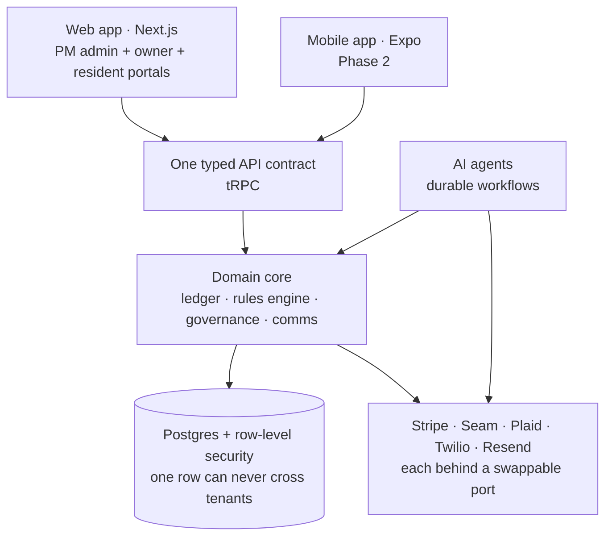

# Architecture Overview — RentalPro.ai

**Date:** 2026-07-05
**Audience:** Founders / partners — the readable walkthrough
**Canonical contract:** [`ARCHITECTURE-SPINE.md`](../_bmad-output/planning-artifacts/architecture/architecture-rentalpro-2026-07-05/ARCHITECTURE-SPINE.md) (17 binding decisions, AD-1 … AD-17)
**Decision rationale log:** [`.memlog.md`](../_bmad-output/planning-artifacts/architecture/architecture-rentalpro-2026-07-05/.memlog.md)

This doc explains the architecture in plain language and says *why* each call was made. The spine is the terse contract agents and engineers build against; this is the tour.

---

## The one decision that shapes everything

**Mobile is Phase 2, but the architecture is multi-client from day 1.**

The web app never becomes "the product" that mobile later has to be carved out of. Instead:

- All business logic lives in shared packages, not in the web app.
- Web talks to the backend through one typed API contract (tRPC). When the Expo mobile app ships in Phase 2, it plugs into the *same* contract and the same shared packages — no rewrite, no second backend, no drift.
- The web app and the future mobile app are both thin shells: UI + wiring only.

We considered a fully separate API service (Express/Hono behind its own deployment). Rejected for MVP: it doubles the ops surface without buying anything at this scale, and the spec already locked the Vercel + Supabase direction. The monorepo keeps the same clean separation *in code* (enforced by lint rules), and the migration path to a standalone service later is straightforward because the domain logic is already isolated.

## The shape: one repo, one brain, many shells

Modeled on the current industry-standard starter for exactly this shape (`create-t3-turbo`: Next.js + Expo + tRPC + Drizzle in a Turborepo), adapted to our locked decisions (Clerk instead of its default auth).

## The stack, and why each piece

| Layer | Choice | Why |
|---|---|---|
| Web | **Next.js 16 (LTS)** on Vercel | Spec direction; portals + webhooks + agent endpoints on one deploy; wildcard subdomains for `{pmco}.rentalpro.ai` |
| Mobile (Phase 2) | **Expo SDK 56** (React Native) | Same TypeScript/React skills; consumes the identical API; EAS handles store builds |
| API contract | **tRPC 11** | End-to-end types shared by web *and* mobile — a field rename that breaks mobile fails the build, today, before mobile even exists |
| Database | **Supabase Postgres 17 + row-level security** | Tenant isolation enforced *by the database*, not by remembering to add a WHERE clause. Cross-tenant access is a security incident (locked constraint) — RLS is the backstop |
| ORM | **Drizzle** (not Prisma) | Drizzle has first-class RLS policy support; Prisma still has none. Since RLS is Constraint #1, this outweighs Prisma's familiarity. *(Supersedes older Prisma references in our docs.)* |
| Auth | **Clerk** (Organizations) | Locked in CAP-11; verified it also supports Expo, so one auth system spans web + mobile |
| Agent workflows | **Inngest** durable functions | An autonomous maintenance flow runs for days (diagnose → quote → schedule → verify → pay) and must survive crashes and human-approval pauses. Inngest gives durable steps, retries, per-tenant concurrency, and "sleep until the human approves" for free |
| AI | **Vercel AI SDK 6 + Claude** (`claude-sonnet-5` reasoning, `claude-haiku-4-5` classification) | One gateway, versioned prompts, structured outputs; every model call is cost-tracked and audit-traced |
| Comms | **Twilio (SMS) + Resend (email)** | Commodity choices behind ports — swappable without touching business logic |
| Monitoring | **Sentry + alert rules** | An autonomous platform's failure mode is *silent inaction*. A crashed 3am delinquency run pages someone — it doesn't just not happen |

## Five rules that keep the build honest

The spine has 17 binding decisions; these five carry the most weight:

1. **One brain.** Every rule about money, law, or governance is a pure, unit-tested function in the domain core. The web app, the mobile app, and the AI agents all call the *same* function — none of them ever re-implements it. (AD-1, AD-12)
2. **One gate.** Every agent action with financial or legal impact passes through a single `governance.evaluate()` choke point that returns allow / escalate / block. The $500 auto-approve limit, the Basic-plan "human approves everything" mode, and the emergency-dispatch bypass all live in that one place. An approval pause has exactly one executor when it resumes — no double-dispatch races. (AD-5, AD-13)
3. **One ledger writer.** Only the ledger module posts entries; every posting is balanced double-entry in integer cents with an idempotency key, so the same rent payment can never book twice — even if a workflow *and* a Stripe webhook both report it. Security deposits sit in a separate trust class (Texas law). (AD-7)
4. **Trace first, act second.** Every autonomous decision writes an immutable audit record — inputs, policy version, prompt version, outcome — *before* the action executes. Delete is blocked at the database level. This is what makes "an auditor traces any decision in 60 seconds" real. (AD-6, AD-10)
5. **Law is a versioned artifact.** Texas rules (late-fee caps, grace periods, deposit deadlines) live in an immutable, attorney-signed `StateRulePack`. Agents evaluate lease → org policy → state pack and hard-block anything illegal — the differentiator AppFolio/Buildium don't have. Expanding to a new state = adding a pack, not rewriting features. (AD-8)

## What a real flow looks like (late rent, autonomous)

1. Daily delinquency workflow wakes for each org (durable, per-lease serialized).
2. Rules engine: lease terms → org policy → Texas pack. Fee legal? Compute it. Illegal (e.g. 15% on a duplex)? **Block**, alert the PM, log why.
3. Governance gate: autonomous mode and under threshold → allow. Otherwise → approval request, workflow sleeps until the PM clicks approve.
4. Audit trace commits, then the fee posts to the ledger (idempotent — a re-run can't double-post).
5. Resident reminder goes out through the comms hub — attorney-approved template only, logged into the same conversation thread the PM sees in the unified inbox.
6. Resident replies "I'll pay Friday" → lands in the inbox *and* routes back to the waiting workflow.

Every step: logged, traced, tenant-scoped, resumable after a crash.

## What we deliberately did not decide yet

| Deferred | When it gets decided |
|---|---|
| E-sign vendor, screening vendor, Plaid-vs-Stripe feeds | At the owning epic — the ports are already defined, so the vendor is a plug-in choice |
| Public REST API (M9), custom domains, white-label tier | Phase 2 |
| Mobile UI build-out | Phase 2 — the architecture work for it is already done |
| AWS/GCP migration | Only if Vercel/Supabase limits actually bite (trigger written into the spine) |

Open questions carried forward: M8 owner-portal scope, M10 document vault UX (the storage foundation is already specified), the screening thesis, and tenant-offboarding data export — none block the Phase 0 build.

## How this was validated

The spine went through a three-lens review gate before being finalized:

- **Fact-check lens** — every version pin re-verified against the live web (July 2026): Next.js 16.2 LTS, Expo 56, Clerk-on-Expo compatibility, Drizzle RLS, current Claude model IDs.
- **Rubric lens** — coverage check against the SPEC: all 12 CAPs, all 9 constraints, M1–M7 locked decisions mapped to owning modules and rules.
- **Adversarial lens** — tried to construct two teams that follow every rule yet build incompatible systems. Found 12 seams (3 critical: double ledger posting, approval races, lease-terms dual ownership) — all closed with new or tightened rules before finalization.

Full reviews: [`reviews/`](../_bmad-output/planning-artifacts/architecture/architecture-rentalpro-2026-07-05/reviews/)

## Next steps

1. **Adopt the spine into the SPEC** as a companion (keeps AD IDs citable downstream).
2. **Epics & stories** (`bmad-create-epics-and-stories`) — Phase 0 first: monorepo scaffold, tenancy, auth, governance, trace.
3. Resolve the screening thesis before the CAP-2 epic starts.
