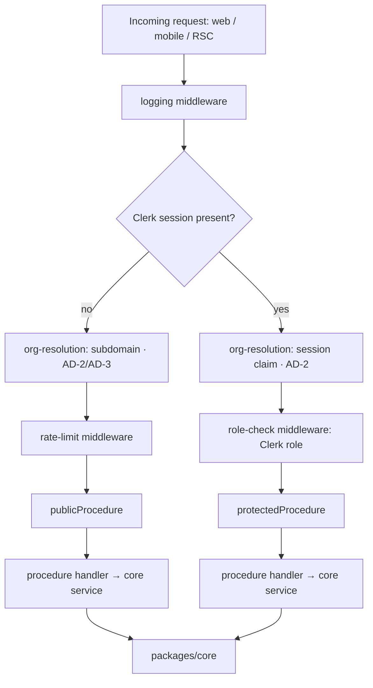

# tRPC API Structure — RentalPro.ai

Reference for `packages/api`. Per AD-3, this is the **only** client data channel — web, mobile (Phase 2), and RSC server callers all go through this root router. Routers orchestrate; they never decide (AD-1). REST-style endpoints in `docs/capabilities/*.md` are draft intent, not the contract — this doc is the contract.

## 1. Root router composition + middleware stack

Canonical per-domain routers (spine Consistency Conventions + this doc's additions):
`org`, `onboarding`, `leasing`, `maintenance`, `accounting`, `governance`, `comms`, `listings`, `platform`.

- **logging** — structured JSON per `docs/rules/observability-logging.md`: `traceId`, `organizationId` (once resolved), `track`, `phase`. Runs first so failures at any later layer are still logged.
- **auth (Clerk session)** — validates the Clerk session token if present. Absence of a session is not itself an error; it routes to the `publicProcedure` branch.
- **org-resolution (AD-2)** — two paths, never merged:
  - Session branch: `organizationId` read from the Clerk session claim (org membership). Used by every `protectedProcedure`.
  - Subdomain branch: `organizationId` resolved from `{slug}.rentalpro.ai` host header, no session required. Used only by `publicProcedure` (AD-3: lead intake, public listings, criteria-notice ack, application start).
  - Either branch failing to resolve an org **fails the request** — no fallback (AD-2).
  - Resolved `organizationId` is bound to the org-scoped Drizzle client (`SET LOCAL app.current_org_id`) for the request's transaction — never taken from body/params.
- **rate-limit** — applied only on the `publicProcedure` branch (AD-3). Protected procedures rely on Clerk session + org RLS instead of IP rate limiting.
- **role-check** — Clerk org roles: `pm-admin`, `pm-staff`, `owner`, `resident`; `platform-ops` in a separate Clerk namespace, checked by a distinct `platformProcedure` (not org-scoped — see `platform` router). Enforced in middleware, never in UI (spine Consistency Conventions).
- **procedure handler** — thin orchestration: input validation (Zod), call into `packages/core`, map the typed result to a tRPC response or throw a tRPC error. No decisions here (AD-1).

`publicProcedure` and `protectedProcedure` are the only two base procedure builders. Every router procedure is declared as one or the other; there is no bare `t.procedure` in `packages/api`.

## 2. Routers

Each entry: **procedure** (query/mutation) — purpose — input (key fields) — output (key fields) — caller role(s) — core delegate.

### 2.1 `org` (CAP-11)

| Procedure | Type | Purpose | Input (key fields) | Output (key fields) | Roles | Delegates to |
|---|---|---|---|---|---|---|
| `org.resolve` | query | Resolve current org from subdomain/session for portal bootstrap | *(none — derived by middleware)* | `{ id, slug, displayName, branding }` | any authenticated + `publicProcedure` variant for pre-auth portal shell | `core/org.getBySubdomainOrSession` |
| `org.create` | mutation | Provision a new PM-company org | `{ slug, displayName, planTier }` | `{ organizationId }` | `platform-ops` (via `platform` router alias, see 2.9) | `core/org.create` |
| `org.getSettings` | query | Read governance defaults + module toggles | *(none)* | `{ governance: {...}, modules: { leasing, maintenance, accounting: { enabled, autonomyMode } } }` | `pm-admin` | `core/org.getSettings` |
| `org.updateSettings` | mutation | Update governance defaults / module toggles (CAP-5/CAP-6) | `{ governance?, modules? }` | `{ updated: true }` | `pm-admin` | `core/governance.updateOrgDefaults`, `core/org.updateModuleToggles` |
| `org.getBranding` | query | Read white-label config | *(none)* | `{ logoUrl, colors, showPoweredBy }` | any authenticated in org; `publicProcedure` for resident/owner subdomain shell | `core/org.getBranding` |
| `org.updateBranding` | mutation | Update logo/colors/display name | `{ logoUrl?, colors?, displayName? }` | `{ updated: true }` | `pm-admin` | `core/org.updateBranding` |
| `org.listMembers` | query | List org members | *(none)* | `[{ id, name, email, role }]` | `pm-admin`, `pm-staff` | `core/org.listMembers` |
| `org.inviteMember` | mutation | Invite PM staff via Clerk | `{ email, role }` | `{ invitationId }` | `pm-admin` | `core/org.inviteMember` (wraps Clerk org invite) |
| `org.removeMember` | mutation | Remove a member | `{ memberId }` | `{ removed: true }` | `pm-admin` | `core/org.removeMember` |
| `org.startStripeConnect` | mutation | Begin Stripe Connect onboarding for org payouts | *(none)* | `{ onboardingUrl }` | `pm-admin` | `integrations/stripe` via `core/org.startConnectOnboarding` |

Cross-tenant lookup rule applies throughout: `org.resolve`/`org.getSettings` etc. for a mismatched or foreign org id return `NOT_FOUND`, never `FORBIDDEN` (see §4).

### 2.2 `onboarding` (CAP-1)

| Procedure | Type | Purpose | Input | Output | Roles | Delegates to |
|---|---|---|---|---|---|---|
| `onboarding.startImport` | mutation | Kick off portfolio import job (CSV upload already landed via signed storage URL, AD-16) | `{ importType: 'properties'|'units'|'owners'|'tenants'|'vendors', fileId }` | `{ jobId }` | `pm-admin` | `core/onboarding.startImport` → emits `onboarding/import.requested` (AD-14) consumed by Inngest |
| `onboarding.getImportStatus` | query | Poll import job status | `{ jobId }` | `{ status: 'queued'|'processing'|'done'|'failed', rowsProcessed, rowErrors: [...] }` | `pm-admin` | `core/onboarding.getImportStatus` |
| `onboarding.createProperty` | mutation | Manual property entry (fallback to CSV) | `{ address, unitCount, structureUnitCount, floodplain, builtYear }` | `{ propertyId }` | `pm-admin` | `core/leasing.createProperty` (owner per AD-12 registry) |
| `onboarding.createUnit` | mutation | Manual unit entry | `{ propertyId, unitNumber, bedrooms, bathrooms, sqft }` | `{ unitId }` | `pm-admin` | `core/leasing.createUnit` |

Required-field declarations (AD-12) — e.g. `structure_unit_count` needed by M2 cap rules — are validated at the owning module's write path, not in the router.

### 2.3 `leasing` (CAP-2, CAP-12, M3)

| Procedure | Type | Purpose | Input | Output | Roles | Delegates to |
|---|---|---|---|---|---|---|
| `leasing.submitLead` | mutation | Prospect inquiry intake — **`publicProcedure`** (AD-3), org from subdomain, rate-limited | `{ unitId or propertyId, name, contact: { email or phone }, message? }` | `{ leadId }` | none (public) | `core/leasing.createLead` → emits `leasing/lead.submitted` |
| `leasing.startApplication` | mutation | Applicant begins application + pays fee — **`publicProcedure`** until identity established, then session-bound | `{ leadId, unitId }` | `{ applicationId, criteriaNoticeRequired: boolean }` | none (public) → `resident`-to-be | `core/leasing.startApplication` — enforces §92.3515 criteria notice before fee via `core/rules` (AD-8) |
| `leasing.submitApplicationDetails` | mutation | Applicant supplies screening inputs, FCRA consent | `{ applicationId, screeningConsent: true, allowlistedFields: {...} }` | `{ status: 'pending_screening' }` | applicant session | `core/leasing.submitApplication` — standalone FCRA consent gate (AD-8) before credit pull |
| `leasing.getApplicationDecisionCard` | query | Screening trace/decision summary for an application | `{ applicationId }` | `{ decision: 'approved'|'denied'|'pending', criteriaVersion, adverseActionReason? }` | `pm-admin`, `pm-staff`, applicant (own record only) | `core/leasing.getDecisionCard` (reads `core/trace`, AD-6) |
| `leasing.listApplications` | query | PM queue of applications | `{ status?, propertyId? }` | `[{ applicationId, applicantName, status, unitId }]` | `pm-admin`, `pm-staff` | `core/leasing.listApplications` |
| `leasing.createLease` | mutation | Generate lease from PM template + Texas starter (AI-filled draft) | `{ applicationId, terms: { rentCents, termMonths, startDate } }` | `{ leaseId, draftDocumentId }` | `pm-admin`, `pm-staff` | `core/leasing.createLease` (owns `Lease` + `LeaseTerms`, AD-12) |
| `leasing.getLease` | query | Lease detail incl. effective terms | `{ leaseId }` | `{ lease, effectiveTerms }` | `pm-admin`, `pm-staff`, `owner` (own property), `resident` (own lease) | `core/leasing.getEffectiveTerms` |
| `leasing.sendLeaseForSignature` | mutation | Send lease for e-sign | `{ leaseId }` | `{ envelopeId, sentAt }` | `pm-admin`, `pm-staff` | `core/leasing.sendForSignature` — routes through `integrations/esign` port (AD-9) |
| `leasing.listLeases` | query | PM lease list/filter | `{ status?, propertyId? }` | `[{ leaseId, unitId, residentName, status, endDate }]` | `pm-admin`, `pm-staff`, `owner` (own properties) | `core/leasing.listLeases` |
| `leasing.getKeyIssuanceStatus` | query | Digital key status for a signed/active lease (CAP-12) | `{ leaseId }` | `{ status: 'pending'|'issued'|'revoked', issuedAt? }` | `pm-admin`, `pm-staff`, `resident` (own lease) | `core/leasing.getKeyIssuanceStatus` (reads `integrations/seam` grant state via `core/leasing`, never calls Seam directly) |
| `leasing.listRenewals` | query | Renewal cases pending/in-flight (M3) | `{ status? }` | `[{ renewalCaseId, leaseId, offerStatus, proposedRentCents }]` | `pm-admin`, `pm-staff` | `core/leasing.listRenewals` |
| `leasing.getOwnerPendingRenewalApprovals` | query | Renewal offers awaiting owner sign-off (M3) | *(none — owner scoped by session)* | `[{ renewalCaseId, propertyId, currentRentCents, proposedRentCents, increasePercent }]` | `owner` | `core/leasing.getPendingOwnerApprovals` — increases above `renewalAutoApproveIncreasePercent` only |
| `leasing.decideRenewalOffer` | mutation | Owner approves/rejects a proposed increase (M3) | `{ renewalCaseId, decision: 'approve'|'reject', note? }` | `{ recorded: true }` | `owner` | `core/governance.resolve` (records verdict only, AD-13) — resumed Inngest workflow sends the offer |
| `leasing.respondToRenewalOffer` | mutation | Resident accepts/declines renewal offer | `{ renewalCaseId, response: 'accept'|'decline' }` | `{ recorded: true }` | `resident` | `core/leasing.recordRenewalResponse` |

### 2.4 `maintenance` (CAP-3, CAP-9)

| Procedure | Type | Purpose | Input | Output | Roles | Delegates to |
|---|---|---|---|---|---|---|
| `maintenance.createWorkOrder` | mutation | Resident/PM submits maintenance request (video/photo via signed storage URL, AD-16) | `{ unitId, description, mediaFileIds: [...], emergency?: boolean }` | `{ workOrderId }` | `resident`, `pm-admin`, `pm-staff` | `core/maintenance.createWorkOrder` → emits `maintenance/workorder.created` |
| `maintenance.listWorkOrders` | query | List/filter work orders | `{ status?, propertyId?, vendorId? }` | `[{ workOrderId, unitId, status, estimatedCostCents }]` | `pm-admin`, `pm-staff`, `owner` (own properties) | `core/maintenance.listWorkOrders` |
| `maintenance.getWorkOrder` | query | Work order detail + trace link | `{ workOrderId }` | `{ workOrder, decisionTraceId }` | `pm-admin`, `pm-staff`, `owner` (own), `resident` (own) | `core/maintenance.getWorkOrder` |
| `maintenance.getWorkOrderStatus` | query | Lightweight status poll for resident portal | `{ workOrderId }` | `{ stage: 'triaged'|'quoted'|'dispatched'|'in_progress'|'completed', updatedAt }` | `resident` (own) | `core/maintenance.getComputedStage` (single computing function per AD-12) |
| `maintenance.submitVendorQuote` | mutation | Vendor submits a quote against a dispatched WO | `{ workOrderId, quoteCents, notes? }` | `{ accepted: boolean }` | vendor (magic-link session, not a Clerk org role — see note below) | `core/maintenance.submitQuote` — governance-gated via `core/governance.evaluate` if quote exceeds threshold (AD-5) |
| `maintenance.getDispatchStatus` | query | Dispatch/assignment status for a WO | `{ workOrderId }` | `{ vendorId?, dispatchedAt?, appointmentAt? }` | `pm-admin`, `pm-staff`, vendor (own assignment) | `core/maintenance.getDispatchStatus` |
| `maintenance.confirmCompletion` | mutation | Vendor marks complete with photo; optionally resident confirms | `{ workOrderId, completionPhotoFileId }` | `{ recorded: true }` | vendor, `resident` (confirmation step, if org requires) | `core/maintenance.recordCompletion` |
| `maintenance.listVendors` | query | Vendor directory | `{ trade?, activeOnly? }` | `[{ vendorId, name, trades, coiStatus }]` | `pm-admin`, `pm-staff` | `core/maintenance.listVendors` |
| `maintenance.upsertVendor` | mutation | Create/update vendor record incl. COI | `{ vendorId?, name, trades, coiFileId?, coiExpiresAt? }` | `{ vendorId }` | `pm-admin`, `pm-staff` | `core/maintenance.upsertVendor` — expired COI blocks future dispatch at the owning module, not the router |

Note: vendors authenticate via a magic-link token (per `docs/capabilities/CAP-9-vendor-management.md`), not a Clerk org role. The role-check middleware treats vendor-token procedures as a distinct guard branch scoped to a single `workOrderId`/`vendorId`, still passing through org-resolution (the token embeds `organizationId`) — it does not bypass AD-2.

### 2.5 `accounting` (CAP-4, CAP-8, M5)

| Procedure | Type | Purpose | Input | Output | Roles | Delegates to |
|---|---|---|---|---|---|---|
| `accounting.listTransactions` | query | Ledger read model — transaction list | `{ period?, accountId?, propertyId? }` | `[{ transactionId, postedAt, accountId, amountCents, category, sourceRef }]` | `pm-admin`, `pm-staff` | `core/ledger.listTransactions` (read model only — never writes) |
| `accounting.getMonthlyReport` | query | Monthly close report for a period | `{ period }` | `{ period, status: 'open'|'pending_signoff'|'closed', totalsByAccount, distributions }` | `pm-admin` | `core/ledger.getMonthlyReport` |
| `accounting.signOffMonth` | mutation | Accountant approves month, unblocking distributions | `{ period, notes? }` | `{ closedAt }` | `pm-admin` (accountant-designated) | `core/ledger.closeMonth` — single writer, one posting owner per money event (AD-7) |
| `accounting.recategorizeTransaction` | mutation | Human override of AI categorization | `{ transactionId, newCategory, reason }` | `{ recorded: true }` | `pm-admin`, `pm-staff` | `core/ledger.recategorize` — writes a `human.action` trace event (AD-6), never mutates the original entry (reversing entry only, AD-7) |
| `accounting.getOwnerStatement` | query | Owner-facing statement for a period | `{ ownerId, period }` | `{ period, incomeCents, expenseCents, distributionCents, lineItems }` | `owner` (own), `pm-admin` (PM view of any owner) | `core/ledger.getOwnerStatement` — distribution hidden until `signOffMonth` (CAP-8 acceptance test) |
| `accounting.listOwnerStatements` | query | Statement history for an owner | `{ ownerId? }` | `[{ period, status }]` | `owner` (own), `pm-admin` | `core/ledger.listOwnerStatements` |
| `accounting.getDepositLedger` | query | Trust sub-ledger view for a lease's security deposit (M5) | `{ leaseId }` | `{ heldCents, trustAccountId, dueBackBy, returnStatus }` | `pm-admin`, `pm-staff`, `resident` (own), `owner` (own property) | `core/ledger.getDepositLedger` — reads distinct trust account class (AD-7) |
| `accounting.initiateTrustToOperatingTransfer` | mutation | Explicit governed transfer between trust and operating classes (M5) | `{ leaseId, amountCents, reason }` | `{ approvalRequestId }` | `pm-admin` | `core/governance.evaluate` (always ESCALATE-eligible per AD-7/AD-5) → `core/ledger.postTransfer` only on approval |

### 2.6 `governance` (CAP-5) — enforces AD-13 explicitly

| Procedure | Type | Purpose | Input | Output | Roles | Delegates to |
|---|---|---|---|---|---|---|
| `governance.getOrgDefaults` | query | Org-level approval thresholds/autonomy defaults | *(none)* | `{ maintenanceThresholdCents, autonomyMode, emergencyList }` | `pm-admin` | `core/governance.getOrgDefaults` |
| `governance.updateOrgDefaults` | mutation | Update org-level thresholds (CAP-5) | `{ maintenanceThresholdCents?, autonomyMode?, emergencyList? }` | `{ updated: true }` | `pm-admin` | `core/governance.setOrgDefaults` |
| `governance.getPropertyOverrides` | query | Property-level governance override | `{ propertyId }` | `{ overrides: {...} }` | `pm-admin` | `core/governance.getPropertyOverrides` |
| `governance.updatePropertyOverrides` | mutation | Set stricter-than-org property override | `{ propertyId, overrides: {...} }` | `{ updated: true }` | `pm-admin` | `core/governance.setPropertyOverrides` |
| `governance.listApprovals` | query | Pending approval queue | `{ status?: 'pending'|'approved'|'denied'|'expired' }` | `[{ approvalRequestId, actionType, context, requestedAt, expiresAt }]` | `pm-admin`, `pm-staff`, `owner` (renewal-increase approvals only, scoped) | `core/governance.listApprovals` |
| `governance.decide` | mutation | Approve or deny a pending request | `{ approvalRequestId, decision: 'approve'|'deny', note? }` | `{ recorded: true, newStatus: 'approved'|'denied' }` | `pm-admin`, `pm-staff` (per action-type policy), `owner` (renewal increases) | `core/governance.resolve` |

**AD-13 enforcement note, stated explicitly here because it is easy to violate at the router layer:** `governance.decide` performs the conditional `pending → approved|denied` transition and emits `governance/approval.resolved` — **it does not execute the gated side effect**. The procedure handler must not call any core mutation beyond `core/governance.resolve()`. The paused Inngest workflow, on waking, re-reads the `ApprovalRequest` row (source of truth) and is the sole executor of the action (dispatch, payment, lease send, key issuance, etc.), for every approval type, no UX exceptions. A router change that adds a second execution path here is an AD-13 violation, not a feature.

### 2.7 `comms` (CAP-7, M7) — enforces AD-15

| Procedure | Type | Purpose | Input | Output | Roles | Delegates to |
|---|---|---|---|---|---|---|
| `comms.listThreads` | query | Unified inbox thread list (M7) | `{ partyType?, status?, assignedAgent? }` | `[{ threadId, partyType, partyId, entityRef, lastMessageAt, status }]` | `pm-admin`, `pm-staff` | `core/comms.listThreads` |
| `comms.getThread` | query | Thread detail with messages | `{ threadId }` | `{ thread, messages: [{ channel, direction, body, senderType, sentAt }] }` | `pm-admin`, `pm-staff`, party owner (`resident`/`owner`/vendor-token, own thread only) | `core/comms.getThread` |
| `comms.sendMessage` | mutation | Send outbound message via approved template only | `{ threadId, templateId, params: {...} }` | `{ messageId, sentAt }` | `pm-admin`, `pm-staff` | `core/comms.send(templateId, params, recipientRef, traceId)` — the only call site permitted to reach Twilio/Resend adapters (AD-15) |
| `comms.sendBulkCampaign` | mutation | Emergency/bulk broadcast to a property's residents | `{ propertyId, templateId, params: {...} }` | `{ campaignId, recipientCount }` | `pm-admin` | `core/comms.sendBulk` — CAP-5 gate: Basic always confirms, Pro one-click only if template pre-approved |
| `comms.submitResidentMessage` | mutation | Resident portal chat message (becomes inbound thread message) | `{ threadId?, body }` | `{ threadId, messageId }` | `resident` | `core/comms.recordInbound` (portal channel) — same path webhooks use for SMS/email |

**AD-15 enforcement note:** no router in this API imports a comms adapter directly. Any procedure needing to notify a party (lease sent, renewal offer, delinquency reminder, WO status change) calls `core/comms.send`/`core/comms.sendBulk` from within its own domain's core service, or the caller passes a `templateId` here — the router surface for arbitrary outbound text is exactly these two mutations. LLM-drafted copy in any legally sensitive category (notices, adverse action, fee assessment) is a template parameter set, never a free-form `body` field — `sendMessage`'s Zod schema rejects a raw body for those `templateId` categories at the input boundary.

### 2.8 `listings` (M1)

| Procedure | Type | Purpose | Input | Output | Roles | Delegates to |
|---|---|---|---|---|---|---|
| `listings.getPublicListing` | query | Public listing detail for marketing/syndication pages — **`publicProcedure`**, org from subdomain | `{ unitId or slug }` | `{ unit, property, photos, rentCents, availableDate }` | none (public) | `core/listings.getPublicListing` |
| `listings.searchPublicListings` | query | Public search across an org's available units — **`publicProcedure`** | `{ propertyId?, bedrooms?, maxRentCents? }` | `[{ unitId, summary }]` | none (public) | `core/listings.search` |
| `listings.upsertListing` | mutation | PM edits listing copy/photos/pricing | `{ unitId, description?, photoFileIds?, rentCents? }` | `{ updated: true }` | `pm-admin`, `pm-staff` | `core/listings.upsert` |
| `listings.getSyndicationStatus` | query | Per-unit feed publication status (Zillow et al.) | `{ unitId }` | `{ syndicated: boolean, lastPublishedAt, feedErrors: [...] }` | `pm-admin`, `pm-staff` | `core/listings.getSyndicationStatus` |

**MITS feed note:** the machine-readable MITS XML feed consumed by syndication partners is **not** one of these procedures — it is a sanctioned read-only HTTP route outside tRPC (AD-3, §3 below). `listings.getSyndicationStatus`/`upsertListing` manage the data that feed serves; they do not serve the feed itself.

### 2.9 `org` extension: `platform` (ops-only, CAP-11 org provisioning)

Separate root-level router, gated by a distinct `platformProcedure` builder — Clerk platform-ops namespace, not an org role, and **not** subject to org-resolution middleware (there is no tenant org in scope for these calls).

| Procedure | Type | Purpose | Input | Output | Roles | Delegates to |
|---|---|---|---|---|---|---|
| `platform.createOrg` | mutation | Provision a new PM-company tenant | `{ slug, displayName, planTier, initialAdminEmail }` | `{ organizationId }` | `platform-ops` | `core/org.create` |
| `platform.listOrgs` | query | List all tenant orgs (ops dashboard) | `{ status? }` | `[{ organizationId, slug, planTier, createdAt }]` | `platform-ops` | `core/org.listAll` (deliberately the one query allowed to cross tenant boundaries — ops-only, unscoped by design) |
| `platform.suspendOrg` | mutation | Suspend a tenant (non-payment, abuse, offboarding) | `{ organizationId, reason }` | `{ suspended: true }` | `platform-ops` | `core/org.suspend` |
| `platform.getSecurityEvents` | query | Cross-org security/RLS-violation events (AD-17, CAP-10) | `{ since?, severity? }` | `[{ organizationId, eventType, occurredAt }]` | `platform-ops` | `core/trace.getSecurityEvents` |

`platform` is the only router permitted to query across `organizationId` values — every other router's core delegate is called with exactly one resolved org in scope for the request's transaction (AD-2).

## 3. What is NOT a tRPC procedure

Sanctioned non-tRPC surfaces, per AD-3's exhaustive list — each is an exception because tRPC's request/response, session-based contract doesn't fit the caller:

| Surface | Why it's exempt |
|---|---|
| **Provider webhooks** (Stripe, Seam, Plaid, Twilio, Resend) | Caller is the external provider, not an authenticated client — no Clerk session, no org-resolution middleware applies. Signature verification replaces auth (AD-9). Handlers dedupe on provider event ID, translate to a typed catalog event (AD-14), and return 200 — no business logic runs in the handler itself. |
| **Inngest serve route** | Invoked by the Inngest platform to execute durable workflow steps, not by a client. It calls into `packages/core` directly (same as tRPC does), so AD-1 still holds — but the transport is Inngest's own protocol, not tRPC. |
| **MITS feed** (M1) | Consumed by third-party syndication crawlers (Zillow et al.) expecting a specific read-only XML format at a fixed URL convention, not a tRPC client. Read-only, no auth — the feed exposes only data already public via `listings.getPublicListing`. |
| **Public listing pages** (M1) | Server-rendered HTML for SEO/crawler indexing; the page itself is a Next.js route, though it calls `listings.*` `publicProcedure`s internally for data — the route, not the data channel, is the exception. |
| **Signed storage URLs** (AD-16) | Direct-to-Supabase-Storage upload/download using a short-lived signed URL. The URL is *issued* by a tRPC procedure (that's the sanctioned control point), but the actual byte transfer bypasses tRPC because tRPC isn't a file-transport protocol — proxying file bytes through it would be wasteful and gain nothing. |

Everything else — including realtime — goes through tRPC. MVP "realtime" is polling/refetch through ordinary `query` procedures; if Supabase Realtime is ever adopted it must be wrapped behind an API-issued, org-scoped channel token and added to this list (AD-3). Public REST API (M9) is Phase 2 and will be a facade over these same core services, not a bypass of them.

## 4. Error conventions

- **Typed core-service results vs thrown tRPC errors.** `packages/core` functions return typed discriminated-union results for domain-expected outcomes — e.g. `{ blocked: 'TX-LF-003' }` for a rules-engine BLOCK (AD-8), `{ status: 'ESCALATE', approvalRequestId }` for a governance verdict (AD-5). These are not exceptions; the router maps them to a normal successful tRPC response (the client renders "blocked"/"pending approval" as UI state, not an error toast). A tRPC error (`TRPCError`) is thrown only for transport/contract failures: bad input (Zod), missing auth, unresolved org context, not-found, or an unexpected core exception (bug). Do not throw for expected domain branches — that pushes control flow into `try/catch` at call sites and makes the discriminated union pointless.
- **NOT_FOUND, never FORBIDDEN, for cross-tenant lookups.** Per the spine's Consistency Conventions: any lookup by ID that resolves to a row outside the caller's resolved `organizationId` returns `NOT_FOUND`. Returning `FORBIDDEN` would confirm the ID exists in some other tenant — an enumeration leak. This applies uniformly: `leasing.getLease` for a foreign `leaseId`, `maintenance.getWorkOrder` for a foreign `workOrderId`, `org.getSettings` for a foreign org, etc. all look identical to the caller whether the row doesn't exist or belongs to another tenant. RLS makes the underlying query return zero rows either way, so this is the natural result, not a special case to remember — but router code must not "helpfully" distinguish the two in an error message.
- **Role-check failures** (authenticated, correct org, wrong Clerk role) *do* return `FORBIDDEN` — no enumeration risk since the resource's existence within the caller's own org is not sensitive information.
- **Approval/governance verdicts are not errors.** `governance.decide` and any action gated by `core/governance.evaluate` returning `ESCALATE` or `BLOCK` are successful responses with a typed payload, consistent with the first bullet — an escalated maintenance dispatch is not a failed request.
