# Database Schema Reference — RentalPro.ai

Logical schema for the multi-tenant B2B PM platform, derived from the finalized architecture spine (17 ADs) and the 12 CAP specs. This is the detailed table-level companion to the spine's name-only ERD — implementation lives in `packages/db` (Drizzle + hand-written RLS).

Conventions used throughout, per AD-11 / AD-12 / AD-2:
- **IDs**: `uuid`, default `uuidv7()`, DB-generated.
- **Money**: `bigint` cents, USD implicit.
- **Timestamps**: `timestamptz` UTC, suffix `_at`. Lease/rent dates: `date` columns, suffix `_date` or `_day`.
- **Tenant scoping**: `organization_id uuid not null references organization(id)`, indexed, `FORCE ROW LEVEL SECURITY`.
- **Ownership**: each table's writes are owned by exactly one `packages/core` module (AD-12); consumers read via the owner's API, not raw SQL joins across ownership boundaries.

---

## 1. Entity-relationship diagram

```mermaid
erDiagram
    ORGANIZATION {
        uuid id PK
        text slug UK
        text name
        text plan "basic|pro"
        text status "active|suspended"
        text stripe_connect_account_id
        timestamptz created_at
        timestamptz updated_at
    }
    ORGANIZATION_MEMBER {
        uuid id PK
        uuid organization_id FK
        text clerk_user_id
        text role "pm_admin|pm_staff"
        timestamptz created_at
    }
    ORGANIZATION_SETTINGS {
        uuid organization_id PK,FK
        jsonb governance_defaults
        jsonb module_toggles
        text timezone
        text locale
    }
    ORGANIZATION_BRANDING {
        uuid organization_id PK,FK
        text display_name
        text logo_url
        text primary_color
        text favicon_url
        boolean show_powered_by
    }
    PLATFORM_USER {
        uuid id PK
        text clerk_user_id UK
        text role "platform_ops"
    }
    OWNER {
        uuid id PK
        uuid organization_id FK
        text name
        text email
        uuid portal_user_id
    }
    PROPERTY {
        uuid id PK
        uuid organization_id FK
        uuid owner_id FK
        text name
        jsonb address
        int structure_unit_count
        int built_year
        boolean floodplain_flag
        timestamptz created_at
    }
    UNIT {
        uuid id PK
        uuid organization_id FK
        uuid property_id FK
        text unit_number
        bigint rent_cents
        text status "vacant|occupied|make_ready|offline"
    }
    RESIDENT {
        uuid id PK
        uuid organization_id FK
        uuid clerk_user_id
        jsonb contact_prefs
        timestamptz created_at
    }
    LEASE {
        uuid id PK
        uuid organization_id FK
        uuid unit_id FK
        date start_date
        date end_date
        text status "draft|active|renewing|ended|terminated"
        timestamptz created_at
    }
    LEASE_PARTY {
        uuid id PK
        uuid organization_id FK
        uuid lease_id FK
        uuid resident_id FK
        text role "primary|cosigner|occupant"
    }
    LEASE_TERMS {
        uuid id PK
        uuid organization_id FK
        uuid lease_id FK
        int version
        date effective_from
        date effective_to
        bigint rent_amount_cents
        int rent_due_day
        int grace_days
        jsonb late_fee_clause
        text payment_method_constraint
        text source "signing|renewal|import"
        timestamptz created_at
    }
    VENDOR {
        uuid id PK
        uuid organization_id FK
        text name
        text[] trades
        text email
        text phone
        text stripe_connect_id
        date coi_expires_at
        jsonb service_area
    }
    WORK_ORDER {
        uuid id PK
        uuid organization_id FK
        uuid unit_id FK
        uuid resident_id FK
        uuid vendor_id FK
        text category
        text priority "emergency|urgent|routine"
        bigint estimated_cost_cents
        text status
        uuid trace_id
        timestamptz created_at
    }
    WORK_ORDER_EVENT {
        uuid id PK
        uuid organization_id FK
        uuid work_order_id FK
        text type
        jsonb payload
        timestamptz created_at
    }
    VENDOR_QUOTE {
        uuid id PK
        uuid organization_id FK
        uuid work_order_id FK
        uuid vendor_id FK
        bigint amount_cents
        date proposed_date
        text status "pending|accepted|declined"
    }
    LEDGER_ACCOUNT {
        uuid id PK
        uuid organization_id FK
        text account_code
        text name
        text account_class "operating|trust"
        text type "asset|liability|equity|revenue|expense"
    }
    LEDGER_ENTRY {
        uuid id PK
        uuid organization_id FK
        uuid ledger_account_id FK
        uuid transaction_group_id
        bigint amount_cents
        text direction "debit|credit"
        text source_ref UK
        text domain
        uuid entity_id
        text event_type
        text account_class_discriminator "operating|trust"
        timestamptz posted_at
    }
    APPROVAL_REQUEST {
        uuid id PK
        uuid organization_id FK
        uuid trace_id
        text type
        text entity_ref
        jsonb context
        text status "pending|approved|denied|expired"
        uuid approver_id
        timestamptz decided_at
        timestamptz expires_at
        timestamptz created_at
    }
    DECISION_TRACE {
        uuid id PK
        uuid organization_id FK
        uuid trace_id
        text event_kind "intent|result"
        int sequence
        text agent_type
        text trigger_ref
        text entity_type
        uuid entity_id
        jsonb payload
        text policy_version
        text outcome
        timestamptz created_at
    }
    CONVERSATION {
        uuid id PK
        uuid organization_id FK
        text party_type "resident|owner|vendor|lead"
        uuid party_id
        text context_ref
        timestamptz created_at
    }
    MESSAGE {
        uuid id PK
        uuid organization_id FK
        uuid conversation_id FK
        text channel "sms|email|chat"
        text direction "inbound|outbound"
        text sender_type
        text template_id
        text body
        timestamptz sent_at
    }
    FILE {
        uuid id PK
        uuid organization_id FK
        text domain
        uuid entity_id
        text storage_path
        text content_type
        text retention_class
        timestamptz created_at
    }
    INSPECTION {
        uuid id PK
        uuid organization_id FK
        uuid lease_id FK
        uuid unit_id FK
        text type "move_in|move_out"
        text status
        timestamptz completed_at
    }
    STATE_RULE_PACK {
        uuid id PK
        text state_code
        text version
        jsonb rules
        date effective_date
        text status "draft|approved|retired"
        text approved_by
    }
    ORG_DELINQUENCY_POLICY {
        uuid id PK
        uuid organization_id FK
        text state_code
        jsonb config
        int policy_version
        timestamptz updated_at
    }
    PROPERTY_DELINQUENCY_OVERRIDE {
        uuid id PK
        uuid organization_id FK
        uuid property_id FK
        jsonb config
        timestamptz updated_at
    }
    DELINQUENCY_EVENT {
        uuid id PK
        uuid organization_id FK
        uuid lease_id FK
        text type "reminder|fee_assessed|fee_blocked|fee_waived|payment_plan_offered"
        bigint amount_cents
        text rule_pack_version
        int policy_version
        uuid trace_id
        timestamptz created_at
    }
    SMART_LOCK {
        uuid id PK
        uuid organization_id FK
        uuid unit_id FK
        text seam_device_id
        text status
    }
    ACCESS_GRANT {
        uuid id PK
        uuid organization_id FK
        uuid lease_id FK
        uuid resident_id FK
        text seam_access_code_id
        timestamptz valid_from
        timestamptz valid_until
        text status "pending|active|revoked|expired"
    }
    LEAD {
        uuid id PK
        uuid organization_id FK
        uuid unit_id FK
        text status
        text source
    }
    APPLICATION {
        uuid id PK
        uuid organization_id FK
        uuid lead_id FK
        timestamptz criteria_ack_at
        timestamptz consent_at
        text screening_report_ref
        text decision
        uuid trace_id
    }
    LEASE_TEMPLATE {
        uuid id PK
        uuid organization_id FK
        text source "pm|platform"
        text document_url
        int version
    }
    OWNER_STATEMENT {
        uuid id PK
        uuid organization_id FK
        uuid owner_id FK
        uuid property_id FK
        text period
        jsonb lines
        bigint net_distribution_cents
        text status
    }
    DISTRIBUTION {
        uuid id PK
        uuid organization_id FK
        uuid owner_id FK
        bigint amount_cents
        text period
        timestamptz paid_at
        text status
    }
    MONTHLY_CLOSE {
        uuid id PK
        uuid organization_id FK
        text period
        text status "open|closed"
        uuid signed_off_by
        timestamptz signed_off_at
    }

    ORGANIZATION ||--o{ ORGANIZATION_MEMBER : has
    ORGANIZATION ||--|| ORGANIZATION_SETTINGS : configures
    ORGANIZATION ||--|| ORGANIZATION_BRANDING : brands
    ORGANIZATION ||--o{ OWNER : has
    ORGANIZATION ||--o{ PROPERTY : has
    ORGANIZATION ||--o{ VENDOR : has
    ORGANIZATION ||--o{ LEDGER_ACCOUNT : "chart of accounts"
    ORGANIZATION ||--o{ APPROVAL_REQUEST : queues
    ORGANIZATION ||--o{ DECISION_TRACE : audits
    ORGANIZATION ||--o{ CONVERSATION : hosts
    ORGANIZATION ||--o{ FILE : indexes
    ORGANIZATION ||--o{ ORG_DELINQUENCY_POLICY : configures
    ORGANIZATION ||--o{ LEAD : has
    ORGANIZATION ||--o{ MONTHLY_CLOSE : closes

    OWNER ||--o{ PROPERTY : owns
    PROPERTY ||--o{ UNIT : contains
    PROPERTY ||--o{ PROPERTY_DELINQUENCY_OVERRIDE : overrides
    PROPERTY ||--o{ OWNER_STATEMENT : reports

    UNIT ||--o{ LEASE : "leased via"
    UNIT ||--o{ WORK_ORDER : has
    UNIT ||--o{ SMART_LOCK : secures
    UNIT ||--o{ LEAD : "inquired on"
    UNIT ||--o{ INSPECTION : inspected

    LEASE ||--o{ LEASE_TERMS : "versioned terms"
    LEASE ||--o{ LEASE_PARTY : parties
    LEASE_PARTY }o--|| RESIDENT : is
    LEASE ||--o{ DELINQUENCY_EVENT : generates
    LEASE ||--o{ ACCESS_GRANT : grants
    LEASE ||--o{ INSPECTION : "move in/out"

    RESIDENT ||--o{ WORK_ORDER : reports
    RESIDENT ||--o{ ACCESS_GRANT : receives

    WORK_ORDER ||--o{ WORK_ORDER_EVENT : logs
    WORK_ORDER ||--o{ VENDOR_QUOTE : receives
    VENDOR ||--o{ VENDOR_QUOTE : submits
    VENDOR }o--o| WORK_ORDER : "dispatched to"

    LEDGER_ACCOUNT ||--o{ LEDGER_ENTRY : posts

    STATE_RULE_PACK ||--o{ ORG_DELINQUENCY_POLICY : bounds
    ORG_DELINQUENCY_POLICY ||--o{ PROPERTY_DELINQUENCY_OVERRIDE : "narrowed by"

    LEAD ||--o| APPLICATION : produces
    APPLICATION ||--o| LEASE : "on approval"
    ORGANIZATION ||--o{ LEASE_TEMPLATE : provides

    OWNER ||--o{ OWNER_STATEMENT : receives
    OWNER ||--o{ DISTRIBUTION : receives

    CONVERSATION ||--o{ MESSAGE : contains
```



---

## 2. Tables by domain

Each entry: purpose, columns (name / type / notes), PK, FKs, indexes, RLS, write owner.

### 2.1 Tenancy & Identity

#### `organization`
Root tenant record. Not itself RLS-scoped by `organization_id` (it *is* the tenant boundary); scoped by `id = current org` for member-visible rows only, otherwise resolved pre-query by subdomain/session (AD-2).

| Column | Type | Notes |
|---|---|---|
| id | uuid | PK, default `uuidv7()` |
| slug | text | unique, subdomain (`{slug}.rentalpro.ai`, AD-2/CAP-11) |
| name | text | |
| plan | text | `basic \| pro` |
| status | text | `active \| suspended` |
| stripe_connect_account_id | text | nullable |
| created_at | timestamptz | |
| updated_at | timestamptz | |

- **PK**: `id`. **Indexes**: unique on `slug`.
- **RLS**: `id = current_setting('app.current_org_id')::uuid` (row is visible only for the caller's own org; platform-ops queries use a separate service path, not the app role).
- **Owner**: `core/onboarding` (creation), `core/governance`/`core/comms` config subtables below.

#### `organization_member`
Clerk org membership mirror.

| Column | Type | Notes |
|---|---|---|
| id | uuid | PK |
| organization_id | uuid | FK → organization.id |
| clerk_user_id | text | |
| role | text | `pm_admin \| pm_staff` (AD spine: also `owner`, `resident` roles are Clerk-side, not rows here) |
| created_at | timestamptz | |

- **Indexes**: `(organization_id)`, unique `(organization_id, clerk_user_id)`.
- **RLS**: `organization_id = current_setting('app.current_org_id')::uuid`.
- **Owner**: `core/onboarding`.

#### `organization_settings`
One row per org. Holds CAP-6 module toggles and CAP-5 governance defaults pointer (governance specifics normalized into `approval_request`/org governance fields — see §2.5).

| Column | Type | Notes |
|---|---|---|
| organization_id | uuid | PK, FK → organization.id |
| governance_defaults | jsonb | maintenance auto-approve limit, emergency auto-pay limit, leasing auto-send flag (CAP-5) |
| module_toggles | jsonb | `{ leasing, maintenance, accounting }` each `enabled: bool`, `autonomyMode: autonomous\|human_approve` (CAP-6, AD-5) |
| timezone | text | property-portfolio default; overridable per property |
| locale | text | |

- **RLS**: `organization_id = current_setting('app.current_org_id')::uuid`.
- **Owner**: `core/governance` (governance_defaults), `core/onboarding` (module_toggles bootstrap); CAP-6 toggle writes route through `core/governance` per AD-5's rule that only `evaluate()`/entry-gates read these fields.

#### `organization_branding`
CAP-11 white-label (subdomain-tier only in MVP).

| Column | Type | Notes |
|---|---|---|
| organization_id | uuid | PK, FK → organization.id |
| display_name | text | |
| logo_url | text | |
| primary_color | text | |
| favicon_url | text | |
| show_powered_by | boolean | default true |

- **RLS**: `organization_id = current_setting('app.current_org_id')::uuid`.
- **Owner**: `core/onboarding`.

#### `platform_user`
RentalPro internal ops. **Not tenant-scoped** — separate Clerk namespace, no `organization_id`.

| Column | Type | Notes |
|---|---|---|
| id | uuid | PK |
| clerk_user_id | text | unique |
| role | text | `platform_ops` |

- **RLS**: exempt (see §3).
- **Owner**: `core/onboarding` / platform admin tooling.

#### `owner`
Property owner (client of the PM company).

| Column | Type | Notes |
|---|---|---|
| id | uuid | PK |
| organization_id | uuid | FK → organization.id |
| name | text | |
| email | text | |
| portal_user_id | uuid | nullable, Clerk user for owner portal |
| created_at | timestamptz | |

- **Indexes**: `(organization_id)`.
- **RLS**: `organization_id = current_setting('app.current_org_id')::uuid`.
- **Owner**: `core/onboarding` (import/creation); `core/ledger` reads for statements (CAP-8) without write access.

#### `resident`
Tenant-facing party on a lease.

| Column | Type | Notes |
|---|---|---|
| id | uuid | PK |
| organization_id | uuid | FK → organization.id |
| clerk_user_id | uuid | nullable until portal activation |
| contact_prefs | jsonb | channel + quiet-hours prefs (AD-15) |
| created_at | timestamptz | |

- **Indexes**: `(organization_id)`.
- **RLS**: `organization_id = current_setting('app.current_org_id')::uuid`.
- **Owner**: `core/leasing` (creation via application/import); `core/comms` reads `contact_prefs`.

---

### 2.2 Leasing

#### `property`

| Column | Type | Notes |
|---|---|---|
| id | uuid | PK |
| organization_id | uuid | FK → organization.id |
| owner_id | uuid | FK → owner.id |
| name | text | |
| address | jsonb | street/city/state/zip; `state` drives StateRulePack lookup (AD-8) |
| structure_unit_count | int | required NOT NULL — cross-module field consumed by M2 TX-LF-003/004 caps (AD-12 registry entry) |
| built_year | int | nullable |
| floodplain_flag | boolean | default false |
| created_at | timestamptz | |

- **Indexes**: `(organization_id)`, `(owner_id)`.
- **RLS**: `organization_id = current_setting('app.current_org_id')::uuid`.
- **Owner**: `core/onboarding` (CAP-1 import/creation); `structure_unit_count` NOT NULL enforced at write path per AD-12 since `core/rules` (M2) depends on it.

#### `unit`

| Column | Type | Notes |
|---|---|---|
| id | uuid | PK |
| organization_id | uuid | FK → organization.id |
| property_id | uuid | FK → property.id |
| unit_number | text | |
| rent_cents | bigint | list/target rent |
| status | text | `vacant \| occupied \| make_ready \| offline` |

- **Indexes**: `(organization_id)`, `(property_id)`.
- **RLS**: `organization_id = current_setting('app.current_org_id')::uuid`.
- **Owner**: `core/onboarding` (creation); `core/leasing` updates `status` on lease activation/end.

#### `lease`
Owner: `core/leasing` (AD-12).

| Column | Type | Notes |
|---|---|---|
| id | uuid | PK |
| organization_id | uuid | FK → organization.id |
| unit_id | uuid | FK → unit.id |
| start_date | date | |
| end_date | date | |
| status | text | `draft \| active \| renewing \| ended \| terminated` — single computing function in `core/leasing` (AD-12 derived-status rule) |
| created_at | timestamptz | |

- **Indexes**: `(organization_id)`, `(unit_id)`.
- **RLS**: `organization_id = current_setting('app.current_org_id')::uuid`.
- **Owner**: `core/leasing`. `leaseStatus` is the one AD-12 derived status computed only here.

#### `lease_party`
Join table for lease ↔ resident (many-to-many, spine's `LEASE }o--o{ RESIDENT`).

| Column | Type | Notes |
|---|---|---|
| id | uuid | PK |
| organization_id | uuid | FK → organization.id |
| lease_id | uuid | FK → lease.id |
| resident_id | uuid | FK → resident.id |
| role | text | `primary \| cosigner \| occupant` |

- **Indexes**: `(organization_id)`, `(lease_id)`, `(resident_id)`, unique `(lease_id, resident_id)`.
- **RLS**: `organization_id = current_setting('app.current_org_id')::uuid`.
- **Owner**: `core/leasing`.

#### `lease_terms`
Versioned child of `lease`. Owner: `core/leasing` (AD-12). See §4 for versioning detail.

| Column | Type | Notes |
|---|---|---|
| id | uuid | PK |
| organization_id | uuid | FK → organization.id |
| lease_id | uuid | FK → lease.id |
| version | int | monotonically increasing per lease |
| effective_from | date | |
| effective_to | date | nullable — null = currently effective |
| rent_amount_cents | bigint | |
| rent_due_day | int | day of month |
| grace_days | int | must be ≥ `state_rule_pack` floor (AD-8, TX-LF-002) |
| late_fee_clause | jsonb | `{ present: bool, type: percent\|flat, amount, dailyAmount }` — M2 FR-M2-05 |
| payment_method_constraint | text | nullable; TX-PAY-001 (cash acceptance if lease silent) |
| source | text | `signing \| renewal \| import` |
| created_at | timestamptz | |

- **Indexes**: `(organization_id)`, `(lease_id)`, unique `(lease_id, version)`.
- **RLS**: `organization_id = current_setting('app.current_org_id')::uuid`.
- **Owner**: `core/leasing`, written at signing (CAP-2), renewal (M3), or import (CAP-1). Never mutated in place — see §4.

#### `lease_template` / `lead` / `application`
Support CAP-2 lead-to-lease flow; owned by `core/leasing`.

| Table | Column | Type | Notes |
|---|---|---|---|
| `lease_template` | id, organization_id, source (`pm\|platform`), document_url, version | | |
| `lead` | id, organization_id, unit_id, status, source | | FK unit_id → unit.id |
| `application` | id, organization_id, lead_id, criteria_ack_at, consent_at, screening_report_ref, decision, trace_id | | FK lead_id → lead.id; `screening_report_ref` is a vendor-side pointer only — no raw SSN/report bytes stored (spine security posture) |

- **Indexes**: `(organization_id)` on all three; `(lead_id)` on application; unique nothing beyond PK.
- **RLS**: `organization_id = current_setting('app.current_org_id')::uuid` on all three.
- **Owner**: `core/leasing`. `application.trace_id` links to `decision_trace` for the screening/adverse-action decision (AD-6, CAP-10).

---

### 2.3 Maintenance & Vendors

#### `vendor`

| Column | Type | Notes |
|---|---|---|
| id | uuid | PK |
| organization_id | uuid | FK → organization.id |
| name | text | |
| trades | text[] | |
| email | text | |
| phone | text | |
| stripe_connect_id | text | nullable, for CAP-9 payouts |
| coi_expires_at | date | certificate of insurance expiry |
| service_area | jsonb | |

- **Indexes**: `(organization_id)`.
- **RLS**: `organization_id = current_setting('app.current_org_id')::uuid`.
- **Owner**: `core/maintenance`.

#### `work_order`
Owner: `core/maintenance` (AD-12). `workOrderStage` derived status computed only here.

| Column | Type | Notes |
|---|---|---|
| id | uuid | PK |
| organization_id | uuid | FK → organization.id |
| unit_id | uuid | FK → unit.id |
| resident_id | uuid | FK → resident.id, nullable (PM-initiated) |
| vendor_id | uuid | FK → vendor.id, nullable until dispatch |
| category | text | |
| priority | text | `emergency \| urgent \| routine` — emergency list bypasses spend approval per AD-5 |
| estimated_cost_cents | bigint | nullable pre-quote |
| status | text | workOrderStage, single computing fn in `core/maintenance` |
| trace_id | uuid | links to decision_trace for triage/dispatch decisions |
| created_at | timestamptz | |

- **Indexes**: `(organization_id)`, `(unit_id)`, `(vendor_id)`, `(status)`.
- **RLS**: `organization_id = current_setting('app.current_org_id')::uuid`.
- **Owner**: `core/maintenance`.

#### `work_order_event`
Append-style activity log (distinct from `decision_trace` — this is operational history, not the governed audit trail).

| Column | Type | Notes |
|---|---|---|
| id | uuid | PK |
| organization_id | uuid | FK → organization.id |
| work_order_id | uuid | FK → work_order.id |
| type | text | |
| payload | jsonb | |
| created_at | timestamptz | |

- **Indexes**: `(organization_id)`, `(work_order_id)`.
- **RLS**: `organization_id = current_setting('app.current_org_id')::uuid`.
- **Owner**: `core/maintenance`.

#### `vendor_quote`

| Column | Type | Notes |
|---|---|---|
| id | uuid | PK |
| organization_id | uuid | FK → organization.id |
| work_order_id | uuid | FK → work_order.id |
| vendor_id | uuid | FK → vendor.id |
| amount_cents | bigint | |
| proposed_date | date | |
| status | text | `pending \| accepted \| declined` |

- **Indexes**: `(organization_id)`, `(work_order_id)`, `(vendor_id)`.
- **RLS**: `organization_id = current_setting('app.current_org_id')::uuid`.
- **Owner**: `core/maintenance`.

---

### 2.4 Accounting & Ledger

#### `ledger_account`
Chart of accounts. Owner: `core/ledger` (AD-12/AD-7).

| Column | Type | Notes |
|---|---|---|
| id | uuid | PK |
| organization_id | uuid | FK → organization.id |
| account_code | text | |
| name | text | |
| account_class | text | `operating \| trust` — M5 security-deposit trust sub-ledger discriminator |
| type | text | `asset \| liability \| equity \| revenue \| expense` |

- **Indexes**: `(organization_id)`, unique `(organization_id, account_code)`.
- **RLS**: `organization_id = current_setting('app.current_org_id')::uuid`.
- **Owner**: `core/ledger`.

#### `ledger_entry`
Only table `core/ledger` allows external code to trigger writes into, and only through `post()` (AD-7). See §5 for idempotency detail.

| Column | Type | Notes |
|---|---|---|
| id | uuid | PK |
| organization_id | uuid | FK → organization.id |
| ledger_account_id | uuid | FK → ledger_account.id |
| transaction_group_id | uuid | groups the balanced debit/credit lines of one posting |
| amount_cents | bigint | always positive; sign implied by `direction` |
| direction | text | `debit \| credit` |
| source_ref | text | **unique** — `{provider}:{providerTxnId}` or `{domain}:{entityId}:{eventType}` (AD-7) |
| domain | text | e.g. `delinquency`, `maintenance`, `deposit` — internal-assessment source_ref component |
| entity_id | uuid | nullable — internal-assessment source_ref component |
| event_type | text | nullable — internal-assessment source_ref component |
| account_class_discriminator | text | `operating \| trust` mirrors `ledger_account.account_class` at post time (M5); trust↔operating transfers require a governance-gated op (AD-7) |
| posted_at | timestamptz | |

- **Indexes**: `(organization_id)`, `(ledger_account_id)`, `(transaction_group_id)`, **unique `(source_ref)`**.
- **RLS**: `organization_id = current_setting('app.current_org_id')::uuid`.
- **Owner**: `core/ledger` exclusively — no other module writes rows here (AD-7 "one writer, one posting owner").

#### `monthly_close`

| Column | Type | Notes |
|---|---|---|
| id | uuid | PK |
| organization_id | uuid | FK → organization.id |
| period | text | `YYYY-MM` |
| status | text | `open \| closed` |
| signed_off_by | uuid | nullable until close |
| signed_off_at | timestamptz | nullable |

- **Indexes**: `(organization_id)`, unique `(organization_id, period)`.
- **RLS**: `organization_id = current_setting('app.current_org_id')::uuid`.
- **Owner**: `core/ledger`.

#### `owner_statement` / `distribution`
CAP-8 read-model outputs over the ledger. Owner: `core/ledger` (per capability map, "core/ledger read models").

| Table | Columns | Notes |
|---|---|---|
| `owner_statement` | id, organization_id, owner_id (FK), property_id (FK), period, lines jsonb, net_distribution_cents, status | |
| `distribution` | id, organization_id, owner_id (FK), amount_cents, period, paid_at, status | |

- **Indexes**: `(organization_id)`, `(owner_id)` on both; `(property_id)` on `owner_statement`.
- **RLS**: `organization_id = current_setting('app.current_org_id')::uuid` on both.
- **Owner**: `core/ledger`.

---

### 2.5 Governance & Audit

#### `approval_request`
Owner: `core/governance` (AD-5, AD-13). Single-transition state machine.

| Column | Type | Notes |
|---|---|---|
| id | uuid | PK |
| organization_id | uuid | FK → organization.id |
| trace_id | uuid | links to decision_trace |
| type | text | e.g. `maintenance_spend`, `payment_plan`, `lease_send` |
| entity_ref | text | polymorphic ref to the gated entity |
| context | jsonb | full context for the human approver |
| status | text | `pending \| approved \| denied \| expired` — transition only via `UPDATE ... WHERE status='pending'` |
| approver_id | uuid | nullable until resolved |
| decided_at | timestamptz | nullable |
| expires_at | timestamptz | for timeout-driven expiry |
| created_at | timestamptz | |

- **Indexes**: `(organization_id)`, `(status)`, `(trace_id)`.
- **RLS**: `organization_id = current_setting('app.current_org_id')::uuid`.
- **Owner**: `core/governance`. Resolution is exclusively `core/governance.resolve()`; the tRPC procedure and the woken Inngest workflow never write this row directly (AD-13).

#### `decision_trace`
Owner: `core/trace` (AD-6). Append-only; DB grants deny UPDATE/DELETE to the application role.

| Column | Type | Notes |
|---|---|---|
| id | uuid | PK |
| organization_id | uuid | FK → organization.id |
| trace_id | uuid | shared by the intent/result event pair |
| event_kind | text | `intent \| result` |
| sequence | int | ordering within a trace_id |
| agent_type | text | |
| trigger_ref | text | |
| entity_type | text | nullable |
| entity_id | uuid | nullable |
| payload | jsonb | inputs, policy applied, outcome detail — no PII beyond what's necessary |
| policy_version | text | e.g. rulePackVersion, policyVersion (M2), governance rail version |
| outcome | text | nullable until result event |
| created_at | timestamptz | |

- **Indexes**: `(organization_id)`, `(trace_id)`, `(entity_type, entity_id)`.
- **RLS**: `organization_id = current_setting('app.current_org_id')::uuid` for SELECT; **no UPDATE/DELETE grants for the application role on this table, at any organization** (enforced at the GRANT level, not by RLS policy predicate — RLS governs row visibility, not statement type).
- **Owner**: `core/trace` exclusively. Retention: 7 years; rows survive tenant offboarding (AD-6).

---

### 2.6 Comms (AD-15)

#### `conversation`
Owner: `core/comms`.

| Column | Type | Notes |
|---|---|---|
| id | uuid | PK |
| organization_id | uuid | FK → organization.id |
| party_type | text | `resident \| owner \| vendor \| lead` |
| party_id | uuid | polymorphic — resolves against the matching party table |
| context_ref | text | routes inbound replies back to owning workflow: `workOrderId \| leaseId \| delinquencyCaseId` |
| created_at | timestamptz | |

- **Indexes**: `(organization_id)`, `(party_type, party_id)`, `(context_ref)`.
- **RLS**: `organization_id = current_setting('app.current_org_id')::uuid`.
- **Owner**: `core/comms`.

#### `message`

| Column | Type | Notes |
|---|---|---|
| id | uuid | PK |
| organization_id | uuid | FK → organization.id |
| conversation_id | uuid | FK → conversation.id |
| channel | text | `sms \| email \| chat` |
| direction | text | `inbound \| outbound` |
| sender_type | text | |
| template_id | text | nullable for inbound; required for outbound legally-sensitive categories (AD-15) |
| body | text | |
| sent_at | timestamptz | |

- **Indexes**: `(organization_id)`, `(conversation_id)`.
- **RLS**: `organization_id = current_setting('app.current_org_id')::uuid`.
- **Owner**: `core/comms`. Row is written atomically with the send inside `core/comms.send()` — no other module inserts here.

---

### 2.7 Compliance / Rules Engine (AD-8, M2)

#### `state_rule_pack`
Platform-owned, immutable, versioned. **Not tenant-scoped** — shared reference data.

| Column | Type | Notes |
|---|---|---|
| id | uuid | PK |
| state_code | text | e.g. `TX` |
| version | text | |
| rules | jsonb | rule set (TX-LF-001…TX-PAY-001 etc.) |
| effective_date | date | |
| status | text | `draft \| approved \| retired` |
| approved_by | text | attorney sign-off record (AD-8 prod gate) |

- **Indexes**: unique `(state_code, version)`.
- **RLS**: exempt (see §3) — shared immutable reference data, no `organization_id`.
- **Owner**: `core/rules`. Rows are immutable post-approval; a legal change creates a new version row, never an update.

#### `org_delinquency_policy`
Owner: `core/rules`.

| Column | Type | Notes |
|---|---|---|
| id | uuid | PK |
| organization_id | uuid | FK → organization.id |
| state_code | text | |
| config | jsonb | grace_days, late_fee (type/amount/daily), reminders[], payment_plans, block_maintenance_if_delinquent, waive_fee_requires_reason |
| policy_version | int | incremented on every save; pinned on `delinquency_event` (NFR-M2-02) |
| updated_at | timestamptz | |

- **Indexes**: `(organization_id)`, unique `(organization_id, state_code)`.
- **RLS**: `organization_id = current_setting('app.current_org_id')::uuid`.
- **Owner**: `core/rules`. Every save runs `validatePolicy(orgPolicy, stateRulePack, property)`; violations reject with field-level errors citing the state rule ID (NFR-M2-03).

#### `property_delinquency_override`
Owner: `core/rules`. Optional, must be equal-or-stricter than the org policy.

| Column | Type | Notes |
|---|---|---|
| id | uuid | PK |
| organization_id | uuid | FK → organization.id |
| property_id | uuid | FK → property.id |
| config | jsonb | subset of org policy fields, stricter only |
| updated_at | timestamptz | |

- **Indexes**: `(organization_id)`, unique `(property_id)`.
- **RLS**: `organization_id = current_setting('app.current_org_id')::uuid`.
- **Owner**: `core/rules`.

#### `delinquency_event`
Owner: `core/rules`. One row per assess/block/waive/reminder/plan-offer decision.

| Column | Type | Notes |
|---|---|---|
| id | uuid | PK |
| organization_id | uuid | FK → organization.id |
| lease_id | uuid | FK → lease.id |
| type | text | `reminder \| fee_assessed \| fee_blocked \| fee_waived \| payment_plan_offered` |
| amount_cents | bigint | nullable (reminders have no amount) |
| rule_pack_version | text | pinned per NFR-M2-02 |
| policy_version | int | pinned org policy version at evaluation time |
| trace_id | uuid | FK-like ref to decision_trace.trace_id — trace commits atomically with/before the ledger post, never after (AD-6 erratum) |
| created_at | timestamptz | |

- **Indexes**: `(organization_id)`, `(lease_id)`, `(trace_id)`.
- **RLS**: `organization_id = current_setting('app.current_org_id')::uuid`.
- **Owner**: `core/rules`. A `fee_assessed` event's ledger posting is a separate `ledger_entry` row owned by `core/ledger`, correlated via `source_ref = delinquency:{leaseId}:fee_assessed:{cycleKey}`.

---

### 2.8 Storage (AD-16)

#### `file`
Storage index — every stored object has exactly one row here; this is what traces and entities reference, never a raw bucket URL.

| Column | Type | Notes |
|---|---|---|
| id | uuid | PK |
| organization_id | uuid | FK → organization.id |
| domain | text | e.g. `lease`, `inspection`, `maintenance`, `comms-attachment` |
| entity_id | uuid | owning entity's ID |
| storage_path | text | `org/{organizationId}/{domain}/{entityId}/{fileId}` (AD-16) |
| content_type | text | |
| retention_class | text | `standard \| trace_linked` — `trace_linked` inherits 7-year, delete-blocked retention when referenced by a `decision_trace` row |
| created_at | timestamptz | |

- **Indexes**: `(organization_id)`, `(domain, entity_id)`.
- **RLS**: `organization_id = current_setting('app.current_org_id')::uuid`. Supabase Storage bucket policies mirror this on the `org/{organizationId}/...` path prefix.
- **Owner**: storage index owner per AD-16 (shared utility in `packages/integrations`/`core`, invoked only via tRPC-issued signed URLs — no other write path).

#### `inspection`
M4 move-in/move-out. References `file` rows for photos rather than embedding media.

| Column | Type | Notes |
|---|---|---|
| id | uuid | PK |
| organization_id | uuid | FK → organization.id |
| lease_id | uuid | FK → lease.id |
| unit_id | uuid | FK → unit.id |
| type | text | `move_in \| move_out` |
| status | text | |
| completed_at | timestamptz | nullable |

- **Indexes**: `(organization_id)`, `(lease_id)`, `(unit_id)`.
- **RLS**: `organization_id = current_setting('app.current_org_id')::uuid`.
- **Owner**: `core/inspections`. Photo/media rows live in `file` (domain=`inspection`, entity_id=inspection.id).

---

### 2.9 Smart Access (CAP-12)

#### `smart_lock`

| Column | Type | Notes |
|---|---|---|
| id | uuid | PK |
| organization_id | uuid | FK → organization.id |
| unit_id | uuid | FK → unit.id |
| seam_device_id | text | |
| status | text | |

- **Indexes**: `(organization_id)`, `(unit_id)`.
- **RLS**: `organization_id = current_setting('app.current_org_id')::uuid`.
- **Owner**: `core/leasing` (Seam integration step in the lease-activation workflow, per capability map).

#### `access_grant`

| Column | Type | Notes |
|---|---|---|
| id | uuid | PK |
| organization_id | uuid | FK → organization.id |
| lease_id | uuid | FK → lease.id |
| resident_id | uuid | FK → resident.id |
| seam_access_code_id | text | |
| valid_from | timestamptz | |
| valid_until | timestamptz | |
| status | text | `pending \| active \| revoked \| expired` |

- **Indexes**: `(organization_id)`, `(lease_id)`, `(resident_id)`.
- **RLS**: `organization_id = current_setting('app.current_org_id')::uuid`.
- **Owner**: `core/leasing`.

---

## 3. RLS policy matrix

All tenant-scoped tables use the identical predicate per AD-2:

```sql
organization_id = current_setting('app.current_org_id')::uuid
```

applied as `FORCE ROW LEVEL SECURITY` so it binds even for the table-owning role, with the app connecting as a non-superuser/non-owner role.

| Table | RLS policy |
|---|---|
| organization | `id = current_setting('app.current_org_id')::uuid` (self-row only) |
| organization_member | `organization_id = current_setting('app.current_org_id')::uuid` |
| organization_settings | same |
| organization_branding | same |
| owner | same |
| resident | same |
| property | same |
| unit | same |
| lease | same |
| lease_party | same |
| lease_terms | same |
| lease_template | same |
| lead | same |
| application | same |
| vendor | same |
| work_order | same |
| work_order_event | same |
| vendor_quote | same |
| ledger_account | same |
| ledger_entry | same |
| monthly_close | same |
| owner_statement | same |
| distribution | same |
| approval_request | same |
| decision_trace | same (SELECT only — see below) |
| conversation | same |
| message | same |
| org_delinquency_policy | same |
| property_delinquency_override | same |
| delinquency_event | same |
| file | same |
| inspection | same |
| smart_lock | same |
| access_grant | same |

**Tables exempt from RLS** (no `organization_id`, shared or platform-scoped):

| Table | Reason |
|---|---|
| `platform_user` | RentalPro internal ops; separate Clerk namespace, not a tenant (AD-2 explicit exception) |
| `state_rule_pack` | Shared, immutable, versioned legal reference data owned by the platform, not any tenant (AD-8) |

**Additional grant restriction beyond RLS** (statement-level, not row-level):

- `decision_trace` — the application DB role has no UPDATE/DELETE grant on this table at all, in addition to the standard SELECT RLS policy. This is enforced by GRANT, not by a `USING`/`WITH CHECK` clause, since RLS only filters rows, not statement types (AD-6).
- `approval_request` — UPDATE is only reachable through `core/governance.resolve()`'s conditional `WHERE status='pending'`; this is an application-layer + row-value invariant, not a DB grant restriction (contrast with `decision_trace`, where it's enforced at the grant level because no legitimate UPDATE exists at all).

---

## 4. `lease_terms` versioning and `getEffectiveTerms`

`lease_terms` is a versioned, immutable-once-written child of `lease`, owned exclusively by `core/leasing` (AD-12). A new row is inserted — never an existing row updated — at three trigger points: initial signing, each M3 renewal, and CAP-1 historical import.

Columns driving the effective-dated read: `lease_id`, `version` (monotonic per lease), `effective_from`, `effective_to` (nullable; null means "still current as of the latest write"). Consumers never query this table directly — they call `core/leasing.getEffectiveTerms(leaseId, onDate)`.

Query shape:

```sql
SELECT *
FROM lease_terms
WHERE lease_id = $1
  AND effective_from <= $2
  AND (effective_to IS NULL OR effective_to > $2)
ORDER BY version DESC
LIMIT 1;
```

When a renewal or amendment is written, the prior open-ended row's `effective_to` is closed out (set to the new row's `effective_from`) in the same transaction as the new row's insert — so at any instant exactly one row per lease has `onDate` inside its `[effective_from, effective_to)` window. This is what prevents the AD-12-called-out failure mode: an M2 fee calculation reading stale terms after an M3 renewal.

---

## 5. `ledger_entry.source_ref` and idempotent posting

`ledger_entry.source_ref` carries a **unique constraint**, and `core/ledger.post()` is the only write path onto the table (AD-7). Two source_ref shapes:

- **External movements**: `{provider}:{providerTxnId}` — e.g. a Stripe charge or Plaid bank-feed transaction ID. Provider webhook retries resolve to the same `source_ref`; the unique constraint turns a re-delivered webhook into a no-op insert conflict rather than a duplicate posting.
- **Internal assessments**: `{domain}:{entityId}:{eventType}` — e.g. `delinquency:{leaseId}:fee_assessed:{cycleKey}` for an M2 late fee, or `deposit:{leaseId}:return` for an M5 deposit return. This makes scheduled re-runs (the daily delinquency job re-evaluating a lease it already posted a fee for) safe: `post()` attempts the insert, the conflict on `source_ref` signals "already posted," and the caller treats it as a successful no-op rather than retrying application-level dedupe logic.

`post()` writes the full balanced set of debit/credit rows for one transaction under a shared `transaction_group_id` inside a single DB transaction; the `source_ref` uniqueness is checked as part of that same transaction, so a partial post (some lines written, conflict on others) cannot occur. Corrections are new reversing entries with their own `source_ref` (e.g. suffixed `:reversal`), never a mutation of posted rows. Provider webhooks only *create* postings for externally-originated items with no matching `source_ref`; where a `source_ref` match exists, the webhook path reconciles (marks matched) rather than posts again — this is what keeps a workflow-initiated Stripe charge from being double-posted when its webhook confirmation arrives.

---

## 6. Cross-cutting notes

- **Money**: every `*_cents` column is `bigint`, no floats anywhere in the schema (AD-11).
- **IDs**: every `id` column is `uuid` with DB-side `uuidv7()` default — sortable by creation time without a separate `created_at` index for most access patterns (AD-11).
- **Entity ownership boundaries** mirror AD-12 exactly: `core/leasing` (lease, lease_terms, lease_party, lead, application, lease_template, smart_lock, access_grant), `core/ledger` (ledger_account, ledger_entry, monthly_close, owner_statement, distribution), `core/trace` (decision_trace), `core/governance` (approval_request, organization_settings.governance_defaults), `core/comms` (conversation, message), `core/rules` (state_rule_pack, org_delinquency_policy, property_delinquency_override, delinquency_event), `core/maintenance` (vendor, work_order, work_order_event, vendor_quote), `core/onboarding` (organization, organization_member, organization_branding, owner, property, unit, resident bootstrap), `core/inspections` (inspection), storage index owner (file).
- **Derived statuses** each have exactly one computing function in the owning module per AD-12: `lease.status` (`core/leasing`), `work_order.status` (`core/maintenance`), delinquency status (`core/rules`, derived from `delinquency_event` history, not stored as a column on `lease`).
