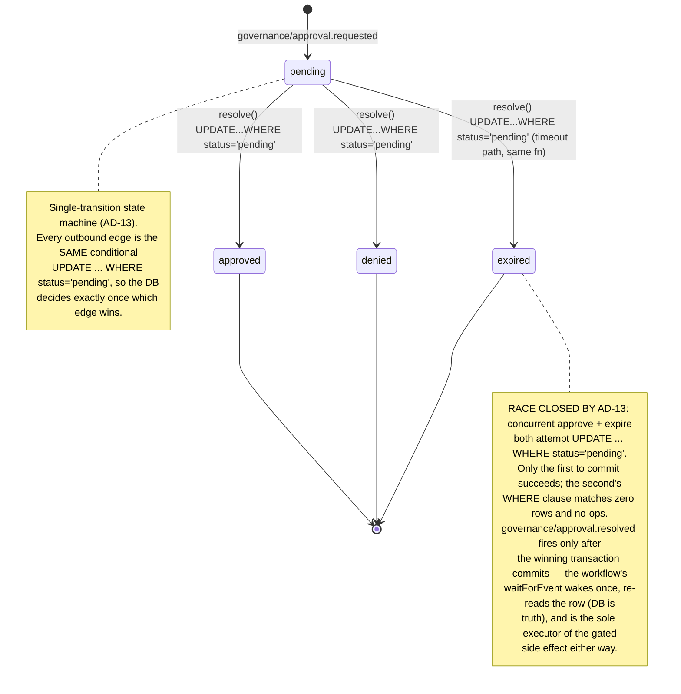
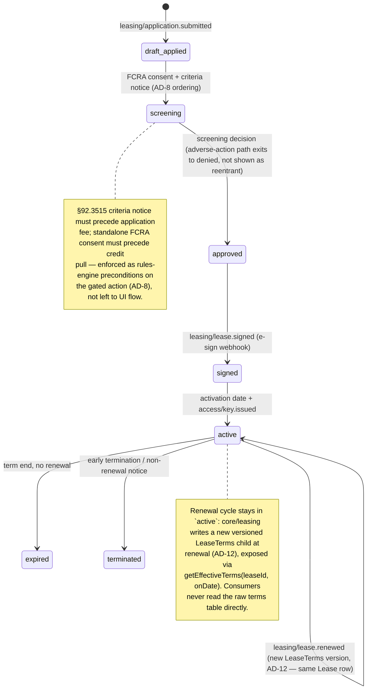
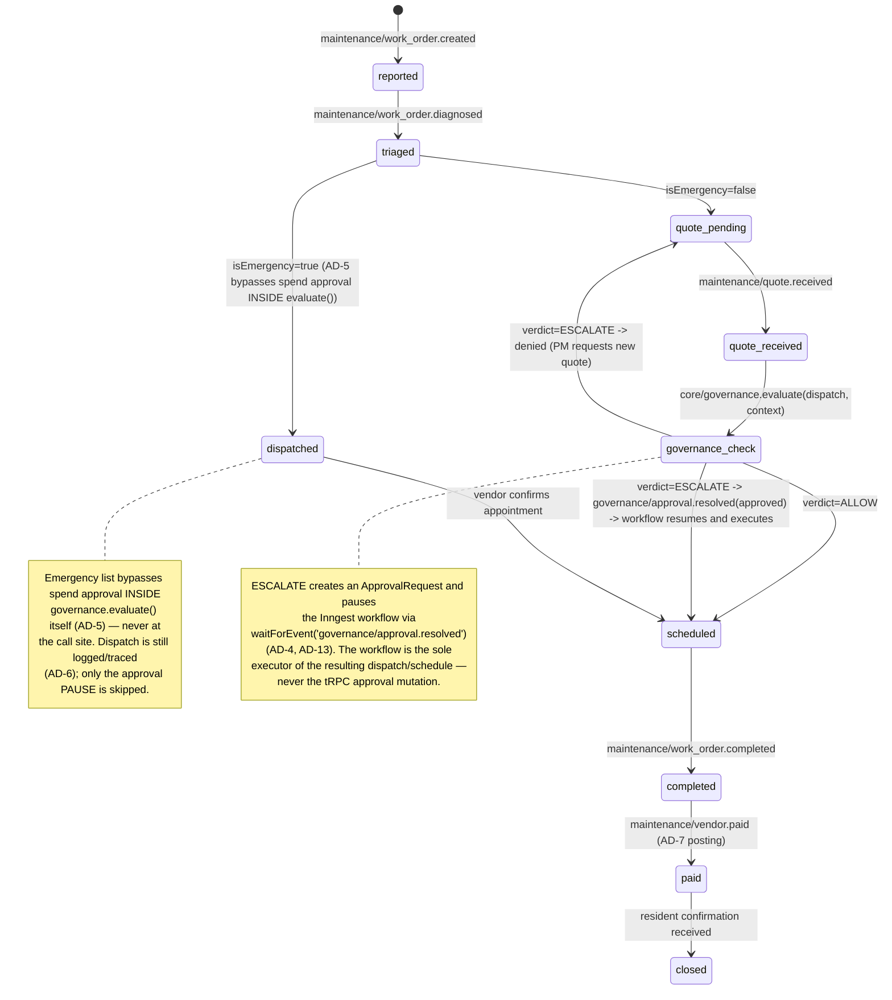
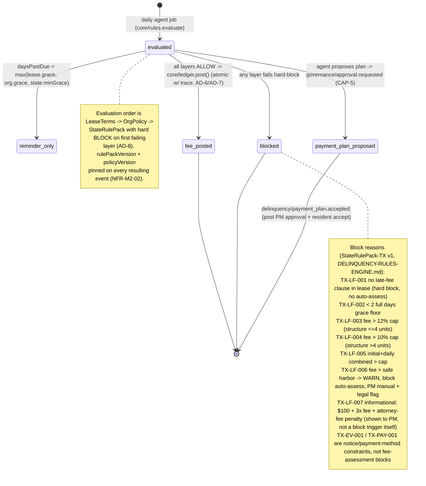
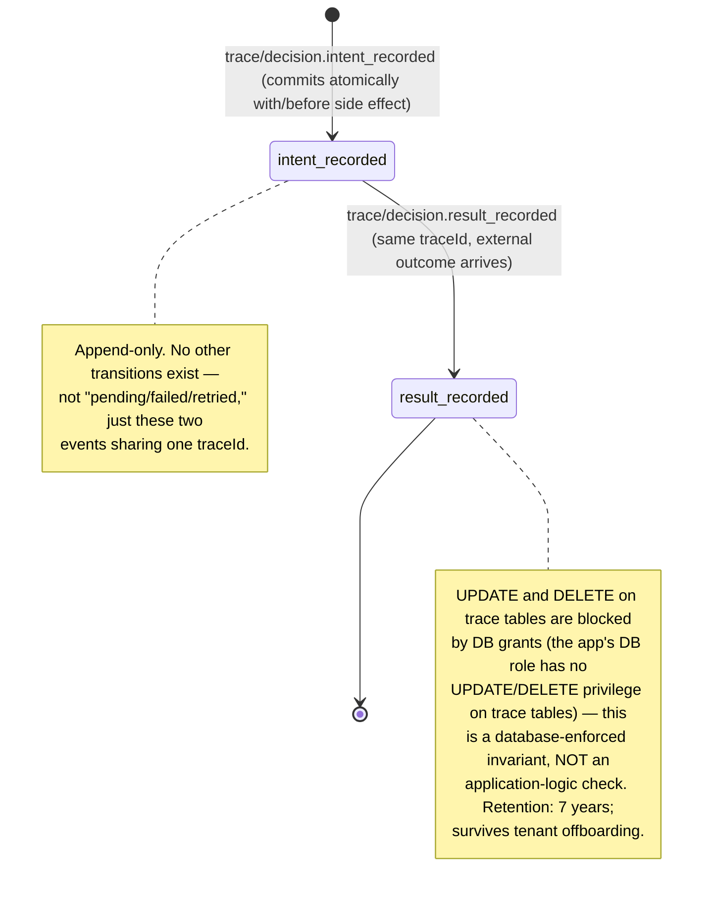

# Event Catalog & Entity State Machines — RentalPro.ai

Reference companion to `ARCHITECTURE-SPINE.md`. This is the concrete `packages/events` contract (AD-14) and the state-machine behavior behind AD-12's "one computer per derived status." Not a tutorial — cite AD IDs, don't re-derive them.

---

## Part 1 — Typed Event Catalog (AD-14)

**Naming convention:** `domain/noun.verb`, past tense. No exceptions, no string literals at call sites (lint/CI-enforced).

**Mandatory envelope on every event** (`packages/events`, Zod-validated, `EventSchemas`-registered):

```ts
{
  organizationId: string;   // AD-2 — tenant scope, required even for background jobs
  traceId: string;          // AD-6 — links intent/result trace events to this event
  occurredAt: string;       // ISO 8601, UTC (AD-11)
  schemaVersion: number;    // catalog PR bumps this on payload shape change
}
```

An event schema change is a catalog PR reviewed by producer **and** consumer owners (AD-14). `send()` / `waitForEvent` calls outside the catalog fail typecheck.

### 1.1 Governance (AD-5, AD-13)

| Event | Producer | Consumer(s) | Key payload fields |
| --- | --- | --- | --- |
| `governance/approval.requested` | `core/governance.evaluate()` on `ESCALATE` verdict | `agents/*` workflow (`waitForEvent` pause), PM approval inbox (tRPC read model) | `approvalRequestId`, `action`, `actionContext`, `requestedAmountCents?`, `module`, `expiresAt` |
| `governance/approval.resolved` | `core/governance.resolve()` — **only after** the conditional `UPDATE ... WHERE status='pending'` commits (AD-13) | The paused workflow's `waitForEvent('governance/approval.resolved')` | `approvalRequestId`, `verdict: approved \| denied \| expired`, `resolvedBy?`, `resolvedAt` |

> Naming note: this is the corrected name per AD-14 (`governance/approval.resolved`, not `approval.resolved` as an earlier draft had it — the wrong name would leave `waitForEvent` callers asleep forever).
>
> **Payload is a wake-up signal only.** On wake, the workflow re-reads the `ApprovalRequest` row — the event never carries the side-effect authorization itself; the DB row is truth (AD-13). This is why the event consumer list above is just "the paused workflow," never "the workflow, which then executes X" — execution is decided by the re-read, not the event.

### 1.2 Leasing (CAP-2, M3)

| Event | Producer | Consumer(s) | Key payload fields |
| --- | --- | --- | --- |
| `leasing/lead.received` | Inbound webhook translation (listing site / M1 syndication / direct inquiry) → `core/listings` or `core/leasing` | `agents/leasing` lead-to-lease workflow | `leadId`, `propertyId`, `unitId?`, `source`, `contactRef` |
| `leasing/application.submitted` | `core/leasing` (tRPC `publicProcedure` — prospect has no session, AD-3) | `agents/leasing` (screening step), `core/trace` | `applicationId`, `leadId`, `unitId`, `screeningConsentId` |
| `leasing/lease.signed` | `core/leasing` on e-sign webhook translation (AD-9) | `agents/leasing` (activation step → CAP-12 key issuance), `core/ledger` (first-payment expectation), `core/trace` | `leaseId`, `unitId`, `leaseTermsVersion`, `signedAt`, `esignEnvelopeRef` |
| `leasing/lease.renewed` | `core/leasing` at renewal e-sign completion (M3, AD-12 — new `LeaseTerms` version) | `core/ledger` (rent schedule update), `agents/leasing` (renewal workflow close-out), owner reporting read model | `leaseId`, `newLeaseTermsVersion`, `previousLeaseTermsVersion`, `effectiveDate` |

### 1.3 Smart Access (CAP-12, Seam)

| Event | Producer | Consumer(s) | Key payload fields |
| --- | --- | --- | --- |
| `access/key.issuance_requested` | `agents/leasing` workflow step, triggered by `leasing/lease.signed` + activation date reached | `integrations/seam` adapter (via `core` port call) | `leaseId`, `unitId`, `residentId`, `activationWindow` |
| `access/key.issued` | Seam webhook translation (`seam/lock.unlocked`-adjacent provisioning callback) → `core/leasing` or dedicated `core/access` per registry | Resident portal (CAP-7 notification), `core/trace` (result event, AD-6) | `leaseId`, `unitId`, `seamCredentialId`, `issuedAt`, `expiresAt?` |

### 1.4 Maintenance (CAP-3, CAP-9)

| Event | Producer | Consumer(s) | Key payload fields |
| --- | --- | --- | --- |
| `maintenance/work_order.created` | `core/maintenance` (resident portal submission or PM-initiated) | `agents/maintenance` triage workflow | `workOrderId`, `unitId`, `residentId`, `mediaFileIds`, `reportedAt` |
| `maintenance/work_order.diagnosed` | `agents/maintenance` after AI triage (AD-10 gateway; LLM output is a proposal) | `agents/maintenance` (routing: emergency-dispatch vs quote path per AD-5), owner/PM notification | `workOrderId`, `category`, `severity`, `isEmergency`, `diagnosisConfidence` |
| `maintenance/quote.received` | `integrations/*` vendor-quote channel → `core/maintenance` | `agents/maintenance` (governance check step), `core/trace` | `workOrderId`, `vendorId`, `quoteId`, `amountCents` |
| `maintenance/work_order.scheduled` | `core/maintenance` after governance `ALLOW` or approved `ESCALATE` (AD-5) | Vendor comms (`core/comms`), resident notification, `core/trace` | `workOrderId`, `vendorId`, `scheduledFor` |
| `maintenance/work_order.completed` | `core/maintenance` on vendor completion confirmation (photo/signoff) | `agents/maintenance` (payment step), resident confirmation request (CAP-7) | `workOrderId`, `completedAt`, `completionMediaFileIds` |
| `maintenance/vendor.paid` | `core/ledger` posting confirmation (Stripe Connect payout, AD-7 posting catalog) | `core/trace`, owner reporting, `agents/maintenance` (close-out) | `workOrderId`, `vendorId`, `amountCents`, `sourceRef` |

### 1.5 Accounting & Ledger (CAP-4, AD-7)

| Event | Producer | Consumer(s) | Key payload fields |
| --- | --- | --- | --- |
| `accounting/transaction.categorized` | `agents/accounting` AI categorization (AD-10), applies **only** to unmatched externally-originated bank-feed items (AD-7) | `core/ledger` (posting step), `core/trace` | `bankTxnId`, `proposedCategory`, `confidence`, `sourceRef` |
| `accounting/ledger.posted` | `core/ledger.post()` — the only ledger writer (AD-7) | Owner reporting read models, `core/trace` (result event), delinquency engine (balance recheck) | `ledgerTxnId`, `sourceRef`, `entries[] {accountId, amountCents, direction}`, `accountClass: trust \| operating` |
| `accounting/month.closed` | `core/ledger` on accountant sign-off (CAP-4 human gate) | Owner distribution calculation, owner reporting (CAP-8) | `organizationId`, `period`, `closedBy`, `closedAt` |

### 1.6 Delinquency (M2)

Full flow and block-code semantics in `docs/DELINQUENCY-RULES-ENGINE.md`; this is the event-shape summary. Rule evaluation order is `LeaseTerms → OrgPolicy → StateRulePack` (AD-8); every event pins `rulePackVersion` and `policyVersion` (NFR-M2-02).

| Event | Producer | Consumer(s) | Key payload fields |
| --- | --- | --- | --- |
| `delinquency/fee.assessed` | `core/rules` + `core/ledger` (daily agent job, atomic post) | `core/comms` (resident notify), owner reporting, `core/trace` | `leaseId`, `amountCents`, `rulePackVersion`, `policyVersion`, `daysPastDue` |
| `delinquency/fee.blocked` | `core/rules` on hard-block (any layer fails, AD-8) | PM admin alert, `core/trace` | `leaseId`, `blockReason` (TX-LF-001..007), `rulePackVersion`, `attemptedAmountCents` |
| `delinquency/payment_plan.proposed` | `agents/accounting` delinquency workflow → `governance/approval.requested` (CAP-5 gate, D4 locked decision) | PM approval inbox, `core/trace` | `leaseId`, `proposedMonths`, `installmentAmountCents`, `approvalRequestId` |
| `delinquency/payment_plan.accepted` | `core/leasing`/`core/ledger` on resident portal acceptance (post PM approval) | `core/ledger` (schedule creation), `core/comms` | `leaseId`, `paymentPlanId`, `scheduleEntries[]` |

### 1.7 Comms (M7, AD-15)

| Event | Producer | Consumer(s) | Key payload fields |
| --- | --- | --- | --- |
| `comms/message.sent` | `core/comms.send()` — sole write path, atomic with `Conversation` row insert | M7 unified inbox read model, `core/trace` | `conversationId`, `contextRef`, `channel`, `templateId`, `recipientRef` |
| `comms/message.received` | Twilio/Resend/chat webhook translation → routed via `contextRef` (workOrderId / leaseId / delinquencyCaseId) | The owning workflow (`agents/*`) waiting on that `contextRef`; M7 inbox | `conversationId`, `contextRef`, `channel`, `fromRef`, `body` |

### 1.8 Trace / Decision (CAP-10, AD-6)

| Event | Producer | Consumer(s) | Key payload fields |
| --- | --- | --- | --- |
| `trace/decision.intent_recorded` | `core/trace` — commits atomically with (or before) the side effect | `core/trace` storage only (append-only); read side is audit/query, not event-driven | `traceId`, `module`, `decisionType` (governance \| rules \| llm \| override), `inputsRef`, `policyVersion?` |
| `trace/decision.result_recorded` | `core/trace` — same `traceId`, written when the external outcome arrives | Audit/query read models | `traceId`, `outcome`, `externalRef?`, `resultAt` |

Governance, rules-engine, and LLM-gateway verdicts trace themselves inside those modules — call sites never re-trace (AD-6). No UPDATE/DELETE on trace tables (DB-grant enforced, not application logic).

### 1.9 Webhook Translation Events (per provider, AD-9)

Inbound webhooks: verify signature → dedupe on provider event ID → translate to one of these typed events → return 200. No business logic in the handler itself.

| Event | Producer (adapter) | Consumer(s) | Key payload fields |
| --- | --- | --- | --- |
| `stripe/transfer.created` | `integrations/stripe` webhook route | `core/ledger` (reconciliation against `source_ref`, AD-7) | `stripeTransferId`, `amountCents`, `destinationAccountRef` |
| `stripe/payment.succeeded` | `integrations/stripe` webhook route | `core/ledger` (rent/fee payment posting), `agents/leasing` (first-payment confirmation) | `stripePaymentIntentId`, `amountCents`, `leaseId?`, `sourceRef` |
| `seam/lock.unlocked` | `integrations/seam` webhook route | `core/access` / `core/leasing` (audit of physical access events), `core/trace` | `seamCredentialId`, `unitId`, `unlockedAt`, `method` |
| `bank_feed/transaction.synced` | `integrations/plaid` (or vendor-agnostic bank-feed adapter) webhook/poll translation | `agents/accounting` (categorization step, AD-7 — creates postings only for unmatched items) | `bankTxnId`, `amountCents`, `postedDate`, `accountRef`, `sourceRef` |

*(Named `bank_feed/transaction.synced` rather than `plaid/transaction.synced` per the spine's Deferred note that Plaid-vs-Stripe-only bank feeds is still open — the domain event stays vendor-agnostic; if Plaid is confirmed the adapter name can differ from the event domain without a catalog change.)*

---

## Part 2 — Entity State Machines

Per AD-12: every derived status has exactly one computing function in its owning module. Diagrams below show the state machine; each is annotated with **Owner** (the module) and **Guard AD** (which invariant governs the transition logic).

### 2.1 ApprovalRequest

**Owner:** `core/governance` (sole writer, per AD-5/AD-12) · **Guard AD:** AD-13



### 2.2 Lease

**Owner:** `core/leasing` (owns `Lease` **and** `LeaseTerms`, AD-12) · **Guard AD:** AD-8 (statutory sequencing), AD-12 (`LeaseTerms` versioning), AD-13 (approval gates during screening/spend)



### 2.3 WorkOrder

**Owner:** `core/maintenance` (`workOrderStage` is a derived status with one computing function, AD-12) · **Guard AD:** AD-5 (governance choke point + emergency bypass), AD-13 (approval wait)



### 2.4 DelinquencyEvent

**Owner:** `core/rules` (evaluation) + `core/ledger` (posting) — `delinquencyStatus` derivation lives in `core/rules` per AD-12 · **Guard AD:** AD-8 (3-layer engine), AD-7 (posting), AD-11 (legal-day math via `core/time`)



### 2.5 DecisionTrace

**Owner:** `core/trace` (sole write path, AD-6/AD-12) · **Guard AD:** AD-6



---

## Cross-reference: state ownership registry (AD-12 excerpt)

| Entity / derived status | Owning module | Guard AD(s) |
| --- | --- | --- |
| `ApprovalRequest.status` | `core/governance` | AD-5, AD-13 |
| `Lease.status`, `LeaseTerms` (versioned) | `core/leasing` | AD-8, AD-12, AD-13 |
| `WorkOrder.workOrderStage` | `core/maintenance` | AD-5, AD-13 |
| `DelinquencyEvent` / `delinquencyStatus` | `core/rules` (eval) + `core/ledger` (post) | AD-7, AD-8, AD-11 |
| `DecisionTrace` | `core/trace` | AD-6 |

This table is a projection of the full entity ownership registry, which per AD-12 lives in the architecture spine's workspace and must be updated before any epic adds an entity.
