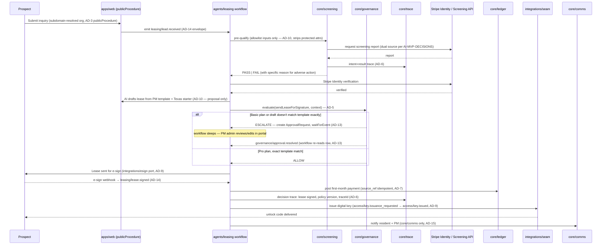
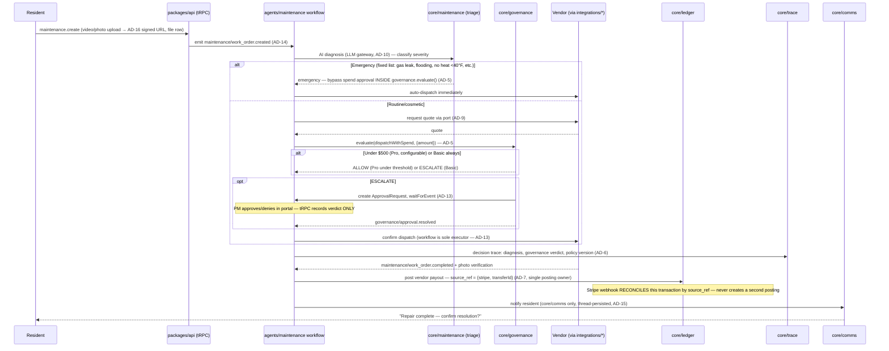
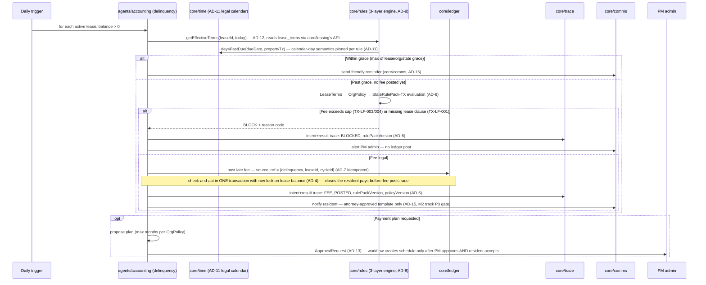
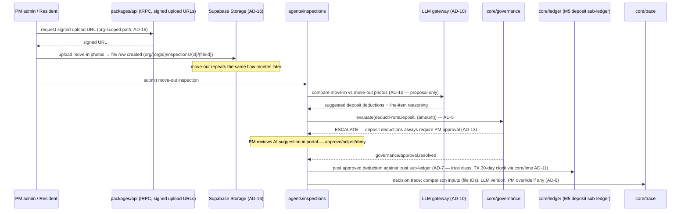
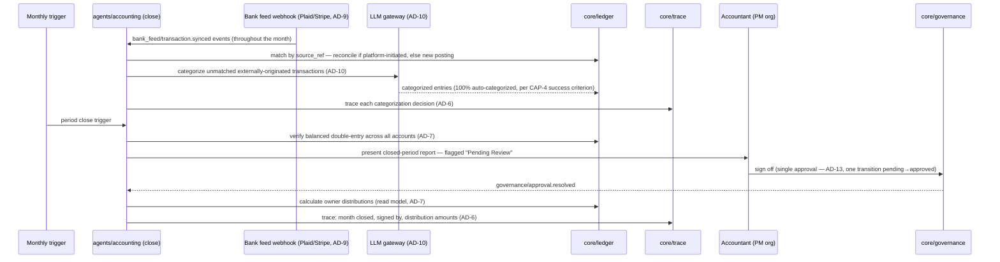

# Key Autonomous Flows — Sequence Diagrams

**Source of truth:** [`ARCHITECTURE-SPINE.md`](../../_bmad-output/planning-artifacts/architecture/architecture-rentalpro-2026-07-05/ARCHITECTURE-SPINE.md) (AD-1 … AD-17). This doc expands the spine's invariants into concrete step-by-step flows for the five autonomous processes that define the product. Every flow follows the same skeleton: **rules → governance → trace → side effect**, per AD-5/AD-6/AD-8.

Each diagram cites the AD(s) enforced at each step so a builder can verify compliance by inspection.

---

## 1. Lead → Lease → Key (CAP-2 + CAP-12, 48-hour SLA)

Owning modules: `core/leasing`, `agents/leasing`. Workflow: `leasing.lead_to_lease` (Inngest, keyed by `organizationId` + `leadId`).

**Governance checkpoints:** lease-send (AD-5/AD-13), first-payment confirmation implicitly gated by AD-7's idempotent post.
**Compliance ordering (AD-8):** §92.3515 criteria notice must precede the application fee charge; standalone FCRA consent must precede the credit pull — both enforced as rules-engine preconditions inside `core/screening`, not left to UI sequencing.

---

## 2. Maintenance Dispatch (CAP-3 + CAP-9)

Owning modules: `core/maintenance`, `agents/maintenance`. Workflow: `maintenance.work_order_lifecycle` (Inngest, keyed by `organizationId` + `workOrderId` per AD-4's per-aggregate concurrency rule).

**Governance checkpoint:** spend-threshold dispatch (AD-5/AD-13). **Idempotency:** vendor payout has exactly one posting owner — the workflow at transfer initiation (AD-7); the Stripe webhook reconciles, it does not re-post. **Toggle semantics (CAP-6/AD-5):** if maintenance `autonomyMode = human_approve`, `governance.evaluate()` returns ESCALATE for every non-emergency dispatch — the workflow still runs and triages, it never silently drops the request.

---

## 3. Delinquency → Late Fee (M2, three-layer rules engine)

Owning modules: `core/rules`, `core/ledger`. Workflow: `accounting.delinquency_daily` (Inngest, daily cron, keyed by `organizationId` + `leaseId` per AD-4).

**Compliance gate:** `StateRulePack-TX` requires an attorney sign-off record before this workflow runs in production (AD-8). **Race closed:** the balance check and fee post execute inside one scoped transaction with a lease-level lock — a resident payment landing via the tRPC path between "check" and "post" is impossible by construction (AD-4). **Idempotency:** a crashed/re-run daily job cannot double-post because `source_ref` is unique per lease per cycle (AD-7).

---

## 4. Move-In / Move-Out Inspection (M4)

Owning modules: `core/inspections`. Workflow: `inspections.compare` (Inngest, triggered on move-out inspection submission).

**Storage tenancy:** every photo is a `file` row under the org-prefixed path with RLS-mirrored bucket policy — cross-tenant leakage via a guessable URL is structurally prevented (AD-16). **Trust accounting:** deductions move funds from the trust class to operating only through this governance-gated path, never a direct ledger write (AD-7/M5). **Retention:** files referenced by the resulting `DecisionTrace` inherit 7-year retention even if the lease is later deleted from active view (AD-6/AD-16).

---

## 5. Monthly Accounting Close (CAP-4, "one sign-off" success criterion)

Owning modules: `core/ledger`, `core/rules`. Workflow: `accounting.monthly_close` (Inngest, monthly cron per org).

**Zero manual journal entries:** every entry traces to either a platform-initiated posting (workflow flows 1–4 above) or an LLM-categorized bank-feed item — there is no code path for a human to hand-enter a journal line (AD-7). **One sign-off:** the accountant's single approval transitions the entire period at once via the same `ApprovalRequest` machinery as every other approval in the system (AD-13) — no per-transaction approval UI exists.

---

## Cross-flow invariant recap

Every flow above shares the same four-beat rhythm — this is not incidental, it is AD-1/AD-5/AD-6/AD-13 forcing one shape onto all autonomous work:

1. **Evaluate** — `core/rules` and/or `core/governance` decide, never the workflow or the UI.
2. **Trace** — `core/trace` records intent before (or atomically with) the side effect.
3. **Act** — the workflow is the *only* executor of a gated side effect, whether resuming from an approval or proceeding directly.
4. **Notify** — `core/comms` is the only path to a human, keeping the M7 unified inbox complete by construction.

A builder implementing a *new* autonomous flow (Phase 2) should be able to redraw this same four-beat diagram before writing code — if a step doesn't fit one of the four beats, it's a sign the flow is routing around a choke point the spine intentionally created.
