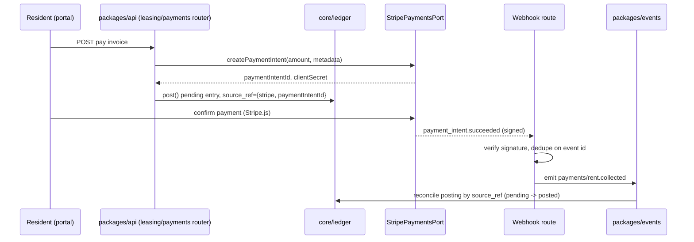
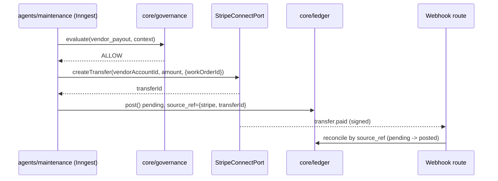
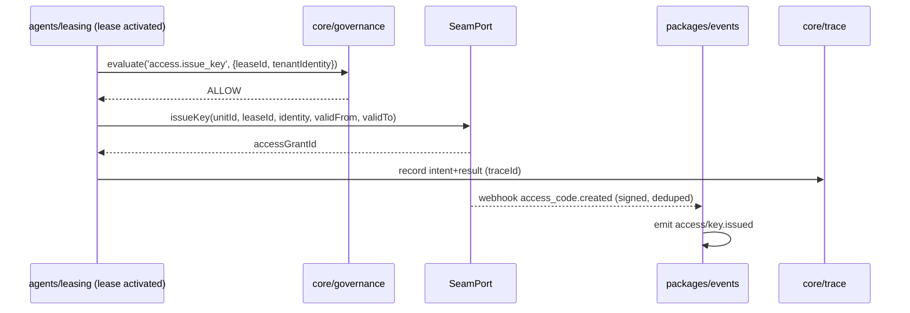
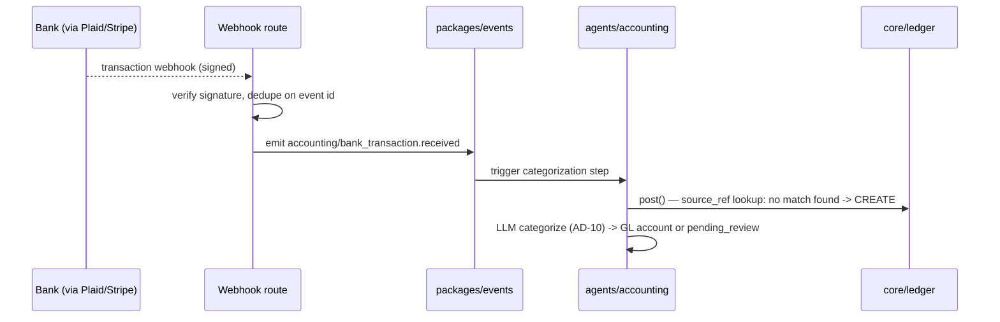
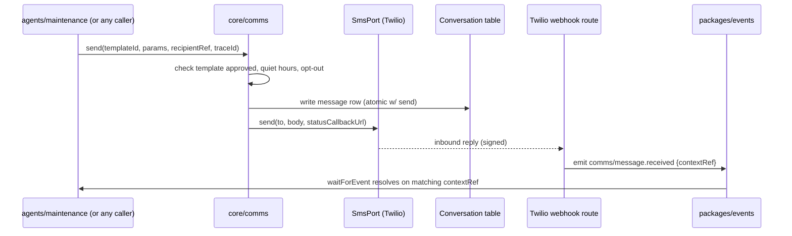
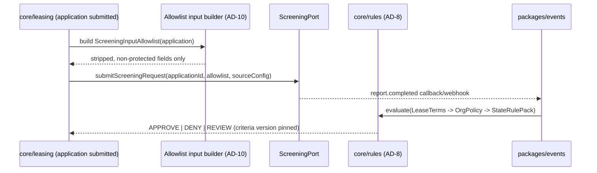
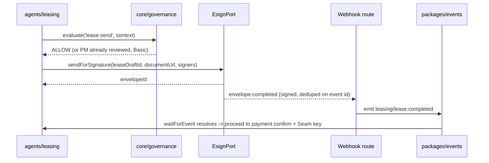

# External Integrations Architecture — RentalPro.ai

**Status:** reference — derives from ARCHITECTURE-SPINE.md (AD-9, AD-10, AD-14, AD-15, AD-7) and SPEC.md Constraint 8.
**Scope:** every third-party system RentalPro's domain core depends on. Vendor-agnostic where the spine leaves the vendor TBD.
**Source of truth:** `_bmad-output/planning-artifacts/architecture/architecture-rentalpro-2026-07-05/ARCHITECTURE-SPINE.md`, `_bmad-output/specs/spec-rentalpro/SPEC.md`, `docs/capabilities/CAP-{2,4,9,11,12}-*.md`, `docs/AI-MVP-DECISIONS.md`.

## Canonical rules (apply to every integration below)

1. **Ports, not SDKs (AD-9).** Domain code depends on a port interface in `packages/integrations/{vendor}/`. Vendor SDK types never cross into `packages/core` or `packages/agents`. Adapters are swappable per vendor without touching call sites.
2. **Webhook handling (AD-9, AD-14).** Every inbound webhook route: verify signature → dedupe on provider event ID (persisted, unique constraint) → translate to a typed catalog event in `packages/events` carrying the mandatory envelope `{ organizationId, traceId, occurredAt, schemaVersion }` → return `200`. The handler contains zero business logic — translation only. Event names follow `domain/noun.verb`, past tense.
3. **Money-moving idempotency (AD-7).** Any integration that moves money carries a `source_ref` (`{provider, providerTxnId}`) into `core/ledger.post()`, which is idempotent on it. Webhooks from Stripe **reconcile** platform-initiated postings matched by `source_ref`; they only **create** new postings for externally-originated items with no match (e.g., an unmatched bank-feed deposit). AI categorization applies only to that unmatched case.
4. **Comms choke point (AD-15).** Twilio and Resend adapters are export-scoped to `core/comms` only. No feature module, agent step, or router calls them directly. All sends go through `core/comms.send(templateId, params, recipientRef, traceId)`.
5. **LLM input hygiene (AD-10).** Any integration boundary that feeds applicant/tenant data into an LLM-backed decision (screening) uses an explicit allowlist input builder — never the raw entity object — to strip FHA/FCRA-protected fields by construction.
6. **Traceability (AD-6).** Outbound calls that represent a governed decision or side effect carry `traceId`; the intent event commits with (or before) the call, the result event records the external outcome.

---

## 1. Stripe — three distinct products, three distinct flows

Stripe is used for three unrelated purposes. They are separate ports with separate credentials/config even though they share one vendor — do not conflate them into a single `StripePort`.

### 1a. Stripe Payments — rent collection (CAP-4, CAP-7)

**Purpose:** resident rent/fee payment collection feeding the ledger (AD-7).

**Port:** `packages/integrations/stripe/payments-port.ts`

```ts
interface StripePaymentsPort {
  createPaymentIntent(orgStripeAccountId: string, amountCents: number, metadata: { organizationId, leaseId, invoiceId }): Promise<{ paymentIntentId: string, clientSecret: string }>
  retrievePaymentIntent(paymentIntentId: string): Promise<PaymentIntentStatus>
  refund(paymentIntentId: string, amountCents: number, reason: string): Promise<{ refundId: string }>
}
```

**Inbound webhooks** (`payment_intent.succeeded`, `payment_intent.payment_failed`, `charge.refunded`) → translate to:
- `payments/rent.collected` — `{ organizationId, leaseId, invoiceId, amountCents, source_ref: { provider: 'stripe', providerTxnId: paymentIntentId } }`
- `payments/rent.failed`
- `payments/refund.recorded`

**Outbound + idempotency:** `createPaymentIntent` is called once per invoice attempt with a Stripe `idempotencyKey = {organizationId}:{invoiceId}:{attempt}`. The resulting `paymentIntentId` becomes the `source_ref.providerTxnId`. `core/ledger.post()` is called at *intent creation* with a pending posting keyed on that `source_ref`; the webhook **reconciles** it (flips pending → posted or reverses on failure) rather than creating a new entry — per AD-7, webhooks never blindly create rent postings.



### 1b. Stripe Identity — applicant verification (CAP-2)

**Purpose:** identity verification step between screening approval and lease send.

**Port:** `packages/integrations/stripe/identity-port.ts`

```ts
interface StripeIdentityPort {
  createVerificationSession(applicationId: string, returnUrl: string): Promise<{ sessionId: string, clientSecret: string }>
  retrieveVerificationResult(sessionId: string): Promise<{ status: 'verified' | 'requires_input' | 'failed', extractedName?: string }>
}
```

**Inbound webhooks** (`identity.verification_session.verified`, `identity.verification_session.requires_input`) → translate to:
- `screening/identity.verified` — `{ organizationId, applicationId, source_ref: { provider: 'stripe', providerTxnId: sessionId } }`
- `screening/identity.failed`

No ledger involvement — this is a leasing-workflow gate, not a money event. `agents/leasing` `waitForEvent('screening/identity.verified')` after a governance `ALLOW` on the screening decision (CAP-2 step 5). Identity verification failure escalates to PM admin per CAP-2's escalation table.

### 1c. Stripe Connect — vendor payouts (CAP-9) and owner distributions (CAP-8)

**Purpose:** two distinct money-out flows, both riding the same connected-accounts primitive, one per PM org (CAP-11's per-org `stripeConnectAccountId`).

**Port:** `packages/integrations/stripe/connect-port.ts`

```ts
interface StripeConnectPort {
  createConnectedAccount(organizationId: string, type: 'vendor' | 'owner', kycData): Promise<{ connectAccountId: string, onboardingUrl: string }>
  createTransfer(fromOrgAccountId: string, toConnectAccountId: string, amountCents: number, metadata: { workOrderId? , distributionId? }): Promise<{ transferId: string }>
  getAccountStatus(connectAccountId: string): Promise<'pending' | 'active' | 'restricted'>
}
```

**Inbound webhooks** (`transfer.paid`, `transfer.failed`, `account.updated`) → translate to:
- `payments/vendor_payout.settled` — `{ organizationId, workOrderId, vendorId, source_ref: { provider: 'stripe', providerTxnId: transferId } }`
- `payments/owner_distribution.settled` — `{ organizationId, distributionId, ownerId, source_ref: {...} }`
- `payments/connect_account.updated`

**Outbound + idempotency:** `createTransfer` is invoked from `agents/maintenance` (vendor payout after completion verification, CAP-9) or the monthly-close distribution step (CAP-4/CAP-8), both gated by `core/governance.evaluate()` (AD-5) before the call. Same AD-7 pattern: a pending ledger posting is created with `source_ref = {stripe, transferId}` at transfer-creation time; the `transfer.paid` webhook reconciles it. Distribution transfers are additionally blocked pre-transfer by the CAP-4 monthly-close sign-off gate — `createTransfer` for distributions is unreachable until `MonthlyClose.status = signed_off`.



---

## 2. Seam — smart lock key issuance (CAP-12)

**Purpose:** time-bound digital key issuance triggered by lease activation (CAP-2 → CAP-12), governed by AD-5 (key issuance is a resident-facing side effect on the governance list).

**Port:** `packages/integrations/seam/seam-port.ts`

```ts
interface SeamPort {
  registerDevice(unitId: string, seamDeviceId: string): Promise<{ smartLockId: string }>
  issueKey(unitId: string, leaseId: string, tenantIdentity: VerifiedIdentityRef, validFrom: Date, validTo: Date): Promise<{ accessGrantId: string, seamAccessCodeId: string }>
  revokeKey(accessGrantId: string): Promise<void>
  getAccessEvents(smartLockId: string, since: Date): Promise<AccessEvent[]>
}
```

**Inbound webhooks** (`access_code.created`, `access_code.deleted`, `noise_sensor.noise_detected` — MVP uses lock events only) → translate to:
- `access/key.issued` — `{ organizationId, leaseId, unitId, accessGrantId, source_ref: { provider: 'seam', providerTxnId: seamAccessCodeId } }`
- `access/key.revoked`
- `access/door.unlocked` (informational, feeds CAP-10 trace + PM lock-status view)

**Outbound + idempotency:** `issueKey` is called by an `agents/leasing` Inngest step, gated by `core/governance.evaluate('access.issue_key', context)` (AD-5) — key issuance is explicitly named in AD-5's list of governed side effects (payments, fees, dispatches, lease sends, key issuance, notices). The step is idempotent via the Inngest step id keyed on `leaseId` (AD-4: concurrency keyed by aggregate id); retries on Seam API failure fall back to the CAP-12 escalation path (notify PM, manual key handoff) rather than retrying indefinitely. `revokeKey` fires on lease termination through the same governance gate.



---

## 3. Bank feed (Plaid or Stripe-only) — accounting (CAP-4)

**Status per spine's Deferred table:** Plaid vs. Stripe-only bank feeds is explicitly **not finally locked** — "Port defined; decide at CAP-4 epic," and the spine flags this as a conscious relaxation of SPEC Constraint 8 ("architecture phase finalizes"), to be raised as a spec amendment. **The port is therefore vendor-agnostic by design** so either vendor satisfies it without a core rewrite.

**Port:** `packages/integrations/bank-feed/bank-feed-port.ts` (concrete adapter is `plaid/` or folded into `stripe/payments-port.ts` if Stripe-only wins)

```ts
interface BankFeedPort {
  linkAccount(organizationId: string, publicToken: string): Promise<{ bankAccountRef: string }>
  listTransactions(bankAccountRef: string, since: Date): Promise<BankFeedTransaction[]>
  getAccountBalance(bankAccountRef: string): Promise<{ availableCents: number, currentCents: number }>
}
```

**Inbound webhooks** (Plaid: `TRANSACTIONS/SYNC_UPDATES_AVAILABLE`; Stripe-only equivalent: balance-transaction events) → translate to:
- `accounting/bank_transaction.received` — `{ organizationId, bankAccountRef, externalTxnId, amountCents, source_ref: { provider: 'plaid'|'stripe', providerTxnId: externalTxnId } }`

**Outbound + idempotency:** This is the AD-7 "externally-originated, no match" path. Unlike Stripe Payments/Connect, these transactions have **no prior platform-initiated posting** to reconcile against — `core/ledger.post()` is called to **create** a new posting keyed on `source_ref`, and only then does AI categorization (`agents/accounting`) assign GL accounts. If a `bank_transaction.received` event's `source_ref` happens to match an existing pending Stripe-originated posting (e.g., a Stripe payout settling into the bank), it reconciles instead of double-posting — the posting catalog (AD-7) designates one owner per money-event type to prevent this ambiguity from being decided ad hoc.



---

## 4. Twilio (SMS) and Resend (email) — comms choke point (AD-15)

**Purpose:** all outbound resident/owner/vendor/lead SMS and email. Per AD-15, these adapters are **only** reachable via `core/comms` — no feature or agent code imports them directly. This is enforced the same way as AD-9's SDK-isolation rule, but the boundary is `core/comms`, not just "a port."

**Ports:**

```ts
// packages/integrations/twilio/twilio-port.ts
interface SmsPort {
  send(to: string, body: string, statusCallbackUrl: string): Promise<{ providerMessageId: string }>
}

// packages/integrations/resend/resend-port.ts
interface EmailPort {
  send(to: string, subject: string, html: string, headers: { contextRef: string }): Promise<{ providerMessageId: string }>
}
```

**The only caller of both:** `core/comms.send(templateId, params, recipientRef, traceId)`. This owns:
- the versioned template registry (unapproved templates refuse to send in prod),
- opt-outs and quiet-hours enforcement,
- channel preference resolution,
- writing the `Conversation` message row **atomically** with the send.

LLM-drafted copy is passed in as template *parameters*, never a free-form body, for legally sensitive categories (AD-15).

**Inbound webhooks:**
- Twilio inbound SMS / delivery status (`MessageStatus=delivered|failed`, inbound `Body`) → `comms/message.received` or `comms/message.delivery_failed`
- Resend inbound (via configured reply-to + webhook, or SMTP inbound parse) → `comms/message.received`

Both translate to the **same** catalog event `comms/message.received` — `{ organizationId, conversationId, channel: 'sms'|'email', contextRef, body, traceId }`. Routing is via `contextRef` (workOrderId / leaseId / delinquencyCaseId) carried on the `Conversation` row, so the inbound reply wakes the correct paused workflow (`waitForEvent('comms/message.received')` scoped by `contextRef`) rather than a generic inbox handler containing business logic.

**Outbound + idempotency:** `core/comms.send()` is called with a `traceId`; retries on transient Twilio/Resend failure use provider-side retry/backoff, deduped by an internal `commsMessageId` (UUIDv7, AD-11) generated before the call so a retried `send()` doesn't double-send — the provider call includes this ID as a client reference where supported (Twilio doesn't natively idempotency-key SMS sends, so `core/comms` checks the `Conversation` row for an existing non-failed send with the same internal ID before calling out).



---

## 5. Screening API — dual-source (vendor TBD)

**Status per AI-MVP-DECISIONS.md:** dual-source is **locked** (integrated API **and** PM's own vendor, "A+B"); the specific integrated-API vendor (e.g., TransUnion SmartMove, RentPrep) and PM-vendor connection model (API key / manual upload / webhook) are **TBD**, parked pending CAP-2 epic. The native decision-layer thesis (Transparent Decision Engine / Portable Passport / Criteria-First, recommended combined "1+3") is also TBD.

**Port must support both sources through one interface** so `core/screening` never branches on vendor identity:

```ts
// packages/integrations/screening/screening-port.ts
interface ScreeningPort {
  submitScreeningRequest(applicationId: string, allowlistedInput: ScreeningInputAllowlist, sourceConfig: IntegratedApiConfig | PmVendorConfig): Promise<{ screeningReportRef: string }>
  getReportStatus(screeningReportRef: string): Promise<'pending' | 'complete' | 'failed'>
  // Platform NEVER stores raw report contents — only decision + criteria version + this ref (spine Consistency Conventions, security posture row)
}
```

`ScreeningInputAllowlist` is the AD-10 boundary artifact: an explicit allowlisted field set (income, employment, requested move-in date, criteria-relevant history) built by a dedicated input builder — never the `Application`/`Lead` entity passed wholesale — so protected-class fields (race, familial status, disability, etc.) cannot reach the vendor call or any downstream LLM decision layer by construction. This satisfies both AD-10 (FHA/FCRA-protected fields stripped by construction) and CAP-2's acceptance test ("Protected classes never in agent inputs").

**Inbound webhooks / callbacks** (vendor-specific; normalized at the adapter) → translate to:
- `screening/report.completed` — `{ organizationId, applicationId, screeningReportRef, source_ref: { provider: <vendor>, providerTxnId: screeningReportRef } }`
- `screening/report.failed`

Note: unlike Stripe/Seam, screening callbacks are not always webhook-shaped (PM's own vendor may be manual-upload) — the adapter normalizes polling or manual-ingest into the same catalog event so `core/screening`'s consumer code is uniform regardless of source.

**Outbound + idempotency:** `submitScreeningRequest` keyed by `applicationId` (one active request per application; re-submission requires explicit override). The resulting decision (APPROVE/DENY/REVIEW) is computed by `core/rules` (AD-8: `LeaseTerms → OrgPolicy → StateRulePack`) applied to the vendor's report reference — the vendor returns raw signal, RentalPro's rules engine (not the vendor) owns the decision, consistent with the "Criteria-First" thesis direction under consideration. DENY/REVIEW routes to adverse-action generation with the pinned criteria version (AD-6, AD-8).



---

## 6. E-sign — lease execution (vendor TBD)

**Status per spine's Deferred table:** "Port defined (AD-9); pick at CAP-2 epic — pricing + TX compliance review." Candidates named in CAP-2/AI-MVP-DECISIONS: DocuSign, Dropbox Sign (HelloSign), Documenso.

**Port:** `packages/integrations/esign/esign-port.ts`

```ts
interface EsignPort {
  sendForSignature(leaseDraftId: string, documentUrl: string, signers: SignerRef[]): Promise<{ envelopeId: string }>
  getEnvelopeStatus(envelopeId: string): Promise<'sent' | 'viewed' | 'partially_signed' | 'completed' | 'declined' | 'voided'>
  voidEnvelope(envelopeId: string, reason: string): Promise<void>
}
```

**Inbound webhooks** (vendor-specific event names, e.g. DocuSign Connect `envelope-completed`) → normalized and translated to:
- `leasing/lease.sent` — `{ organizationId, leaseDraftId, envelopeId, source_ref: { provider: <vendor>, providerTxnId: envelopeId } }`
- `leasing/lease.signed` (per-signer, if partial-signature tracking matters for CAP-2's multi-party leases)
- `leasing/lease.completed` — terminal event; triggers CAP-2 step 8 (first-payment confirmation) and, once payment confirms, the CAP-12 Seam key-issuance step
- `leasing/lease.declined`

**Outbound + idempotency:** `sendForSignature` is called once per `LeaseDraft` version by an `agents/leasing` Inngest step; re-send after PM edit creates a new `envelopeId` (old one voided), never mutates the sent envelope. Gated by CAP-2's review rule (Basic: PM always reviews before send; Pro: auto-send only if draft matches template exactly — rule TBD). `leasing/lease.completed` is the event `agents/leasing` awaits via `waitForEvent` before proceeding to CAP-12 key issuance — this chains directly into the Seam sequence in Section 2.



---

## Vendor selection status

| Integration | Vendor | Locked? | Port defined | Blocking for epic |
|---|---|---|---|---|
| Payments | Stripe Payments | Locked (SPEC Constraint 8) | Yes | CAP-4, CAP-7 |
| Identity verification | Stripe Identity | Locked (SPEC Constraint 8 / HANDOFF direction) | Yes | CAP-2 |
| Vendor payouts / owner distributions | Stripe Connect | Locked (SPEC Constraint 8) | Yes | CAP-8, CAP-9 |
| Smart access | Seam | Locked (SPEC Constraint 8) | Yes | CAP-12 |
| Bank feed | Plaid **or** Stripe-only | **TBD** — decide at CAP-4 epic; spec-amendment flag raised in spine | Yes (vendor-agnostic) | CAP-4 |
| SMS | Twilio | Locked (SPEC Constraint 7/HANDOFF direction) | Yes | M7, CAP-7, CAP-9 |
| Email | Resend | Locked (HANDOFF direction) | Yes | M7, CAP-7 |
| Screening — integrated API | TBD (e.g. TransUnion SmartMove, RentPrep) | **TBD** — parked, resolve before CAP-2 build | Yes (dual-source interface) | CAP-2 |
| Screening — PM's own vendor | TBD (connection model: API key / upload / webhook) | **TBD** | Yes (same interface) | CAP-2 |
| E-sign | TBD (DocuSign / Dropbox Sign / Documenso) | **TBD** — pick at CAP-2 epic (pricing + TX compliance) | Yes | CAP-2 |
