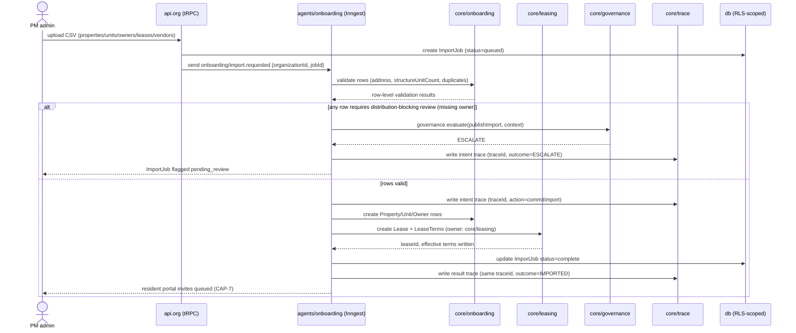

# CAP-1: Portfolio Onboarding

**Status:** draft  
**SPEC reference:** CAP-1  
**MVP phase:** 1  
**Depends on:** CAP-11

## Intent & success (from SPEC)

- **Intent:** PM company onboards portfolio (properties, units, owners, tenants, vendors) into isolated tenant workspace with imported historical records.
- **Success:** PM admin uploads 50-unit portfolio; all units, active leases, and vendor records accessible in branded workspace within one business day of import completion.

## User stories

| Actor | Story |
|-------|-------|
| PM admin | I import properties/units via CSV or manual entry. |
| PM admin | I attach owners to properties; management fee is locked at 7%. |
| PM admin | I import active leases with tenant contact info. |
| PM admin | I import vendor list with trade categories. |
| PM staff | I see only my org's portfolio after import. |

## Happy path

1. PM admin completes org setup (CAP-11).
2. Upload CSV templates: properties → units → owners → leases → vendors (or API bulk import).
3. System validates Texas address fields; maps units to properties.
4. Active leases create resident portal invites (CAP-7).
5. Vendors available to maintenance agent (CAP-9).
6. Chart of accounts template applied (CAP-4).
7. Import job status visible; errors row-level with fix-and-retry.

## Escalation path

| Trigger | Action |
|---------|--------|
| Duplicate unit/property | Block row; PM fixes CSV |
| Missing owner on managed property | Warning; block distribution until resolved |
| Invalid lease dates | Row error; manual fix |

## Integrations

| Service | Use |
|---------|-----|
| Supabase Storage | CSV upload |
| CAP-11 | organizationId on all imported rows |

## Data model (draft)

| Entity | Key fields |
|--------|------------|
| `Property` | organizationId, name, address, ownerId, builtYear, floodplainFlag |
| `Unit` | organizationId, propertyId, unitNumber, rent, status |
| `Owner` | organizationId, name, email, portalUserId, managementFeePercent=7 |
| `Lease` | organizationId, unitId, tenantId, startDate, endDate, rent, status |
| `ImportJob` | organizationId, type, status, errorLog JSON |

## API surface (draft)

| Method | Endpoint | Purpose |
|--------|----------|---------|
| POST | `/api/orgs/current/import/:type` | Upload CSV |
| GET | `/api/orgs/current/import/:jobId` | Job status |
| POST | `/api/orgs/current/properties` | Manual CRUD |
| POST | `/api/orgs/current/units` | Manual CRUD |

## Acceptance tests

- [ ] 50-unit CSV import completes; all units searchable in org workspace
- [ ] Imported data not visible to other orgs
- [ ] Active lease creates resident record linked to unit
- [ ] Vendor import available in maintenance dispatch

## Open questions

- [ ] Supported import formats beyond CSV (AppFolio export, Buildium)?
- [ ] Historical ledger import scope for MVP?

## Architecture

*Per `ARCHITECTURE-SPINE.md` Capability → Architecture Map. See that doc for full AD text.*

### Owning modules

- **Core:** `core/onboarding` owns `ImportJob` and orchestrates row-level validation/creation of `Property`, `Unit`, `Owner`, `Lease` (import path) — but per AD-12, `Lease`/`LeaseTerms` write API is `core/leasing`, so CAP-1's import flow calls into `core/leasing` rather than writing those tables itself.
- **tRPC router:** `org` router (and `leasing`/`listings` for imported lease/unit records exposed post-import), per the Consistency Conventions router list.
- **Inngest workflow:** `agents/onboarding` import workflow (per AD-4 — CSV bulk import is exactly the kind of multi-step, long-lived process AD-4 requires as a durable function: parse → validate → create rows → invite residents → report row-level errors, resumable across steps).

### Governing decisions

| AD | What it constrains for CAP-1 |
| --- | --- |
| AD-2 | Every imported row (`Property`, `Unit`, `Owner`, `Lease`, `Vendor`) is written through the org-scoped Drizzle client; `organizationId` comes from the authenticated session/subdomain, never from the CSV payload |
| AD-4 | The CSV/API bulk import is an Inngest workflow, not a synchronous request — concurrency keyed by `organizationId` so two simultaneous imports for one org don't race on duplicate-row checks |
| AD-11 | `Property`/`Unit`/`Lease` dates and rent import as `date` columns and integer cents respectively; IDs generated as UUIDv7 on write, never taken from source CSV/export |
| AD-12 | CAP-1 is the **declaring consumer**, not owner, of cross-module required fields — `property.structure_unit_count` must be captured at import time because M2 (CAP-4) enforces it NOT NULL at `core/ledger`'s and `core/rules`' read path; CAP-1 also defers to `core/leasing` as the sole writer of `Lease`/`LeaseTerms` even during import |

### Primary flow — CSV portfolio import

### Cross-CAP dependencies

- **CAP-1 → CAP-2 (`core/leasing`):** CAP-1 does not own `Lease`/`LeaseTerms`; it invokes `core/leasing`'s write API during import so a historically-imported lease is indistinguishable from one originated by CAP-2's autonomous flow.
- **CAP-1 → CAP-4/M2:** `property.structure_unit_count` and `builtYear`/`floodplainFlag` captured here are cross-module required fields per AD-12 — M2's rule engine (`TX-LF-003` vs `TX-LF-004`) cannot evaluate a late-fee cap without `structure_unit_count`, so CAP-1's import validation must enforce it NOT NULL before a property is usable by CAP-4.
- **CAP-1 → CAP-7:** active-lease import triggers resident portal invites (`core/comms` per AD-15), not a direct email send from `core/onboarding`.
- **CAP-1 → CAP-9:** imported `Vendor` records become readable by `agents/maintenance` for CAP-3/CAP-9 dispatch selection.
- **CAP-1 ← CAP-11:** onboarding cannot run until the org/tenant workspace and RLS policies exist (AD-2); CAP-1 is listed as depending on CAP-11 for this reason.

## Decisions log

| Date | Decision |
|------|----------|
| 2026-07-06 | Management fee locked at 7% (no per-property override); baked into Owner entity |
| 2026-07-05 | Draft micro-spec; Texas property fields required (floodplain, builtYear for lease addenda) |
