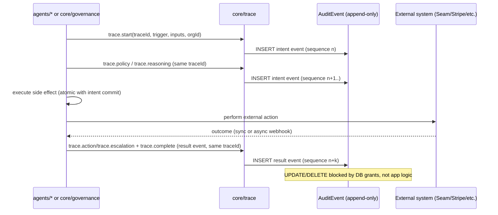

# CAP-10: Audit Trail

**Status:** draft  
**SPEC reference:** CAP-10  
**MVP phase:** 0  
**Depends on:** CAP-11

## Intent & success (from SPEC)

- **Intent:** Every autonomous agent action produces an immutable audit record sufficient for tax, legal, and fair-housing review.
- **Success:** An auditor can trace any autonomous leasing or maintenance decision to inputs, policy applied, actions taken, and human overrides within 60 seconds.

## User stories

| Actor | Story |
|-------|-------|
| PM admin | I can view a full trace of any agent decision in my org by applicant ID, work order ID, or transaction ID. |
| PM admin | I see who overrode an agent and why. |
| Auditor | I export org audit records for a date range as JSON or CSV. |
| Platform ops | I see cross-tenant security events (IDOR, RLS violations). |
| AI agent | I write a decision trace before any side-effecting action. |
| Accountant | I trace any ledger categorization to source transaction and agent reasoning. |

## Happy path

1. Agent receives trigger → creates `DecisionTrace` with `traceId`.
2. Agent logs `trace.start` (trigger, inputs, orgId).
3. Agent evaluates governance (CAP-5) → logs `trace.policy`.
4. Agent logs `trace.reasoning` (model version, summary, promptHash — not full prompt in MVP).
5. Agent executes or escalates → logs `trace.action` or `trace.escalation`.
6. Human approves if escalated → logs `trace.override`.
7. Agent logs `trace.complete`.
8. PM admin searches by entity ID → full chain rendered in one view (<60s).

## Escalation path

| Trigger | Logged as |
|---------|-----------|
| Cross-tenant access attempt | `security.access_denied` + alert platform ops |
| RLS violation | `security.rls_violation` |
| Applicant disputes screening | Export trace bundle for fair-housing review |
| Legal hold | Flag traces; block purge |

## Integrations

| Service | Use |
|---------|-----|
| Supabase PostgreSQL | Append-only `AuditEvent` table; INSERT only for app role |
| CAP-5 | Policy version referenced in traces |
| CAP-11 | All events scoped by `organizationId` |

## Data model (draft)

| Entity | Key fields |
|--------|------------|
| `DecisionTrace` | id, organizationId, traceId, agentType, triggerRef, status, policyVersion, startedAt, completedAt |
| `AuditEvent` | id, organizationId, traceId, sequence, eventType, actorType, actorId, entityType, entityId, payload JSON, createdAt |

**Immutability:** No UPDATE/DELETE on `AuditEvent` via application role. **Retention (TBD):** recommend 7 years.

## API surface (draft)

| Method | Endpoint | Purpose |
|--------|----------|---------|
| GET | `/api/orgs/current/audit/traces/:traceId` | Full decision trace |
| GET | `/api/orgs/current/audit/events` | Filtered event list |
| GET | `/api/orgs/current/audit/export` | Bulk JSON/CSV export |
| GET | `/api/platform/audit/security` | Cross-org security events |

## Acceptance tests

- [ ] Leasing decision trace retrievable by applicant ID in under 60 seconds
- [ ] Maintenance decision trace retrievable by work order ID in under 60 seconds
- [ ] UPDATE/DELETE on AuditEvent fails for app role
- [ ] Agent side-effect without trace.start is rejected
- [ ] Org A cannot read Org B audit events
- [ ] IDOR attempt creates security.access_denied event
- [ ] Screening denial trace includes criteria version, rationale, adverse action flag

## Open questions

- [ ] Retention: 7 years vs 3 years?
- [ ] PDF formal audit report — Phase 2?

## Architecture

CAP-10 is AD-6 promoted to a capability: `core/trace` is the sole write path for `DecisionTrace`/`AuditEvent` rows, and every other CAP's side effects route through it.

**Owning modules**

- `core/trace` — the only module permitted to write `DecisionTrace` and `AuditEvent`; exposes `trace.start`, `trace.policy`, `trace.reasoning`, `trace.action`/`trace.escalation`, `trace.override`, `trace.complete`. Side-effect helpers elsewhere in `core` require a `traceId` argument so an untraced call doesn't typecheck.
- `core/governance` — traces its own verdicts (`ALLOW | ESCALATE | BLOCK`) inside `evaluate()`; callers never re-trace.
- `core/rules` — traces rules-engine outcomes (StateRulePack version pinned per AD-8) inside its own evaluation, not at call sites.
- `agents/*` (Inngest functions) — every autonomous workflow step that performs a side effect calls `core/trace` before/atomically with that effect.
- tRPC routers: `governance` (approval resolution), plus read-only `audit` procedures backing the API surface above (`GET .../audit/traces/:traceId`, `.../audit/events`, `.../audit/export`, platform `security` feed).

**Governing decisions**

| AD | Constrains |
| --- | --- |
| AD-6 | Core rule for this CAP: `core/trace` is the only write path; intent event commits atomically with (or before) the side effect, result event shares `traceId`; no UPDATE/DELETE (DB grants); 7-year retention surviving tenant offboarding |
| AD-2 | Every `AuditEvent`/`DecisionTrace` row is `organizationId`-scoped and RLS-enforced like any tenant table |
| AD-4 | Inngest workflow steps are the primary producers of intent/result trace pairs — guard+mutate inside one scoped txn, traced as one intent event |
| AD-5 | Governance verdicts (`ALLOW/ESCALATE/BLOCK`) are traced inside `core/governance.evaluate()`, referenced here as `trace.policy` |
| AD-8 | Rules-engine outcomes trace the `StateRulePack` version pinned on the event, per the 3-layer evaluation order |
| AD-13 | Approval resolution (`trace.override`) is recorded by the single-transition `ApprovalRequest` state machine, traced once per resolution |
| AD-16 | Files referenced by a `DecisionTrace` inherit trace retention (7 years, delete-blocked) — the `file` row, not the trace, is what expires later or never |

**Trace write pattern**

**Cross-CAP dependencies**

`core/trace` is called by every governed CAP's agent/governance code — it is the fan-in point of the whole platform: CAP-2 leasing decisions and lease-signing steps, CAP-3/CAP-9 maintenance dispatch and vendor selection, CAP-4 ledger postings and delinquency assessments, CAP-5 every governance verdict, CAP-12 key issuance/revocation, M1 listing syndication, M4 inspection comparisons. CAP-10 in turn depends on CAP-11 for tenant scoping (every trace row is `organizationId`-bound and RLS-protected) and on AD-16's `file` table when a trace references stored documents (e.g., signed leases, inspection photos) — those files inherit the trace's 7-year retention.

## Decisions log

| Date | Decision |
|------|----------|
| 2026-07-05 | Draft micro-spec; reasoning = summary + modelVersion + promptHash (not full prompt MVP) |
