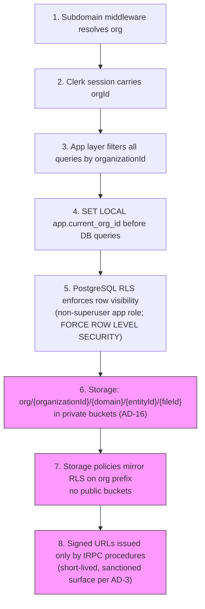

# CAP-11: Multi-Tenant B2B SaaS

**Status:** locked  
**SPEC reference:** CAP-11  
**MVP phase:** 0  
**Locked:** 2026-07-05

## Intent & success (from SPEC)

- **Intent:** Platform operates as multi-tenant B2B SaaS with per-PM-company data isolation, white-label branding, and independent configuration.
- **Success:** Two PM companies on the platform cannot access each other's data; each presents distinct branding to their owners and residents in a penetration test.

## User stories

| Actor | Story |
|-------|-------|
| PM admin | As a PM company admin, I want my own branded workspace at `{slug}.rentalpro.ai` so my owners and residents see my brand, not a generic RentalPro UI. |
| PM staff | As PM staff, I only see properties and units in my org so I cannot accidentally cross portfolios. |
| Owner | As an owner, I log into my PM company's branded portal and see my PM's logo and colors. |
| Resident | As a resident, I access `{pmco}.rentalpro.ai` and see my PM's logo, colors, and display name. |
| Platform ops | As RentalPro ops, I want tenant isolation so one PM company's data never leaks to another. |
| Platform ops | As RentalPro ops, I can provision and suspend orgs and audit cross-tenant access attempts. |
| PM admin | As a PM admin, I want to configure governance defaults for my org without affecting other PM companies on the platform. |
| AI agent | As an agent, every action runs in an org context — I never operate without a resolved `organizationId`. |

## Happy path (autonomous)

```mermaid
sequenceDiagram
    participant Ops as Platform ops
    participant PM as PM admin
    participant Sys as RentalPro
    participant Auth as Clerk
    participant DB as PostgreSQL + RLS

    Ops->>Sys: POST /api/platform/orgs {name, slug, plan}
    Sys->>DB: Create Organization
    Sys->>Auth: Create Clerk org + invite PM admin
    PM->>Auth: Accept invite, set password
    PM->>Sys: PATCH /api/orgs/current/branding {logo, colors, displayName}
    PM->>Sys: Configure governance defaults (CAP-5)
    Note over Sys,DB: All requests carry organizationId from session
    PM->>Sys: Invite staff / onboard portfolio (CAP-1)
    Sys->>DB: Rows scoped by organizationId; RLS enforced
```

1. Platform ops creates `Organization` with `{slug, name, plan: basic|pro}` (sales-led B2B). Lab org is pre-seeded for direct-to-landlord validation.
2. Clerk organization created; PM admin invited with role `pm-admin`.
3. PM admin sets branding: logo URL, primary color, display name, favicon.
4. Tenant resolution: request to `{slug}.rentalpro.ai` → middleware resolves org context from subdomain.
5. Every API call and DB query requires `organizationId` from session; PostgreSQL RLS is the backstop.
6. PM admin configures org-scoped defaults (governance rails → CAP-5, module toggles → CAP-6) in `OrganizationSettings`.
7. Stripe Connect onboarding creates per-org payment account (CAP-4 dependency).
8. Residents and owners access org-branded subdomain; no cross-org navigation.

## Escalation path (human-in-loop)

Infrastructure CAP — no business escalation. Security events:

| Trigger | Action | Owner |
|---------|--------|-------|
| Cross-tenant access attempt (API/IDOR) | Block request, log immutable event (CAP-10), alert platform ops | System |
| RLS policy violation | Fail query, alert platform ops | System |
| Org suspended (non-payment/abuse) | Read-only mode for org; agents stop autonomous actions | Platform ops |
| Auth org compromise suspected | Force re-auth all org users | Platform ops |

## Integrations

| Service | Use in this CAP |
|---------|-----------------|
| **Clerk** | Org-scoped users, RBAC (`pm-admin`, `pm-staff`, `owner`, `resident`), invite flows, session JWT with `orgId` claim |
| **Stripe Connect** | Per-org connected account; onboarding link from PM admin settings (CAP-4) |
| **PostgreSQL RLS** | Database-enforced isolation via `app.current_org_id` session variable |

## Data model (draft)

| Entity | Key fields |
|--------|------------|
| `Organization` | `id`, `slug` (unique), `name`, `plan` (basic\|pro), `status` (active\|suspended), `stripeConnectAccountId`, `createdAt`, `updatedAt` |
| `OrganizationMember` | `id`, `organizationId`, `userId`, `role` (pm-admin, pm-staff), `createdAt` |
| `OrganizationBranding` | `organizationId`, `displayName`, `logoUrl`, `primaryColor`, `faviconUrl`, `showPoweredBy` (default true) |
| `OrganizationSettings` | `organizationId`, `governanceDefaults` (JSON → CAP-5), `moduleToggles` (JSON → CAP-6), `timezone`, `locale` |
| `PlatformUser` | RentalPro ops — no `organizationId`; separate Clerk namespace |

**Tenant-scoping rule:** Every tenant-scoped entity (Property, Unit, Lease, WorkOrder, LedgerEntry, Vendor, etc.) includes `organizationId` with an index. RLS policy: `organizationId = current_setting('app.current_org_id')::uuid`.

**Isolation stack (defense in depth):**

1. Subdomain middleware resolves org
2. Clerk session carries `orgId`
3. App layer filters all queries by `organizationId`
4. `SET LOCAL app.current_org_id` before DB queries
5. PostgreSQL RLS enforces row visibility (non-superuser app role; `FORCE ROW LEVEL SECURITY`)

## API surface (draft)

| Method | Endpoint | Purpose |
|--------|----------|---------|
| POST | `/api/platform/orgs` | Create org (platform-admin only) |
| GET | `/api/orgs/current` | Resolve org from subdomain/session |
| GET/PATCH | `/api/orgs/current/settings` | Org config (governance, module toggles) |
| GET/PATCH | `/api/orgs/current/branding` | White-label (logo, colors, display name) |
| POST | `/api/orgs/current/members/invite` | Invite PM staff |
| GET | `/api/orgs/current/members` | List members |
| DELETE | `/api/orgs/current/members/:id` | Remove member |
| POST | `/api/orgs/current/stripe/connect` | Start Stripe Connect onboarding |

## Acceptance tests

- [ ] **Isolation:** User in Org A cannot GET/PATCH any Org B resource by ID (API returns 404, not 403, to avoid enumeration)
- [ ] **Isolation:** Direct SQL as app role with wrong `app.current_org_id` returns zero rows
- [ ] **Branding:** Org A and Org B resident portals render different logos and colors on their subdomains
- [ ] **Config:** Org A governance threshold change does not affect Org B
- [ ] **Pen test:** IDOR sweep on `organizationId` in URLs and bodies — all attempts fail and are logged (CAP-10)
- [ ] **Agent context:** Autonomous agent action without resolved org context is rejected
- [ ] **Stripe:** Org A Connect payouts never route to Org B account
- [ ] **Provisioning:** Platform ops can create org; lab org is accessible for direct-to-landlord validation
- [ ] **Powered by:** Org portals show "Powered by RentalPro" in MVP; `showPoweredBy` field exists for Phase 2 toggle

## Competitive notes

**Legacy PMS (AppFolio, Buildium, DoorLoop):** Single-tenant per customer, not multi-tenant platforms. Branding is cosmetic — subdomain on vendor domain plus logo/colors. Buildium custom domain is redirect-only; AppFolio portal retains vendor branding in ToS.

**White-label peers (Rentari, Pickspace, Haletale):** Full custom domain with managed SSL on resident/owner portals. RentalPro MVP matches legacy day-one (subdomain + branding); Phase 2 matches white-label peers (CNAME + managed TLS).

**RentalPro differentiator:** Multi-tenant white-label APM sold to many PM firms — no SMB/mid-market competitor offers this model.

## Open questions

- [x] Custom domain per PM company in MVP or subdomain only? → **Subdomain only for MVP** (`{slug}.rentalpro.ai`); custom domain Phase 2 (CNAME + managed SSL, Rentari pattern)
- [x] Auth provider: Clerk, Auth0, or custom? → **Clerk** (Organizations, invite flows, Next.js native; revisit Auth0 when enterprise SAML required)
- [x] Single DB with RLS vs schema-per-tenant? → **Single DB + RLS**; hybrid upgrade path for enterprise tenants later
- [x] Org provisioning model? → **Hybrid:** ops provisions PM companies; lab org pre-seeded
- [x] "Powered by RentalPro" on portals? → **Yes in MVP**; toggle off in Phase 2 white-label tier

## Decisions log

| Date | Decision |
|------|----------|
| 2026-07-04 | Multi-tenancy from Day 1 (HANDOFF locked) |
| 2026-07-05 | Branding MVP: subdomain-only (`{slug}.rentalpro.ai`); custom domain Phase 2 |
| 2026-07-05 | Auth: Clerk with Organizations for PM company mapping |
| 2026-07-05 | Tenancy: single PostgreSQL DB + RLS; `organizationId` on every tenant-scoped table |
| 2026-07-05 | Org provisioning: hybrid (ops provisions PM companies; lab org pre-seeded) |
| 2026-07-05 | "Powered by RentalPro" shown on MVP portals; `showPoweredBy` toggle for Phase 2 |

## Architecture

CAP-11 is AD-2 promoted to a capability. This section maps the CAP's existing isolation stack (above) to the spine's exact wording and adds the AD-16 storage-tenancy layer, which this doc predates and does not otherwise cover.

**Owning modules**

- `packages/db` — org-scoped Drizzle client factory; the only client used by request and background paths (per AD-2, `core` never opens its own connection).
- Subdomain middleware (`apps/web`) — resolves `organizationId` from `{slug}.rentalpro.ai`, never from request body/params.
- `core/*` (all domain modules) — receive `organizationId` from the resolved session/event envelope; code that cannot resolve an org context fails rather than falling back.
- `packages/api` — tRPC root-router middleware enforces org context on every procedure (AD-3's single client-data-channel rule funnels through here).
- Supabase Storage policies — org-prefixed private buckets (AD-16), the storage-layer counterpart to Postgres RLS.

**Governing decisions**

| AD | Constrains |
| --- | --- |
| AD-2 | Core rule for this CAP: `organizationId` resolved server-side only (Clerk claim / subdomain middleware); org-scoped Drizzle client runs `SET LOCAL app.current_org_id` in the same transaction; all tenant tables carry `FORCE ROW LEVEL SECURITY`; app connects as a **non-superuser app role**; the **Supabase service-role key is banned in application code** (migrations/ops tooling only); background jobs receive `organizationId` in the event envelope (AD-14) and open the same scoped client |
| AD-16 | Storage tenancy: every stored object lives at `org/{organizationId}/{domain}/{entityId}/{fileId}` in **private buckets only**; Supabase Storage policies mirror RLS on the org prefix; uploads/downloads use **short-lived signed URLs issued only by tRPC procedures** — no public buckets, no direct client-to-storage access |
| AD-3 | Storage access is one of the few sanctioned non-tRPC surfaces (signed URLs), but issuance itself must go through `packages/api` — no client-originated channel bypasses the router stack |
| AD-14 | Background/Inngest jobs carry `organizationId` in the mandatory event envelope so async paths open the correctly scoped client and storage prefix |
| AD-17 | Cross-tenant access attempts and RLS violations are alert-rule triggers from day 1, routed to platform ops |

**Isolation stack extended with storage (AD-16)**



**Cross-CAP dependencies**

CAP-11's tenancy backstop underlies every table in the schema — there is no tenant-scoped entity in the Capability → Architecture Map that isn't gated by AD-2's RLS layer, and no stored file (CAP-2 leases, CAP-3/M4 photos, M7 attachments, CAP-10 trace-referenced files) that isn't gated by AD-16's storage prefix. CAP-5 governance defaults, CAP-6 module toggles, and CAP-4 Stripe Connect accounts are all `OrganizationSettings`/`Organization` rows scoped by this same isolation stack. CAP-10 depends on CAP-11 for scoping every `AuditEvent`; CAP-11 depends on CAP-10 to log and alert on cross-tenant access attempts and RLS violations (AD-17).
