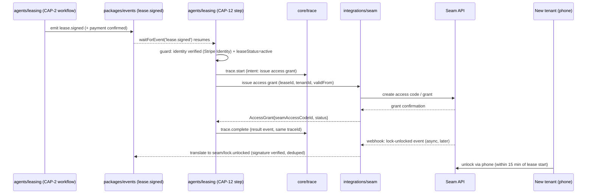

# CAP-12: Smart Access (Seam)

**Status:** draft  
**SPEC reference:** CAP-12  
**MVP phase:** 4  
**Depends on:** CAP-2, CAP-11

## Intent & success (from SPEC)

- **Intent:** Smart-access integration so identity-verified applicants receive time-bound digital keys upon lease activation.
- **Success:** Signed lease triggers Seam key issuance; tenant unlocks unit within 15 minutes of lease activation without manual key handoff.

## User stories

| Actor | Story |
|-------|-------|
| Leasing agent | I issue time-bound digital key after lease signed + payment confirmed. |
| New tenant | I unlock unit door via phone within 15 minutes of lease activation. |
| PM admin | I see lock status and access events per unit. |
| PM admin | I revoke key on lease termination. |

## Happy path

1. Unit configured with Seam device ID during onboarding (CAP-1).
2. Lease signed + first payment confirmed (CAP-2).
3. Agent calls Seam API: create access grant for verified tenant identity.
4. Key valid from lease start date/time; bound to tenant device.
5. Access events logged (CAP-10).
6. Lease ends → agent revokes access grant.

## Escalation path

| Trigger | Action |
|---------|--------|
| Seam API failure | Notify PM; manual key fallback workflow |
| Identity mismatch | Block key issuance; PM review |
| Device offline | Notify PM + tenant; schedule physical key |

## Integrations

| Service | Use |
|---------|-----|
| Seam API | Lock control, access grants |
| Stripe Identity | Verified identity linked to grant |
| CAP-2 | Lease activation trigger |

## Data model (draft)

| Entity | Key fields |
|--------|------------|
| `SmartLock` | organizationId, unitId, seamDeviceId, status |
| `AccessGrant` | organizationId, leaseId, tenantId, seamAccessCodeId, validFrom, validUntil, status |

## API surface (draft)

| Method | Endpoint | Purpose |
|--------|----------|---------|
| POST | `/api/orgs/current/units/:id/locks` | Register Seam device |
| POST | `/api/internal/access/issue` | Agent issues grant (internal) |
| DELETE | `/api/internal/access/:id` | Revoke grant |
| GET | `/api/orgs/current/units/:id/access-events` | Access log |

## Acceptance tests

- [ ] Signed lease + payment → key works within 15 minutes
- [ ] Revoked lease → key stops working
- [ ] Access issue logged in CAP-10
- [ ] Wrong tenant cannot receive key for another unit

## Open questions

- [ ] Supported lock brands for MVP (Schlage, Yale, August via Seam)?
- [ ] Self-showing keys for prospects pre-lease — Phase 2?

## Architecture

CAP-12 is governed by AD-4 (durable workflow — key issuance waits on the `lease.signed` event) and AD-9 (Seam behind a port interface, webhook-driven).

**Owning modules**

- `integrations/seam` — the port/adapter for Seam; owns `SmartLock` device registration, access-grant creation, and revocation. Domain code never imports the Seam SDK directly.
- `agents/leasing` — the Inngest step that issues/revokes `AccessGrant`s; a step within (or triggered by) the same durable lease-activation workflow that CAP-2 owns.
- `core/leasing` — owns `Lease`/`LeaseTerms` and the derived `leaseStatus`; CAP-12's issuance step reads `getEffectiveTerms`/`leaseStatus` rather than raw tables (AD-12).
- `core/trace` — traces access-grant issuance and revocation (CAP-10 dependency, referenced in Integrations table).
- tRPC: `POST /api/internal/access/issue` and `DELETE /api/internal/access/:id` are internal procedures invoked by the workflow, not public client endpoints; `POST .../units/:id/locks` and `GET .../access-events` are the PM-admin-facing surface in `packages/api`.

**Governing decisions**

| AD | Constrains |
| --- | --- |
| AD-4 | Core rule for this CAP: key issuance is a durable Inngest step that `waitForEvent`s on `lease.signed` (and payment confirmation) rather than polling; concurrency keyed by `organizationId` + `leaseId`; guard (identity/payment verified) and act (create grant) execute inside one core service call, not split across `step.run` boundaries |
| AD-9 | Seam sits behind `integrations/seam`'s port interface — swappable adapter, no Seam SDK leakage into `core`/`agents`; inbound Seam webhooks (lock-unlocked, device-offline) verify signature → dedupe on provider event ID → translate to a typed catalog event → return 200, no business logic in the handler |
| AD-14 | `lease.signed`, `access.grant.issued`, `access.grant.revoked`, and inbound `seam/lock.unlocked` all go through the typed event catalog with the mandatory `{organizationId, traceId, occurredAt, schemaVersion}` envelope |
| AD-6 | Grant issuance and revocation are traced via `core/trace` (intent event on issuance call, result event on Seam confirmation/webhook) — CAP-10's pattern applied here |
| AD-2 | `SmartLock` and `AccessGrant` are `organizationId`-scoped, RLS-enforced tables; the workflow opens the org-scoped client using `organizationId` from the event envelope |
| AD-12 | CAP-12 reads `leaseStatus`/effective terms from `core/leasing` (the sole owner) rather than deciding lease-activation state itself |
| AD-5 | Key issuance is a resident-facing side effect in the governance-gated action list; failure/mismatch paths (identity mismatch) route to governance-style PM review, not silent auto-retry |

**Sequence: lease-signed to key-issued**

**Cross-CAP dependencies**

CAP-12 is triggered by CAP-2's lease-signing workflow: the `lease.signed` event (emitted once payment is confirmed) is what wakes the durable `waitForEvent` step in `agents/leasing` that issues the grant — CAP-12 has no independent trigger. It depends on CAP-1 for `SmartLock` device registration during onboarding, on CAP-11 for org-scoped `SmartLock`/`AccessGrant` tables, and on CAP-10 for tracing every issuance/revocation. Lease termination (owned by `core/leasing`) is the corresponding trigger for revocation.

| Date | Decision |
|------|----------|
| 2026-07-05 | Seam as integration partner (HANDOFF direction) |
