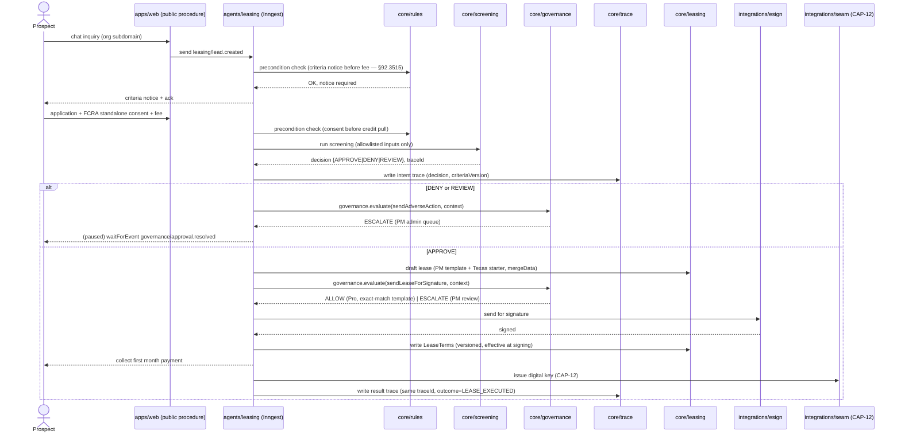

# CAP-2: Autonomous Leasing

**Status:** draft — **screening criteria parked**  
**SPEC reference:** CAP-2  
**MVP phase:** 4  
**Depends on:** CAP-5, CAP-10, CAP-12, CAP-1

## Intent & success (from SPEC)

- **Intent:** Autonomous lead-to-lease—pre-qualification, identity verification, lease execution, first payment, digital key—without human intervention on Professional plan.
- **Success:** Qualified prospect completes inquiry through signed lease and working digital key within 48 hours with zero PM staff touches on Pro; every step logged.

## User stories

| Actor | Story |
|-------|-------|
| Prospect | I inquire via chat 24/7; complete application on branded portal. |
| Leasing agent | I qualify, screen, draft lease, coordinate sign and payment. |
| PM admin | I review lease draft (Basic always; Pro if template deviates). |
| Applicant | I receive specific adverse action notice if denied. |

## Happy path

1. Prospect chats on org subdomain → agent answers unit questions.
2. Agent sends Texas §92.3515 selection criteria **before** application fee; applicant acknowledges.
3. Application + FCRA standalone consent → screening report (integrated API or PM vendor).
4. **Screening decision (TBD):** RentalPro decision engine applies PM criteria → APPROVE / DENY / REVIEW.
5. If approved: Stripe Identity verification.
6. Agent fills lease from PM template + platform Texas starter + required addenda (flood, lead paint, etc.).
7. PM review (Basic always; Pro if exact template match → auto-send TBD).
8. E-sign → first month payment → CAP-12 Seam key.
9. Full CAP-10 trace including criteria version and denial rationale if applicable.

## Escalation path

| Trigger | Approver |
|---------|----------|
| DENY or REVIEW screening | PM admin; adverse action auto-generated |
| Lease draft edited | PM admin before send |
| Identity verification fail | PM admin |
| Basic plan | All significant steps require approval |

## Integrations

| Service | Use |
|---------|-----|
| Screening API + PM vendor | Report sources (A+B) |
| Stripe Identity | ID verification |
| E-sign (TBD) | Lease execution |
| CAP-12 | Digital key |
| CAP-10 | Decision traces |

## Data model (draft)

| Entity | Key fields |
|--------|------------|
| `Lead` | organizationId, unitId, status, source |
| `Application` | organizationId, leadId, criteriaAckAt, consentAt, screeningReportId, decision, traceId |
| `LeaseTemplate` | organizationId, source (pm\|platform), documentUrl, version |
| `LeaseDraft` | organizationId, applicationId, templateVersion, mergeData JSON, status |

## API surface (draft)

| Method | Endpoint | Purpose |
|--------|----------|---------|
| POST | `/api/public/leads` | Inquiry (org from subdomain) |
| POST | `/api/applicant/apply` | Application + fee |
| GET | `/api/orgs/current/applications/:id/decision-card` | Screening trace |
| POST | `/api/orgs/current/leases/:id/send` | Send for e-sign |

## Acceptance tests

- [ ] Criteria notice before fee (Texas §92.3515)
- [ ] FCRA consent before credit pull
- [ ] Denial includes specific adverse action reason
- [ ] Pro: qualified applicant → key within 48h with zero staff touches
- [ ] Signed lease triggers Seam key (CAP-12)
- [ ] Protected classes never in agent inputs

## Open questions

- [ ] **Parked:** Screening criteria defaults — see `docs/AI-MVP-DECISIONS.md`
- [ ] **Parked:** Industry-breaking screening thesis (1+3 recommended)
- [ ] E-sign provider?
- [ ] Pro auto-send exact-match rules?

## Market parity sub-features (TBD)

See `docs/MARKET-GAP-CHECKLIST.md`.

- [ ] Guest card / CRM pipeline (lead stages, source tracking)
- [x] Listing Package + syndication hub (M1 Full MVP) — [`docs/SYNDICATION-MVP-RUNBOOK.md`](../../SYNDICATION-MVP-RUNBOOK.md)
- [ ] Tour / self-showing scheduling (M12)
- [x] Lease renewal workflow (M3) — [`LEASE-RENEWAL-MVP-REQ.md`](../../LEASE-RENEWAL-MVP-REQ.md); Owner (`owner` role) approves increases above threshold
- [ ] Renters insurance requirement

## Architecture

*Per `ARCHITECTURE-SPINE.md` Capability → Architecture Map. See that doc for full AD text.*

### Owning modules

- **Core:** `core/leasing` — the sole owner (AD-12) of `Lease` and versioned `LeaseTerms` (written at signing, renewal, or import), exposing `getEffectiveTerms(leaseId, onDate)` as the only read path for terms. Screening decisioning, criteria evaluation, and FHA/FCRA input stripping live in `core/screening`.
- **tRPC router:** `leasing` router — `publicProcedure` surface for unauthenticated prospect flows (inquiry, application, criteria-notice ack) per AD-3, plus authenticated PM-facing lease review/send procedures.
- **Inngest workflow:** `agents/leasing` — the lead→lease durable workflow (AD-4): inquiry → criteria notice → application/consent → screening → identity verification → lease draft → PM review → e-sign → payment → CAP-12 key issuance, with `waitForEvent('governance/approval.resolved')` pauses at every PM-gated step (AD-13).

### Governing decisions

| AD | What it constrains for CAP-2 |
| --- | --- |
| AD-4 | Lead-to-lease is one durable Inngest workflow; concurrency keyed by `organizationId` + `leadId`/`leaseId`; approval waits use `waitForEvent`, never in-process polling or timers |
| AD-5 | Every resident-facing/legal side effect (sending the lease, issuing a key, auto-sending on Pro) routes through `core/governance.evaluate()`; Basic plan escalates nearly everything, Pro auto-sends only on exact template match |
| AD-8 | Statutory ordering is enforced as rules-engine preconditions, not UI sequencing: Texas §92.3515 criteria notice must precede the application fee, and standalone FCRA consent must precede the credit pull — both hard preconditions on the gated action inside `core/rules` |
| AD-9 | Screening API, Stripe Identity, and the e-sign provider (TBD) are all accessed through `packages/integrations` ports; CAP-2's core logic never imports a vendor SDK directly |
| AD-10 | Any LLM-assisted step (chat qualification, lease-draft fill from PM template) goes through the `packages/agents` gateway; screening inputs are an explicit allowlist stripping FHA/FCRA-protected fields by construction — the model never sees the raw applicant record |
| AD-12 | `core/leasing` is the only writer of `Lease`/`LeaseTerms`; CAP-4/M2's delinquency engine reads terms only via `getEffectiveTerms()`, never the raw table |
| AD-13 | Adverse-action / lease-send / key-issuance approvals are single-transition (`pending→approved|denied|expired`); the tRPC approve mutation only records the verdict, the resumed workflow is sole executor |
| AD-6 | Every screening decision, adverse-action rationale, and criteria version is written to `core/trace` before the resident-facing side effect (e.g. before the denial notice sends) |

### Primary flow — autonomous lead to signed lease (Pro plan)

### Cross-CAP dependencies

- **CAP-2 → CAP-4/M2 (delinquency):** `core/leasing` owns `Lease`/`LeaseTerms`; M2's daily delinquency job (under CAP-4) reads rent due day, grace, and late-fee clause exclusively via `core/leasing.getEffectiveTerms(leaseId, onDate)` — never the raw `LeaseTerms` table — so a mid-term renewal (M3) is reflected correctly without CAP-4 duplicating lease logic.
- **CAP-2 → CAP-1:** import-created leases (CAP-1) and CAP-2-originated leases share the same `core/leasing` write API and `LeaseTerms` versioning, so M2 cannot distinguish (or mis-trust) one over the other.
- **CAP-2 → CAP-12:** signed lease + first payment triggers the Seam digital-key issuance step inside the same Inngest workflow (AD-9 port), not a separate uncoordinated process.
- **CAP-2 → CAP-5/CAP-10:** every escalation point (adverse action, lease send, Basic-plan approvals) is a `governance.evaluate()` call and a `core/trace` write; CAP-2 never implements its own threshold or audit logic (AD-5, AD-6).
- **CAP-2 ← CAP-9 (via CAP-1 import):** vendor and unit availability data consumed for prospect Q&A comes from CAP-1-imported `Unit`/`Property` rows.

## Decisions log

| Date | Decision |
|------|----------|
| 2026-07-05 | Lease A+B: PM template + platform Texas starter |
| 2026-07-05 | AI fills draft; PM reviews; not greenfield generation |
| 2026-07-05 | Screening A+B sources; decision layer TBD |
| 2026-07-05 | M1 Full MVP: Listing Package + Syndication Hub; runbook at `docs/SYNDICATION-MVP-RUNBOOK.md` |
| 2026-07-05 | M3 locked MVP: lease renewals CAP-2; Owner role approves rent increases above threshold; full req `docs/LEASE-RENEWAL-MVP-REQ.md` |

**See also:** `docs/AI-MVP-DECISIONS.md`
