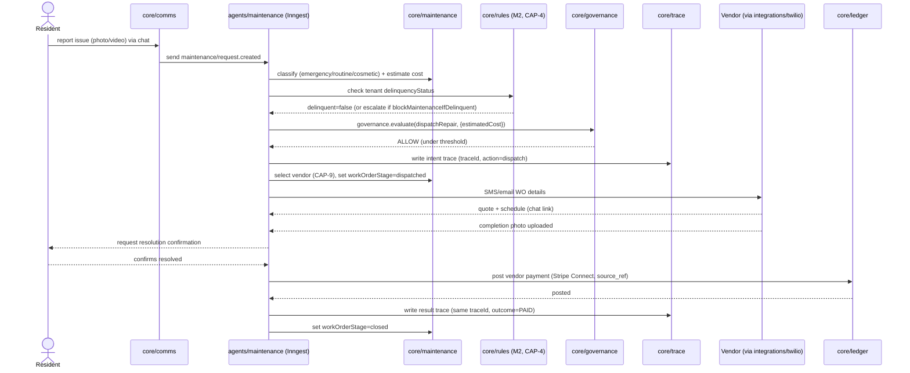

# CAP-3: Autonomous Maintenance

**Status:** draft  
**SPEC reference:** CAP-3  
**MVP phase:** 3  
**Depends on:** CAP-5, CAP-7, CAP-9, CAP-10

## Intent & success (from SPEC)

- **Intent:** Autonomous maintenance from resident report through resolution—diagnosis, vendor quote, scheduling, completion verification, vendor payment—within spend governance.
- **Success:** Non-emergency request with video triaged, dispatched, completed, and paid without human action when cost under PM threshold; resident confirms resolution.

## User stories

| Actor | Story |
|-------|-------|
| Resident | I report issue via chat with video; get status updates. |
| Maintenance agent | I diagnose, dispatch vendor, verify completion, trigger payment. |
| PM admin | I approve over-threshold repairs (Basic) or review exceptions. |
| Vendor | I receive SMS/email with WO details; submit quote and completion photo. |

## Happy path

1. Resident submits request (CAP-7) with photo/video.
2. Agent classifies: emergency vs routine vs cosmetic.
3. Rent delinquency check → if delinquent, escalate to PM (TBD recommend yes).
4. Agent diagnoses category + estimates cost.
5. CAP-5 governance: under limit → auto; over → approval queue.
6. Agent selects vendor (CAP-9); outreach via SMS/email (no voice).
7. Vendor quotes + schedules via chat link.
8. Work completed → vendor uploads completion photo.
9. Resident confirms resolution via chat.
10. Stripe Connect pays vendor → CAP-4 ledger entry.
11. Full trace in CAP-10.

## Escalation path

| Trigger | Action |
|---------|--------|
| Emergency list (gas, sewage, flood, wiring, no heat <40°F, no water) | Auto-dispatch — no spend approval |
| Cost > governance limit | PM approval (CAP-5) |
| Resident disputes resolution | PM review queue |
| Tenant delinquent on rent | Escalate to PM (recommended) |

## Integrations

| Service | Use |
|---------|-----|
| CAP-9 | Vendor DB + outreach |
| Stripe Connect | Vendor payment |
| Supabase Storage | Video/photos |
| CAP-5, CAP-10 | Governance + audit |

## Data model (draft)

| Entity | Key fields |
|--------|------------|
| `WorkOrder` | organizationId, unitId, category, priority, estimatedCost, status, vendorId, traceId |
| `WorkOrderEvent` | workOrderId, type, payload, createdAt |

## API surface (draft)

| Method | Endpoint | Purpose |
|--------|----------|---------|
| GET | `/api/orgs/current/work-orders` | List WOs |
| GET | `/api/orgs/current/work-orders/:id` | WO detail + trace link |
| POST | `/api/vendor/work-orders/:id/quote` | Vendor quote |
| POST | `/api/vendor/work-orders/:id/complete` | Completion photo |

## Acceptance tests

- [ ] Under-threshold WO completes without PM touch on Pro
- [ ] Over-threshold WO waits for approval
- [ ] Emergency bypasses approval
- [ ] Payment recorded against WO in ledger
- [ ] Resident confirmation required before pay (TBD)

## Open questions

- [ ] Require resident confirmation before vendor payment?
- [ ] Cosmetic requests — agent auto-close without vendor?

## Architecture

*Per `ARCHITECTURE-SPINE.md` Capability → Architecture Map. See that doc for full AD text.*

### Owning modules

- **Core:** `core/maintenance` owns `WorkOrder` and `WorkOrderEvent`, including the single computing function for the derived `workOrderStage` status (AD-12) — every consumer (resident portal, PM dashboard, CAP-4 ledger trigger) calls that function rather than deriving stage from raw events.
- **tRPC router:** `maintenance` router — resident/PM-facing WO list/detail procedures, plus a vendor-facing `publicProcedure`-style surface for quote/completion submission (rate-limited per AD-3).
- **Inngest workflow:** `agents/maintenance` — the full WO lifecycle workflow (AD-4): triage/classification → delinquency check → diagnosis/cost estimate → governance gate → vendor dispatch → quote/schedule → completion verification → payment, concurrency keyed by `organizationId` + `workOrderId`.

### Governing decisions

| AD | What it constrains for CAP-3 |
| --- | --- |
| AD-4 | The WO lifecycle is one durable Inngest function; the spend-approval check-and-post-dispatch never splits across step boundaries without a row lock/idempotency key, so a stalled workflow can safely resume mid-dispatch |
| AD-5 | `core/governance.evaluate(dispatchRepair, context)` gates any spend over the PM's configured threshold; the emergency-dispatch list (gas, sewage, flood, wiring, no heat <40°F, no water) bypasses spend approval *inside* `evaluate()` itself, per the rule — CAP-3 never hard-codes its own emergency bypass at the call site |
| AD-9 | Vendor outreach (SMS/email, no voice) goes through `packages/integrations` + `core/comms`; vendor payment goes through the Stripe Connect port; webhook completion/quote events are deduped on provider event ID before translating to a catalog event |
| AD-10 | Diagnosis/classification (emergency vs. routine vs. cosmetic, cost estimate) is an LLM-gateway call producing a structured, Zod-validated *proposal* — it is not itself the dispatch decision; only the governance-gated code executes on it |
| AD-13 | Over-threshold PM approvals are single-transition `ApprovalRequest`s; the resumed `agents/maintenance` workflow — not the tRPC approve mutation — is the sole executor of the dispatch/payment side effect |
| AD-15 | All vendor and resident messaging (SMS/email WO details, status updates) goes through `core/comms.send()`, which writes the `Conversation` row atomically and is the only path M7's unified inbox can see |
| AD-7 | Vendor payment via Stripe Connect posts to `core/ledger` as the single designated posting owner for that money-event type (CAP-4's posting catalog), keyed by a mandatory `source_ref` so the workflow's payment step and any bank-feed webhook can never double-post |

### Primary flow — routine work order, under threshold

### Cross-CAP dependencies

- **CAP-3 ← CAP-4/M2:** before dispatch, the workflow reads `delinquencyStatus` (computed and owned by CAP-4's M2 delinquency engine, per AD-12) to decide whether `blockMaintenanceIfDelinquent` escalates the request to the PM instead of auto-dispatching.
- **CAP-3 → CAP-4:** vendor payment is a `core/ledger` post (AD-7) — CAP-3 never writes ledger rows itself; it calls the ledger's posting API with a `source_ref` tied to the `workOrderId`.
- **CAP-3 → CAP-9:** vendor selection and outreach reuse the vendor DB imported by CAP-1 and the CAP-9 dispatch/outreach logic; `agents/maintenance` calls into it rather than re-implementing vendor matching.
- **CAP-3 → CAP-7/M7:** all resident- and vendor-facing messages are visible in the unified inbox because they're written by `core/comms` (AD-15), not sent ad hoc from `agents/maintenance`.
- **CAP-3 → CAP-5/CAP-10:** spend-threshold gating and full decision trace reuse the shared governance choke point and trace writer — CAP-3 supplies context (`estimatedCost`, `workOrderId`) but never its own threshold logic.

## Decisions log

| Date | Decision |
|------|----------|
| 2026-07-05 | Full lifecycle MVP |
| 2026-07-05 | Emergency auto-dispatch locked (see AI-MVP-DECISIONS) |

**See also:** `docs/AI-MVP-DECISIONS.md`
