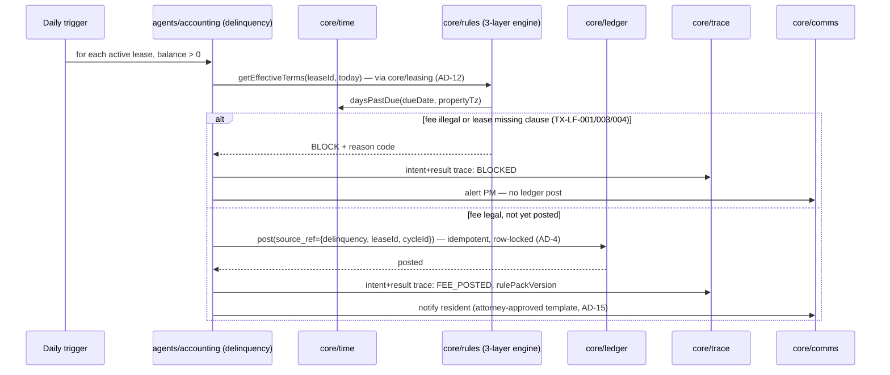

# CAP-4: Autonomous Accounting

**Status:** draft  
**SPEC reference:** CAP-4  
**MVP phase:** 2  
**Depends on:** CAP-1, CAP-5, CAP-10

## Intent & success (from SPEC)

- **Intent:** Fully automated double-entry ledger fed by payment/bank APIs; AI categorizes every transaction; monthly period flagged for human sign-off before owner distributions.
- **Success:** 100% of closed-month transactions auto-categorized with zero manual journal entries; accountant approves one monthly report; owner distributions calculate correctly.

## User stories

| Actor | Story |
|-------|-------|
| Accounting agent | I categorize every inbound/outbound transaction to GL accounts. |
| PM admin | I see pending-review items flagged by AI. |
| Accountant | I sign off monthly report before distributions run. |
| Owner | I receive accurate distribution after sign-off (CAP-8). |

## Happy path

1. Stripe/Plaid webhook posts transaction → `LedgerTransaction` created.
2. Accounting agent loads context (lease, WO, vendor, property).
3. Agent assigns debit/credit accounts → double-entry journal auto-posted.
4. Low-confidence categorization → flagged `pending_review`.
5. Month-end: agent closes period → `MonthlyClose` status `awaiting_signoff`.
6. Accountant reviews report → approves → distributions calculated (CAP-8).
7. Every categorization logged in CAP-10.

## Escalation path

| Trigger | Approver |
|---------|----------|
| Monthly close | Accountant sign-off (always) |
| Unmatched transaction | PM admin queue |
| Distribution amount anomaly | PM admin + accountant |

## Integrations

| Service | Use |
|---------|-----|
| Stripe Connect | Rent payments, vendor payouts |
| Plaid | Bank feed (TBD) |
| CAP-5 | Distribution requires post-signoff gate |

## Data model (draft)

| Entity | Key fields |
|--------|------------|
| `ChartOfAccounts` | organizationId, accountCode, name, type |
| `JournalEntry` | organizationId, date, lines[], sourceRef, categorizedBy (agent\|human) |
| `LedgerTransaction` | organizationId, amount, source, externalId, status |
| `MonthlyClose` | organizationId, period, status, signedOffBy, signedOffAt |

## API surface (draft)

| Method | Endpoint | Purpose |
|--------|----------|---------|
| GET | `/api/orgs/current/ledger/transactions` | Transaction list |
| GET | `/api/orgs/current/ledger/monthly/:period` | Monthly report |
| POST | `/api/orgs/current/ledger/monthly/:period/signoff` | Accountant approve |
| PATCH | `/api/orgs/current/ledger/transactions/:id/recategorize` | Human override |

## Acceptance tests

- [ ] Rent payment auto-categorizes to correct GL accounts
- [ ] Vendor payment links to work order
- [ ] Zero manual journal entries required for closed month test portfolio
- [ ] Distribution blocked until sign-off
- [ ] Recategorization creates CAP-10 human.action event

## Open questions

- [ ] Plaid vs Stripe-only for MVP?
- [ ] Texas TREC trust account rules (2-day deposit)?
- [x] Security deposit sub-ledger (M5) — resolved native CAP-4

## Market parity sub-features (TBD)

See `docs/MARKET-GAP-CHECKLIST.md`.

- [x] Security deposit sub-ledger (M5) — [`SECURITY-DEPOSIT-MVP-REQ.md`](../SECURITY-DEPOSIT-MVP-REQ.md) · ⚠️ check with partner
- [x] Delinquency & late fee auto-assessment (M2) — [`DELINQUENCY-RULES-ENGINE.md`](../DELINQUENCY-RULES-ENGINE.md)
- [x] Management fee auto-calculation — CAP-1 rate locked at **7%**; CAP-4 posts from `Owner.managementFeePercent`
- [ ] Bank reconciliation UI
- [ ] 1099 generation (M11) — Phase 2 candidate

## Architecture

*Per `ARCHITECTURE-SPINE.md` Capability → Architecture Map. See that doc for full AD text.*

### Owning modules

- **Core:** `core/ledger` is the single writer of `LedgerAccount`/`LedgerEntry` (spine naming; this doc's draft `ChartOfAccounts`/`JournalEntry`/`LedgerTransaction` collapse into that schema at build time). `core/rules` owns the M2 three-layer delinquency engine (`StateRulePack` → `OrgDelinquencyPolicy` → `LeaseTerms`) that feeds late-fee postings into this CAP.
- **tRPC router:** `accounting` router — transaction list, monthly report, recategorization (PM override), sign-off procedures.
- **Inngest workflow:** `agents/accounting` — two workflows: `accounting.reconcile` (continuous, triggered by bank-feed/Stripe webhook events) and `accounting.monthly_close` (cron, per org).

### Governing decisions

| AD | What it constrains for CAP-4 |
| --- | --- |
| AD-7 | `core/ledger` is the only writer; every entry is balanced double-entry in integer cents with a mandatory unique `source_ref` — this is the fix for the exact failure this CAP is most exposed to: a vendor payout or rent payment posted once by the originating workflow (CAP-3/CAP-7) and again by this CAP's bank-feed categorizer. The **posting catalog** (owned here) enumerates every money-event type with exactly one designated posting owner; webhooks *reconcile* platform-initiated transactions by `source_ref` and only *create* new postings for externally-originated bank-feed items with no match. AI categorization (the "100% auto-categorized" success criterion) applies only to that externally-originated subset |
| AD-8 | Late-fee assessment and blocking (M2) runs the 3-layer rules engine via `core/rules`; `StateRulePack-TX` version is pinned on every resulting `DelinquencyEvent`; production use requires the attorney sign-off record (Runbook P1) |
| AD-11 | All amounts are `bigint` cents; legal day-boundary math (TX 2-day minimum before a late fee, the 30-day deposit-return clock for M5) goes through `core/time`, never raw date arithmetic in this CAP's code |
| AD-13 | The monthly close is a single `ApprovalRequest` (accountant sign-off) — one conditional transition unlocks distribution calculation for the whole period; there is no per-transaction approval UI, which is what makes "one sign-off" achievable |
| AD-6 | Every categorization decision, late-fee assessment/block, and the close-approval verdict writes an intent+result trace pair before/atomically with the ledger effect |
| AD-4 | The daily delinquency check-and-post (read balance, compute fee, post) executes inside one scoped transaction with a row lock on the lease — closing the "resident pays between check and post" race described in `DELINQUENCY-RULES-ENGINE.md` |

### Primary flow — daily delinquency assessment feeding the ledger

See [`DELINQUENCY-RULES-ENGINE.md`](../DELINQUENCY-RULES-ENGINE.md) for the full M2 flow including payment plans and waive handling, and [`../architecture/flows.md`](../architecture/flows.md) for the monthly-close diagram.

### Cross-CAP dependencies

- **CAP-4 ← CAP-1:** M2's cap logic depends on `property.structure_unit_count` (≤4 vs >4 units), a field CAP-1's import must populate — declared as a required consumer field in the AD-12 entity ownership registry.
- **CAP-4 ← CAP-2:** delinquency reads lease terms via `core/leasing.getEffectiveTerms(leaseId, onDate)` (AD-12) — it never reads the raw `lease_terms` table, so a mid-lease renewal (M3) is always reflected correctly.
- **CAP-4 ← CAP-3/CAP-9:** vendor payouts post here as reconciliations against a `source_ref` the maintenance workflow already created (AD-7) — this CAP does not independently decide to pay a vendor.
- **CAP-4 → CAP-5:** monthly close and any PM-facing exception (unmatched transaction, distribution anomaly) route through the shared `ApprovalRequest`/`governance.evaluate()` choke point, not a CAP-4-local approval flow.
- **CAP-4 → CAP-8:** owner distributions are a read model over `core/ledger`, computed only after the sign-off `ApprovalRequest` resolves — CAP-8 never calculates a distribution independently.
- **CAP-4 → CAP-10:** every categorization, block, and sign-off is traced via `core/trace`, the same API every other CAP uses.

## Decisions log

| Date | Decision |
|------|----------|
| 2026-07-05 | Human monthly sign-off before distributions (HANDOFF locked) |
| 2026-07-05 | Architecture finalized: Drizzle/Postgres ledger with `source_ref` idempotency (AD-7); resolves this doc's "Plaid vs Stripe-only" open question by making the port vendor-agnostic (see `../architecture/integrations.md`) |
