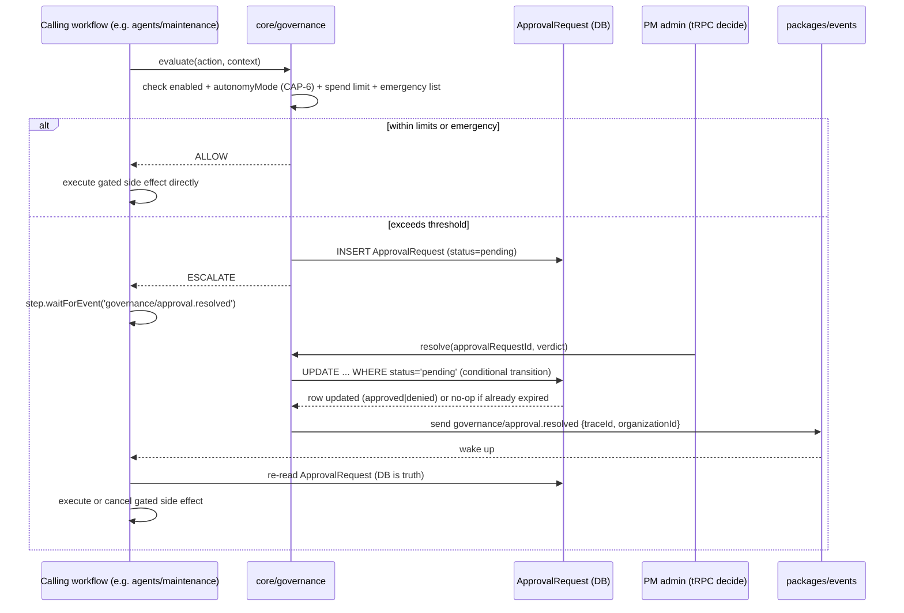

# CAP-5: Governance Rails

**Status:** draft  
**SPEC reference:** CAP-5  
**MVP phase:** 0  
**Depends on:** CAP-11

## Intent & success (from SPEC)

- **Intent:** PM admin configures tiered governance rails—approval thresholds, escalation triggers, spend limits—per organization and optionally per property.
- **Success:** Action exceeding threshold (e.g., $500 repair) is blocked from autonomous execution and routed to human approver with full context; sub-threshold actions proceed without queue.

## User stories

| Actor | Story |
|-------|-------|
| PM admin | I set maintenance auto-approve limit ($500 default on Pro). |
| PM admin | I override governance per property (e.g., stricter on Class A building). |
| PM admin | I receive approval queue items with full agent context. |
| AI agent | I check governance before every side-effecting action. |
| Resident | I am not blocked on emergencies while approval queue runs for routine items. |

## Happy path

1. PM admin sets org defaults: `maintenanceAutoApproveLimit: 500`, `plan: basic|pro`.
2. Optional per-property overrides stored in `PropertyGovernance`.
3. Agent prepares action with estimated cost.
4. Governance engine evaluates: plan + module toggle (CAP-6) + spend limit + emergency list.
5. **Allow** → agent proceeds; **Escalate** → `ApprovalRequest` created; agent pauses.
6. PM admin approves/rejects in dashboard → agent resumes or cancels.
7. Decision logged in CAP-10.

## Escalation path

| Trigger | Approver | Notes |
|---------|----------|-------|
| Maintenance cost > limit | PM admin | Full WO context |
| Leasing draft changed from template (Pro) | PM admin | Basic always reviews |
| Screening REVIEW result | PM admin | When criteria case-by-case (TBD) |
| Emergency maintenance | None (auto-dispatch) | Locked — bypasses spend approval |
| Accounting distribution | Accountant | Monthly sign-off gate (CAP-4) |

## Integrations

| Service | Use |
|---------|-----|
| CAP-6 | Module toggles gate autonomy per domain |
| CAP-10 | Every governance decision logged |
| Inngest (TBD) | `waitForEvent` on approval |

## Data model (draft)

| Entity | Key fields |
|--------|------------|
| `OrganizationGovernance` | organizationId, maintenanceAutoApproveLimit, emergencyAutoPayLimit (TBD), leasingAutoSendEnabled |
| `PropertyGovernance` | propertyId, organizationId, overrides JSON |
| `ApprovalRequest` | id, organizationId, traceId, type, entityRef, context JSON, status, approverId, decidedAt |

## API surface (draft)

| Method | Endpoint | Purpose |
|--------|----------|---------|
| GET/PATCH | `/api/orgs/current/governance` | Org defaults |
| GET/PATCH | `/api/properties/:id/governance` | Property overrides |
| GET | `/api/orgs/current/approvals` | Pending queue |
| POST | `/api/orgs/current/approvals/:id/decide` | Approve/reject |

## Acceptance tests

- [ ] $501 repair on Pro with $500 limit creates approval request; agent does not dispatch
- [ ] $400 repair auto-executes on Pro
- [ ] Basic plan: all non-emergency maintenance requires approval
- [ ] Emergency gas leak dispatches without approval on both plans
- [ ] Property override stricter than org default is enforced

## Open questions

- [ ] Emergency auto-pay cap on Pro (suggested $1,000)?
- [ ] Leasing spend thresholds (placement fees)?

## Architecture

**Owning modules.** `core/governance` owns `evaluate()` and `resolve()` and is the sole writer of `ApprovalRequest`. It is exposed via the `governance` tRPC router (`packages/api`) for org/property settings CRUD and the approval-decide procedure. There is no dedicated Inngest workflow for CAP-5 itself — per AD-13, the *calling* workflow (leasing, maintenance, accounting) is the one that pauses on `waitForEvent('governance/approval.resolved')` and resumes execution; governance only records the verdict.

**Governing decisions**

| AD | What it constrains for CAP-5 |
|----|-------------------------------|
| AD-5 | `governance.evaluate(action, context)` is the single choke point for every financial/legal/resident-facing side effect; returns `ALLOW \| ESCALATE \| BLOCK`. Emergency-dispatch bypass lives inside `evaluate()`, never at call sites. |
| AD-13 | `ApprovalRequest` is a single-transition state machine (`pending → approved \| denied \| expired`) via conditional `UPDATE … WHERE status='pending'` in `core/governance.resolve()`. The tRPC decide procedure only records the verdict; the paused workflow executes the gated action. |
| AD-4 | Approval pauses are modeled as `waitForEvent`, never polling or in-process timers. |
| AD-6 | Every `evaluate()`/`resolve()` verdict is traced inside `core/governance` itself (intent + result events sharing `traceId`) — call sites never re-trace. |
| AD-14 | `governance/approval.resolved` is a catalog event with the mandatory envelope; it is a wake-up signal only — the workflow re-reads the `ApprovalRequest` row as truth on wake. |
| AD-12 | `core/governance` is the one owning module for `ApprovalRequest`, `OrganizationGovernance`, and `PropertyGovernance` — no other module writes them. |

**Primary flow**

**Cross-CAP dependencies.** `core/governance.evaluate()` is the platform's central choke point — it is called by:
- **CAP-2** (`agents/leasing`) before autonomous lease sends / draft-changed-from-template actions
- **CAP-3** (`agents/maintenance`) before dispatch when estimated cost exceeds limits
- **CAP-4** (`agents/accounting`) before the monthly distribution sign-off gate
- **CAP-9** (`agents/maintenance` vendor dispatch) before accepting a vendor quote over threshold

Conversely, `core/governance` reads CAP-6's `enabled`/`autonomyMode` settings (never writes them) and writes every verdict to CAP-10's `core/trace` (AD-6). It does not call `core/comms` (CAP-7) directly — approval-queue notifications to the PM admin are the calling workflow's responsibility via `core/comms.send()`.

## Decisions log

| Date | Decision |
|------|----------|
| 2026-07-05 | Pro maintenance auto-approve default $500 (from AI-MVP-DECISIONS) |
| 2026-07-05 | Emergency list bypasses spend approval |
