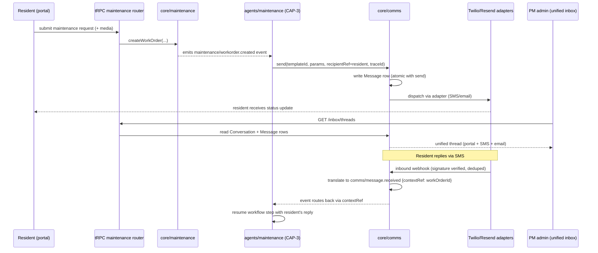

# CAP-7: Resident Portal & Unified Comms Hub

**Status:** draft  
**SPEC reference:** CAP-7 + **M7** expand  
**MVP phase:** 2 (rent + maintenance MVP)  
**Depends on:** CAP-11, CAP-1

## Intent & success (from SPEC)

- **Intent:** Residents self-serve via portal/messaging for rent payment, maintenance requests, lease documents, status 24/7. **M7:** PM admin unified inbox for resident, owner, vendor, and lead threads across chat/SMS/email.
- **Success:** Resident submits maintenance request and pays rent without staff contact; both reflect in ledger and WO system within 5 minutes. PM admin sees all party threads in one inbox; agents reply autonomously on Pro within policy.

## User stories

| Actor | Story |
|-------|-------|
| Resident | I pay rent on `{pmco}.rentalpro.ai` branded portal. |
| Resident | I submit maintenance request with photo/video via chat. |
| Resident | I view my lease and payment history. |
| Resident | I receive status updates via chat/SMS/email (no voice). |
| PM admin | I monitor all lead, resident, owner, and vendor threads in one inbox (M7). |
| PM admin | I take over any agent thread or approve drafts on Basic plan (M7). |

## Happy path

1. Resident invited after lease import or signing (CAP-2).
2. Resident logs in via Clerk (resident role) on org subdomain.
3. **Rent:** Stripe payment → CAP-4 ledger entry within 5 min.
4. **Maintenance:** Chat + media upload → work order created → CAP-3 agent triggered.
5. Push/status via chat thread; portal shows WO timeline.
6. **M7:** Same thread backend powers SMS/email; PM inbox shows unified history.

## Escalation path

| Trigger | Action |
|---------|--------|
| Payment fails | Retry + notify resident |
| Emergency maintenance keywords | CAP-3 emergency path |
| Agent draft on Basic | CAP-5 PM approval before send (M7) |
| Legal notice category | Template-only send — no freeform AI (M2/M7) |

## Integrations

| Service | Use |
|---------|-----|
| Stripe | Rent collection |
| Supabase Storage | Maintenance photos/video |
| Twilio | SMS inbound/outbound (M7) |
| Email provider | Inbound parse + outbound (M7) |
| CAP-3 | Maintenance agent trigger |
| CAP-11 | Branded subdomain |
| M7 | Unified inbox — see [`UNIFIED-COMMS-HUB-MVP-REQ.md`](../UNIFIED-COMMS-HUB-MVP-REQ.md) |

## Data model (draft)

| Entity | Key fields |
|--------|------------|
| `Resident` | organizationId, userId, leaseId, contactPrefs |
| `MaintenanceRequest` | organizationId, unitId, residentId, description, mediaUrls[], status |
| `ConversationThread` | organizationId, partyType, partyId, entityRef (M7) |
| `Message` | threadId, channel, direction, body, senderType (M7) |

## API surface (draft)

| Method | Endpoint | Purpose |
|--------|----------|---------|
| POST | `/api/resident/payments/rent` | Pay rent |
| POST | `/api/resident/maintenance` | Submit request |
| GET | `/api/resident/lease` | Lease docs |
| GET | `/api/resident/maintenance/:id` | WO status |
| GET | `/api/orgs/current/inbox/threads` | PM unified inbox (M7) |

## Acceptance tests

- [ ] Rent payment reflects in ledger within 5 minutes
- [ ] Maintenance request creates WO and triggers agent
- [ ] Portal shows org branding (CAP-11)
- [ ] Resident cannot access other units/orgs
- [ ] PM inbox shows resident thread with portal + SMS messages (M7)

## Open questions

- [ ] PWA install prompt — Phase 2? · see partner discussion [`MOBILE-APP-PHASE2-GAP-DISCUSSION.md`](../MOBILE-APP-PHASE2-GAP-DISCUSSION.md) (gap D4 / agenda item 3)
- [ ] Twilio per-org vs shared number pool?
- [ ] Native resident app timing/persona — tracked in mobile gap doc (not MVP; SPEC Non-goal)

## Market parity sub-features

See `docs/MARKET-GAP-CHECKLIST.md`.

- [ ] Autopay / recurring rent
- [x] Delinquency notices & payment plans (M2) — [`DELINQUENCY-RULES-ENGINE.md`](../DELINQUENCY-RULES-ENGINE.md)
- [x] Bulk resident messaging (emergencies) — [`UNIFIED-COMMS-HUB-MVP-REQ.md`](../UNIFIED-COMMS-HUB-MVP-REQ.md) (M7)
- [x] Unified comms hub (M7) — [`UNIFIED-COMMS-HUB-MVP-REQ.md`](../UNIFIED-COMMS-HUB-MVP-REQ.md)
- [ ] Announcements / community feed — Phase 2 non-goal

## Architecture

**Owning modules.** The resident-facing portal itself is UI/wiring in `apps/web` (resident routes on the org subdomain) calling the `leasing`, `accounting`, and `maintenance` tRPC routers for lease docs, rent payment, and WO submission respectively. The M7 unified comms hub logic — `Conversation`/`Message` ownership, template registry, opt-outs, quiet hours, channel preference — lives in `core/comms`, exposed via the `comms` tRPC router (`GET /api/orgs/current/inbox/threads` for the PM unified inbox). Inbound webhook routes (Twilio SMS, email inbound-parse) are the sanctioned non-tRPC surface (AD-3) that translate to `comms/message.received` catalog events; there is no dedicated CAP-7 Inngest workflow, but the CAP-3 maintenance workflow and CAP-2 leasing workflow are the ones woken by inbound replies via `contextRef`.

**Governing decisions**

| AD | What it constrains for CAP-7 |
|----|-------------------------------|
| AD-15 | `core/comms.send(templateId, params, recipientRef, traceId)` is the only caller of Twilio/Resend adapters; every outbound message writes the `Conversation`/`Message` row atomically with the send; inbound webhooks route to the owning workflow via `contextRef` (workOrderId / leaseId / delinquencyCaseId). |
| AD-3 | Portal data channels (rent pay, maintenance submit, lease view) go only through `packages/api` tRPC routers; unauthenticated flows are out of scope here (CAP-7 residents are authenticated), but webhook inbound routes are the sanctioned non-tRPC exception. |
| AD-9 | Twilio/Resend/Stripe adapters sit behind ports in `packages/integrations`; inbound webhooks verify signature, dedupe on provider event ID, then translate to a typed event — no business logic in the handler itself. |
| AD-5 | Agent-drafted replies on Basic plan route through `core/governance.evaluate()` before send (PM approval gate on the comms send action). |
| AD-16 | Maintenance photos/videos uploaded via chat are stored under `org/{organizationId}/maintenance/{entityId}/{fileId}` with a corresponding `file` row; portal only ever receives short-lived signed URLs from tRPC procedures. |
| AD-2 | Resident session is org/subdomain-scoped; RLS prevents a resident from reading another unit's or org's `Conversation`/`MaintenanceRequest` rows. |
| AD-6 | Legally sensitive sends (delinquency notices, M2) trace the decision before the message goes out, per the standard intent/result trace pattern. |

**Primary flow (resident maintenance request → unified inbox, with inbound reply routing)**

**Cross-CAP dependencies.** `core/comms` is called by every agent that needs resident/owner/vendor/lead-facing messaging — it is the AD-15 choke point, mirroring CAP-5's role for side effects:
- **CAP-2** (`agents/leasing`) — lease-ready notices, signing reminders
- **CAP-3** (`agents/maintenance`) — WO status updates, vendor-facing messages routed through the same hub
- **CAP-4** (`agents/accounting`) — delinquency notices (M2), payment confirmations
- **CAP-9** (vendor outreach) — SMS/email dispatch to vendors also flows through `core/comms`, not a separate Twilio integration

CAP-7 in turn depends on: **CAP-5** for the governance gate on agent-drafted Basic-plan replies; **CAP-11** for org/subdomain branding and RLS isolation of `Conversation`/`MaintenanceRequest`; **CAP-3** as the workflow that owns work-order state (CAP-7 only triggers it); **CAP-10** (`core/trace`) receiving every send decision.

## Decisions log

| Date | Decision |
|------|----------|
| 2026-07-05 | Chat/SMS/email only; no voice |
| 2026-07-05 | M7 locked Full MVP — expand CAP-7 with unified inbox; no new CAP |
