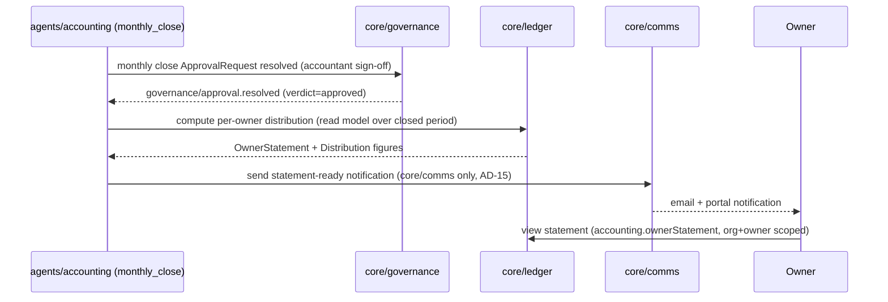

# CAP-8: Owner Reporting

**Status:** draft  
**SPEC reference:** CAP-8  
**MVP phase:** 5  
**Depends on:** CAP-4, CAP-11

## Intent & success (from SPEC)

- **Intent:** Owners receive automated financial statements, distribution calculations, portfolio performance on a defined schedule.
- **Success:** Owner views accurate month-to-date statement matching ledger; distribution matches accountant-approved monthly close.

## User stories

| Actor | Story |
|-------|-------|
| Owner | I log into branded portal and see my property financials. |
| Owner | I receive monthly statement after accountant sign-off. |
| PM admin | I configure statement schedule and delivery (email/portal). |
| Accounting agent | I compute distributions only after CAP-4 monthly sign-off. |

## Happy path

1. CAP-4 monthly close signed off by accountant.
2. System generates owner statements per property: income, expenses, management fees, net.
3. Distribution amount calculated per owner agreement (CAP-1).
4. Owner notified via email; views in owner portal on org subdomain.
5. Optional: Stripe Connect payout to owner account (TBD).

## Escalation path

| Trigger | Action |
|---------|--------|
| Ledger mismatch in statement | Block publish; alert PM |
| Missing owner forwarding address | Hold distribution (Texas security deposit parallel) |

## Integrations

| Service | Use |
|---------|-----|
| CAP-4 | Ledger source of truth |
| CAP-11 | Branded owner portal |
| Email (TBD) | Statement delivery |

## Data model (draft)

| Entity | Key fields |
|--------|------------|
| `OwnerStatement` | organizationId, ownerId, propertyId, period, lines[], netDistribution, status |
| `Distribution` | organizationId, ownerId, amount, period, paidAt, status |

## API surface (draft)

| Method | Endpoint | Purpose |
|--------|----------|---------|
| GET | `/api/owner/statements` | Owner statement list |
| GET | `/api/owner/statements/:period` | Statement detail |
| GET | `/api/orgs/current/owners/:id/statements` | PM view |

## Acceptance tests

- [ ] Statement totals match ledger for test period
- [ ] Distribution not visible until accountant sign-off
- [ ] Owner sees only their properties
- [ ] Org branding on owner portal

## Open questions

- [ ] Automated owner payout via Stripe or statement-only MVP?
- [ ] Statement PDF export?

## Market parity sub-features (TBD)

See `docs/MARKET-GAP-CHECKLIST.md`.

- [ ] Dedicated owner portal login (M8)
- [x] Owner approval for renewal rent increases above threshold (M3) — [`LEASE-RENEWAL-MVP-REQ.md`](../LEASE-RENEWAL-MVP-REQ.md)
- [ ] Owner approval for capital repairs (M8)
- [ ] ACH distribution execution

## Architecture

*Per `ARCHITECTURE-SPINE.md` Capability → Architecture Map. See that doc for full AD text.*

### Owning modules

- **Core:** No new writer entity — `OwnerStatement`/`Distribution` are **read models** computed by `core/ledger` (CAP-4's owning module), not a separate owning module. CAP-8 never writes ledger rows; it only projects them.
- **tRPC router:** `accounting` router (shared with CAP-4) exposes owner-facing procedures (`accounting.ownerStatement`, `accounting.distributions`) scoped by Clerk role `owner` — there is no separate `owner` router, since the underlying data is ledger data with a narrower read scope.
- **Inngest workflow:** statement generation is a step inside `agents/accounting`'s `monthly_close` workflow (CAP-4), not an independent CAP-8 workflow — distribution calculation is triggered by the same `governance/approval.resolved` event that closes the month.

### Governing decisions

| AD | What it constrains for CAP-8 |
| --- | --- |
| AD-7 | Distribution amounts are derived from `core/ledger`'s balanced double-entry state — CAP-8 computes a *view*, never a second source of truth; a statement total that disagreed with the ledger would itself be an AD-7 violation |
| AD-13 | Distribution calculation is gated on the CAP-4 monthly-close `ApprovalRequest` resolving to `approved` — CAP-8 has no approval flow of its own; "not visible until sign-off" is enforced by reading the same single-transition state CAP-4 owns |
| AD-2 | Owner-scoped queries filter by `organizationId` **and** `ownerId` — RLS enforces the org boundary; the owner-vs-owner boundary within one org is an application-layer filter in the `accounting` router, since owners are not separate Clerk organizations |
| AD-3 | Owner portal reads go through the same `accounting` tRPC router as PM-facing ledger reads — no owner-specific REST endpoints (this doc's draft `/api/owner/statements` is intent, not the contract; see `../architecture/api-structure.md`) |
| AD-15 | Statement delivery (email) goes through `core/comms`, not a direct Resend call from a CAP-8-specific job — keeps delivery failures visible in the same observability path as every other notification |

### Primary flow

### Cross-CAP dependencies

- **CAP-8 ← CAP-4:** entirely dependent — CAP-8 has no independent data model beyond the read-model shape; every figure traces back to `core/ledger` entries CAP-4 owns.
- **CAP-8 ← CAP-11:** owner portal branding (logo, colors, subdomain) is CAP-11's `OrganizationBranding`, not duplicated here.
- **CAP-8 → CAP-10:** statement generation and any ledger-mismatch block are traced via the shared `core/trace` API.
- **Open question carried into architecture:** M8 (owner portal scope beyond statements — docs, capital-repair approvals) is an open item in the spine's Open Questions table; if locked, it would likely introduce a genuine CAP-8-owned entity (e.g. `OwnerApprovalRequest`) rather than remaining a pure read model.

## Decisions log

| Date | Decision |
|------|----------|
| 2026-07-05 | Draft micro-spec; gated on CAP-4 sign-off |
| 2026-07-05 | Architecture finalized: CAP-8 modeled as a read layer over CAP-4's ledger, not an independent owning module — avoids a second source of truth for distribution amounts |
