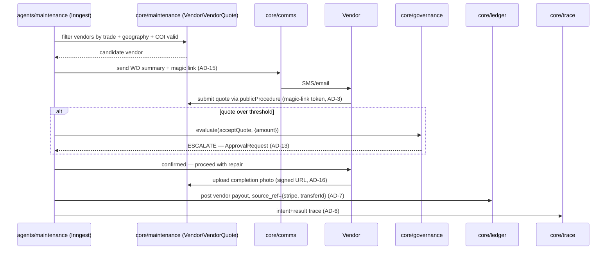

# CAP-9: Vendor Management

**Status:** draft  
**SPEC reference:** CAP-9  
**MVP phase:** 3  
**Depends on:** CAP-1, CAP-11

## Intent & success (from SPEC)

- **Intent:** Vendor database; outreach, quote collection, scheduling, payment via integrated rails.
- **Success:** Dispatched WO results in vendor quote, appointment, completion photo, and Stripe Connect payment recorded without duplicate entry.

## User stories

| Actor | Story |
|-------|-------|
| PM admin | I maintain vendor list with trades, service area, COI expiry. |
| Maintenance agent | I match WO to qualified vendor and send outreach. |
| Vendor | I receive WO via SMS/email; respond with quote without logging in (MVP). |
| Vendor | I optionally use vendor portal for quote upload (Phase 2 polish). |

## Happy path

1. PM imports vendors (CAP-1): name, trades[], phone, email, serviceZipCodes[], coiExpiresAt.
2. Agent filters vendors by trade + geography + COI valid.
3. Agent sends SMS/email with WO summary + magic link for quote/schedule.
4. Vendor submits quote via link → stored on WO.
5. Agent accepts quote (or PM approves if over threshold).
6. Completion photo uploaded via same link.
7. Payment via Stripe Connect (CAP-3/4).

## Escalation path

| Trigger | Action |
|---------|--------|
| COI expired | Block dispatch; notify PM |
| No vendor response in 24h | Agent tries next vendor; notify PM |
| Quote over threshold | CAP-5 approval |

## Integrations

| Service | Use |
|---------|-----|
| Stripe Connect | Vendor payouts |
| SMS/email (TBD Twilio) | Outreach — no voice |
| CAP-3 | WO lifecycle |

## Data model (draft)

| Entity | Key fields |
|--------|------------|
| `Vendor` | organizationId, name, trades[], email, phone, stripeConnectId, coiExpiresAt, serviceArea |
| `VendorQuote` | workOrderId, vendorId, amount, proposedDate, status |

## API surface (draft)

| Method | Endpoint | Purpose |
|--------|----------|---------|
| CRUD | `/api/orgs/current/vendors` | Vendor management |
| GET | `/api/vendor/jobs/:token` | Magic-link WO view |
| POST | `/api/vendor/jobs/:token/quote` | Submit quote |

## Acceptance tests

- [ ] Agent dispatches only to vendors with valid COI
- [ ] Quote appears on WO without duplicate entry
- [ ] Payment ties to vendor + WO in ledger
- [ ] Expired COI blocks dispatch

## Open questions

- [ ] COI upload/verification — manual MVP vs automated?
- [ ] Vendor Stripe Connect onboarding flow?

## Architecture

*Per `ARCHITECTURE-SPINE.md` Capability → Architecture Map. See that doc for full AD text.*

### Owning modules

- **Core:** `core/maintenance` owns `Vendor` and `VendorQuote` (grouped with `WorkOrder` under the same module per AD-12, since vendor matching is inseparable from WO dispatch logic) — CAP-9 is not a separately-owned entity family, it's CAP-3's vendor-facing half.
- **tRPC router:** `maintenance` router (shared with CAP-3) exposes vendor CRUD for PM admins; the vendor-facing magic-link quote/completion submission is a `publicProcedure` (AD-3) — token-authenticated, not Clerk-session-authenticated, since vendors don't have platform accounts in MVP.
- **Inngest workflow:** vendor outreach/dispatch is a step sequence inside `agents/maintenance`'s WO lifecycle workflow (CAP-3) — there is no independent CAP-9 workflow.

### Governing decisions

| AD | What it constrains for CAP-9 |
| --- | --- |
| AD-9 | Vendor SMS/email outreach and Stripe Connect payout both go through ports in `packages/integrations`; outbound messages are further restricted to `core/comms` only (AD-15) — CAP-9's workflow step never calls Twilio/Resend directly, even though it "owns" the outreach logic |
| AD-15 | Every vendor SMS/email is a `core/comms.send()` call, persisted to the `Conversation` thread — this is what makes vendor communication visible in the M7 unified inbox, closing the exact gap named in this doc's own escalation table ("No vendor response in 24h") |
| AD-3 | The vendor magic-link surface (`/api/vendor/jobs/:token`) is the `publicProcedure` pattern's second sanctioned use case (after prospect intake) — token-scoped, rate-limited, no Clerk session |
| AD-7 | Vendor payment posts to `core/ledger` with a `source_ref` tied to `{stripe, transferId}`; CAP-9/CAP-3 is the designated posting owner for `vendor.payout` in CAP-4's posting catalog — the Stripe webhook reconciles this posting, it never creates a second one |
| AD-13 | Over-threshold quotes route through the same `ApprovalRequest` machinery as any other CAP-5 gate — CAP-9 does not implement its own approval queue |
| AD-16 | Vendor completion photos are `file` rows under the org-prefixed storage convention, uploaded via a signed URL issued through the magic-link procedure — not a public bucket, even though the vendor has no platform account |

### Primary flow — vendor dispatch and payment

### Cross-CAP dependencies

- **CAP-9 ← CAP-1:** vendor records (trades, service area, COI expiry) are imported at onboarding; CAP-9 reads but does not own the import path.
- **CAP-9 ↔ CAP-3:** effectively one workflow — CAP-3 drives WO lifecycle, CAP-9 supplies vendor matching/outreach/payment steps within it. They share `core/maintenance` as the owning module.
- **CAP-9 → CAP-4:** vendor payout is a `core/ledger` post with CAP-9/CAP-3 as the sole posting owner for that event type — never a CAP-9-local ledger write.
- **CAP-9 → CAP-7/M7:** vendor messages land in the same unified inbox as resident and PM messages, via `core/comms`.

## Decisions log

| Date | Decision |
|------|----------|
| 2026-07-05 | SMS/email outreach first; chat only |
| 2026-07-05 | Architecture finalized: Vendor/VendorQuote owned by `core/maintenance` (not a separate module); vendor magic-link is the second `publicProcedure` use case alongside prospect intake |
