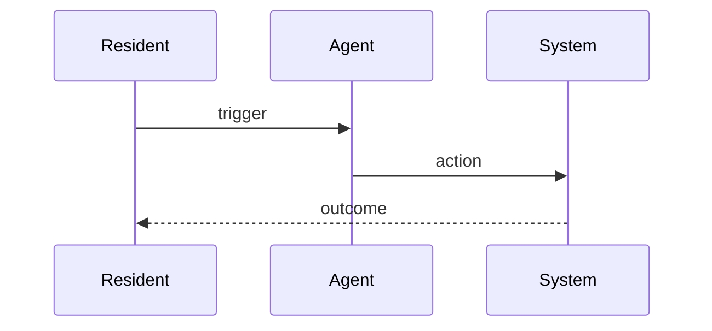

# CAP-N: [Title]

**Status:** draft | in-review | locked  
**SPEC reference:** CAP-N in `SPEC.md`  
**MVP phase:** 0–5 (see MVP-SPRINT-PLAN.md)

## Intent & success (from SPEC)

- **Intent:** …
- **Success:** …

## User stories

| Actor | Story |
|-------|-------|
| PM admin | As a … I want … so that … |
| Resident | … |
| Owner | … |
| AI agent | … |

## Happy path (autonomous)

1. Step …
2. Step …

## Escalation path (human-in-loop)

| Trigger | Action | Approver |
|---------|--------|----------|
| Spend > $X | Block auto-execute | PM admin |
| … | … | … |

## Integrations

| Service | Use in this CAP |
|---------|-----------------|
| Stripe | … |
| Seam | … |
| Plaid | … |

## Data model (draft)

| Entity | Key fields |
|--------|------------|
| … | … |

## API surface (draft)

| Method | Endpoint | Purpose |
|--------|----------|---------|
| POST | `/api/...` | … |

## Acceptance tests

- [ ] …
- [ ] …

## Competitive notes

What AppFolio / Entrata / DoorLoop do; what we do differently.

## Open questions

- [ ] …

## Decisions log

| Date | Decision |
|------|----------|
| … | … |
